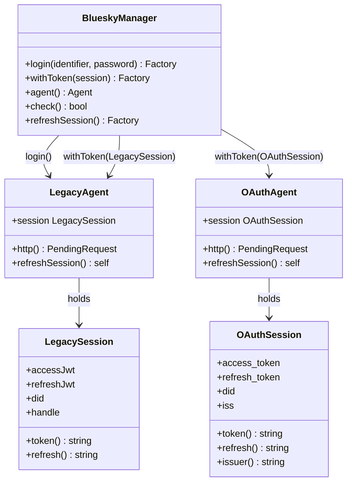
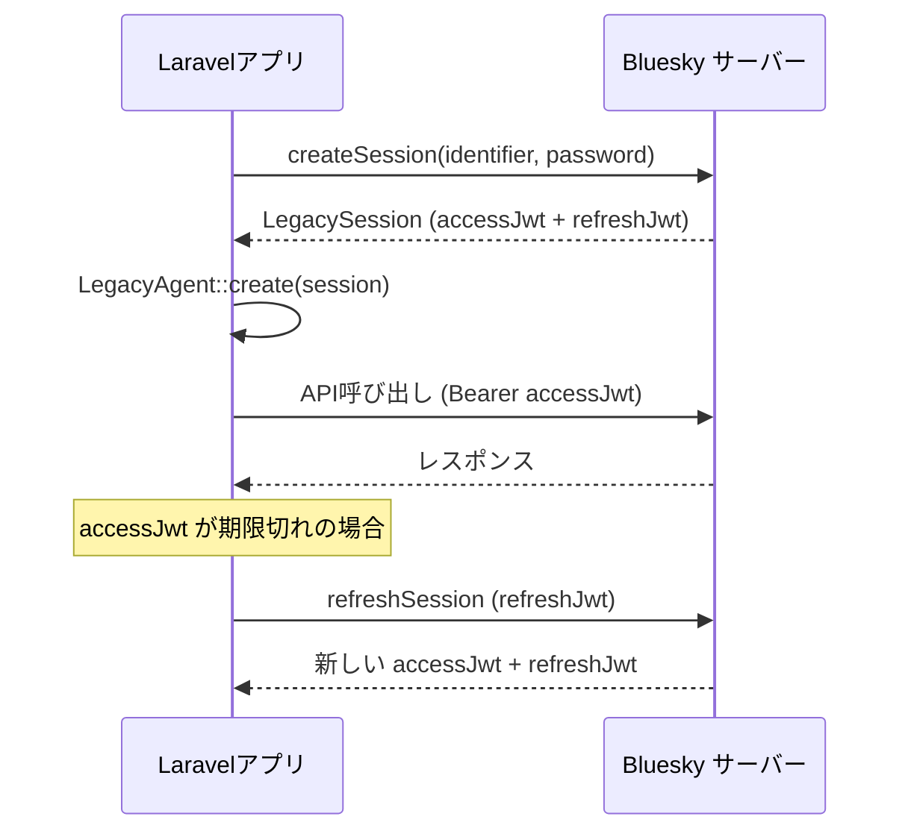
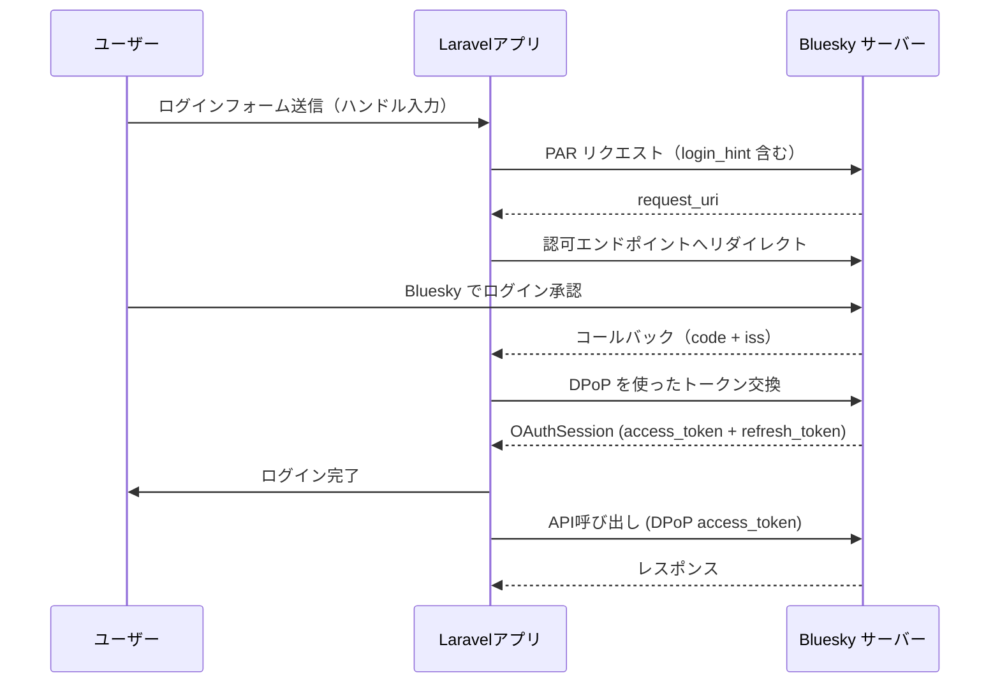
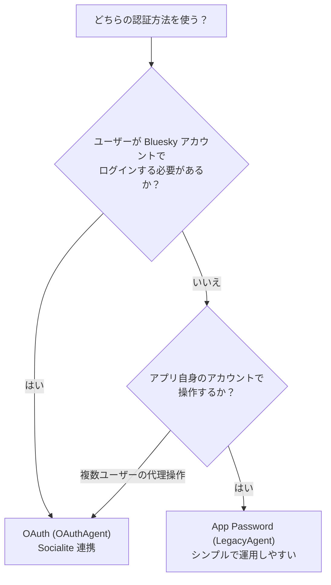

## 概要

Laravel Bluesky は2種類の認証方法をサポートします。認証後の API 呼び出しは両方法で共通です。

| 項目 | App Password | OAuth |
|---|---|---|
| 内部クラス | `LegacyAgent` / `LegacySession` | `OAuthAgent` / `OAuthSession` |
| エントリーポイント | `Bluesky::login()` | `Bluesky::withToken(OAuthSession)` |
| 秘密鍵 | 不要 | `BLUESKY_OAUTH_PRIVATE_KEY` が必要 |
| ユーザーの認可操作 | 不要 | 必要（ブラウザでの承認） |
| バックグラウンド実行 | ✅ 得意 | ✅ 可能（refresh_token を保存） |
| セッションキー | `accessJwt` / `refreshJwt` | `access_token` / `refresh_token` |
| 廃止予定 | **なし** | — |
| 主な用途 | 自動投稿・通知・バッチ処理 | ユーザー代理操作・Socialite 連携 |

<Info>
`LegacyAgent` という命名は「OAuth 以前の認証方式」を意味しますが、App Password 自体は廃止予定ではありません。通知や自動投稿など、ユーザー操作を伴わない場面では App Password の方がシンプルで適しています。
</Info>

## アーキテクチャ



`BlueskyManager` は Facade `Bluesky` の実体です。`login()` または `withToken()` でエージェントを設定し、その後の API 呼び出しはどちらの認証方法でも同じメソッドを使います。

## App Password (LegacyAgent)

### 認証フロー



### Bluesky::login()

`.env` に App Password を設定して `login()` を呼ぶだけです。

```dotenv
BLUESKY_IDENTIFIER=your-handle.bsky.social
BLUESKY_APP_PASSWORD=xxxx-xxxx-xxxx-xxxx
```

```php
use Revolution\Bluesky\Facades\Bluesky;

$response = Bluesky::login(
    identifier: config('bluesky.identifier'),
    password: config('bluesky.password'),
)->post('Hello Bluesky');
```

### LegacySession の再利用

毎回 `login()` を呼ぶと毎回 API リクエストが発生します。セッションをキャッシュして再利用するとより効率的です。

```php
use Revolution\Bluesky\Facades\Bluesky;
use Revolution\Bluesky\Session\LegacySession;

// 初回ログインしてセッションを保存
Bluesky::login(
    identifier: config('bluesky.identifier'),
    password: config('bluesky.password'),
);
cache()->put('bluesky_session', Bluesky::agent()->session()->toArray(), now()->addDay());

// 次回以降はキャッシュから復元
$session = LegacySession::create(cache('bluesky_session', []));
Bluesky::withToken($session);

// アクセストークンが期限切れなら更新
if (! Bluesky::check()) {
    Bluesky::refreshSession();
}

$response = Bluesky::post('Hello from cached session');
```

### LegacySession の主なキー

| キー | 内容 | メソッド |
|---|---|---|
| `accessJwt` | アクセストークン | `token()` |
| `refreshJwt` | リフレッシュトークン | `refresh()` |
| `did` | Bluesky DID | `did()` |
| `handle` | ハンドル | `handle()` |
| `email` | メールアドレス | `email()` |
| `active` | アカウントがアクティブか | `active()` |

### 適したユースケース

- バックグラウンドジョブ・キュー処理での自動投稿
- Laravel Notification チャンネルを使った通知
- バッチ処理・スケジューリング
- アプリケーション自身のアカウントで投稿する場合

## OAuth (OAuthAgent)

### 認証フロー



### Bluesky::withToken()

Socialite で取得した `OAuthSession` を `withToken()` に渡します。

```php
use Revolution\Bluesky\Facades\Bluesky;
use Revolution\Bluesky\Session\OAuthSession;

// Laravel セッションから復元（Web リクエスト）
$session = OAuthSession::create(session('bluesky_session'));
$timeline = Bluesky::withToken($session)->getTimeline();
```

バックグラウンドジョブや Console でも、DB に保存した値から `OAuthSession` を組み立てられます。

```php
use Revolution\Bluesky\Facades\Bluesky;
use Revolution\Bluesky\Session\OAuthSession;

$session = OAuthSession::create([
    'did'           => $user->did,
    'refresh_token' => $user->refresh_token,
    // bsky.social 以外のアカウントは iss も指定
    // 'iss'        => $user->iss,
]);

$response = Bluesky::withToken($session)
                   ->refreshSession()
                   ->post('Hello from OAuth');
```

### OAuthSession の主なキー

| キー | 内容 | メソッド |
|---|---|---|
| `access_token` | アクセストークン | `token()` |
| `refresh_token` | リフレッシュトークン（1回のみ使用可） | `refresh()` |
| `did` / `sub` | Bluesky DID | `did()` |
| `iss` | 認可サーバー URL | `issuer()` |
| `profile.handle` | ハンドル | `handle()` |
| `profile.displayName` | 表示名 | `displayName()` |

<Warning>
OAuth の refresh_token は1回しか使えません。`OAuthSessionUpdated` イベントを使って、トークン更新後は必ず DB を更新してください。詳細は [Socialite](/jp/packages/laravel-bluesky/socialite) を参照してください。
</Warning>

### 適したユースケース

- Socialite を使ったユーザーログイン
- ユーザーの代わりに API を呼び出す操作
- ユーザーごとに異なるアカウントで操作が必要な場合

## 認証後の API 呼び出しは共通

どちらの認証方法でも、`withToken()` の後は同じ API メソッドを使います。

```php
use Revolution\Bluesky\Facades\Bluesky;
use Revolution\Bluesky\Session\LegacySession;
use Revolution\Bluesky\Session\OAuthSession;

// App Password
Bluesky::login(config('bluesky.identifier'), config('bluesky.password'));

// または OAuth
$session = OAuthSession::create(session('bluesky_session'));
Bluesky::withToken($session);

// ↓ 以降のAPI呼び出しは完全に共通 ↓

Bluesky::post('Hello Bluesky');
Bluesky::getTimeline();
Bluesky::getProfile();
Bluesky::searchPosts(q: '#laravel');
```

`BlueskyManager` は内部で `LegacyAgent` または `OAuthAgent` を使い分けますが、呼び出し側のコードには影響しません。

## どちらを選ぶべきか



| 状況 | 推奨 |
|---|---|
| 自動投稿・通知・バッチ | App Password |
| ユーザーログイン機能 | OAuth |
| バックグラウンドジョブのみ | App Password |
| ユーザー代理操作が必要 | OAuth |
| 運用シンプルさ優先 | App Password |
| セキュリティ・権限制御重視 | OAuth |

<Tip>
迷ったときは目的で分けるのが一番わかりやすいです。「アプリが自分で動く」なら App Password、「ユーザーが操作する」なら OAuth です。両方を組み合わせることも可能で、通知には App Password を使い、ユーザーログインには OAuth を使うという構成もよく見られます。
</Tip>

## 参考リンク

- [Basic client](/jp/packages/laravel-bluesky/basic-client) — 認証後の API 操作
- [Socialite](/jp/packages/laravel-bluesky/socialite) — OAuth フローの詳細
- [通知チャンネル](/jp/packages/laravel-bluesky/notification) — App Password / OAuth での通知
- Source: [invokable/laravel-bluesky](https://github.com/invokable/laravel-bluesky)
