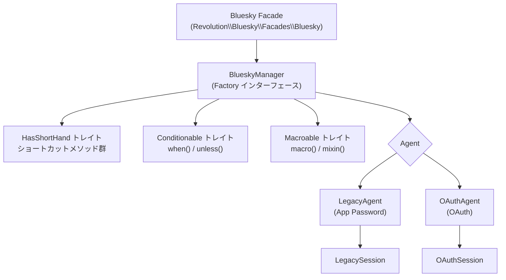

## 概要

`Bluesky` Facade は `BlueskyManager` の薄いラッパーです。`BlueskyManager` は複数の Agent を管理し、`HasShortHand` トレイトが頻繁に使うメソッドのショートカットをまとめて提供します。

## アーキテクチャ



`BlueskyServiceProvider` は `Factory::class` を `BlueskyManager` としてスコープ付きシングルトン（1リクエストにつき1インスタンス）で登録します。

```php
// BlueskyServiceProvider::register()
$this->app->scoped(Factory::class, BlueskyManager::class);
```

Facade の `getFacadeAccessor()` がこのバインディングを解決します。

```php
// Facades/Bluesky.php
protected static function getFacadeAccessor(): string
{
    return Factory::class;
}
```

## BlueskyManager のコアメソッド

`BlueskyManager` 自身が定義するコアメソッドは以下のとおりです。`HasShortHand` トレイトのメソッドとは区別して把握しておくと、内部構造の理解に役立ちます。

### 認証

| メソッド | 説明 |
|---|---|
| `login(string $identifier, string $password, ?string $service = null)` | App Password で認証し `LegacyAgent` をセット |
| `withToken(?AbstractSession $token)` | `OAuthSession` または `LegacySession` を渡して Agent をセット |
| `check(): bool` | 認証済みかどうかを確認（トークン有効期限も検証） |
| `refreshSession()` | トークンをリフレッシュ |
| `logout()` | Agent をクリア |

### Agent 操作

| メソッド | 説明 |
|---|---|
| `agent(): ?Agent` | 現在の Agent を取得 |
| `withAgent(?Agent $agent)` | Agent を直接セット |
| `assertDid(): string` | 認証済み DID を返す。未認証なら例外をスロー |

### HTTP クライアント

| メソッド | 説明 |
|---|---|
| `client(bool $auth = true): AtpClient` | 認証済み（または匿名の）XRPC クライアントを返す |
| `public(): BskyClient` | 認証不要のパブリックエンドポイントクライアントを返す |
| `send(BackedEnum\|string $api, string $method, bool $auth, ?array $params, ?callable $callback)` | 任意の AT Protocol API を直接呼び出す |

### ユーティリティ

| メソッド | 説明 |
|---|---|
| `identity(): Identity` | DID 解決などのアイデンティティサービスを取得 |
| `pds(): PDS` | PDS 情報サービスを取得 |
| `entryway(?string $path): string` | サービス URL（`bsky.social` など）を返す |
| `publicEndpoint(): string` | パブリックエンドポイント URL を返す |

## HasShortHand トレイト

`HasShortHand` トレイトは、AT Protocol の低レベル API を PHP 向けのわかりやすいメソッドにラップしています。`BlueskyManager` に `use HasShortHand;` と記述するだけで、これらのメソッドが `Bluesky::` から直接呼べるようになります。

```php
// BlueskyManager.php
class BlueskyManager implements Factory
{
    use Conditionable;
    use HasShortHand;
    use Macroable;
    // ...
}
```

<Info>
`HasShortHand` を独立したトレイトにしている理由は、テスト・カスタマイズの容易さです。このトレイトを使えば `BlueskyManager` のコードをシンプルに保ちながら、豊富な API ショートカットを提供できます。
</Info>

### 投稿・フィード

| メソッド | 説明 |
|---|---|
| `post(Post\|string\|array $text)` | 新規投稿を作成 |
| `getPost(string $uri)` | AT-URI で投稿を取得 |
| `getPosts(array $uris)` | 複数の投稿を一括取得 |
| `deletePost(string $uri)` | 投稿を削除 |
| `getTimeline(?string $algorithm, ?int $limit, ?string $cursor)` | ホームタイムラインを取得 |
| `getAuthorFeed(?string $actor, ...)` | 指定アカウントのフィードを取得 |
| `searchPosts(string $q, ...)` | 投稿を検索 |

### エンゲージメント

| メソッド | 説明 |
|---|---|
| `like(Like\|StrongRef $subject)` | いいねを作成 |
| `deleteLike(string $uri)` | いいねを取り消し |
| `repost(Repost\|StrongRef $subject)` | リポストを作成 |
| `deleteRepost(string $uri)` | リポストを取り消し |
| `getActorLikes(?string $actor, ...)` | アカウントのいいね一覧を取得 |

### フォロー

| メソッド | 説明 |
|---|---|
| `follow(Follow\|string $did)` | フォロー |
| `deleteFollow(string $uri)` | フォロー解除 |
| `getFollowers(?string $actor, ...)` | フォロワー一覧を取得 |
| `getFollows(?string $actor, ...)` | フォロー中一覧を取得 |

### プロフィール・アカウント

| メソッド | 説明 |
|---|---|
| `getProfile(?string $actor)` | プロフィールを取得 |
| `upsertProfile(callable $callback)` | プロフィールを更新 |
| `resolveHandle(string $handle)` | ハンドルを DID に解決 |

### メディア

| メソッド | 説明 |
|---|---|
| `uploadBlob(StreamInterface\|string $data, string $type)` | 画像などのブロブをアップロード |
| `uploadVideo(StreamInterface\|string $data, string $type)` | 動画をアップロード |
| `getJobStatus(string $jobId)` | 動画アップロードのジョブ状態を確認 |
| `getUploadLimits()` | アップロード制限を取得 |

### 通知

| メソッド | 説明 |
|---|---|
| `listNotifications(...)` | 通知一覧を取得 |
| `countUnreadNotifications(...)` | 未読通知件数を取得 |
| `updateSeenNotifications(string $seenAt)` | 既読を更新 |

### AT Protocol レコード操作

| メソッド | 説明 |
|---|---|
| `createRecord(string $repo, string $collection, ...)` | レコードを作成 |
| `getRecord(string $repo, string $collection, string $rkey, ...)` | レコードを取得 |
| `listRecords(string $repo, string $collection, ...)` | レコード一覧を取得 |
| `putRecord(string $repo, string $collection, string $rkey, ...)` | レコードを更新・作成 |
| `deleteRecord(string $repo, string $collection, string $rkey, ...)` | レコードを削除 |

### フィードジェネレーター・ラベラー

| メソッド | 説明 |
|---|---|
| `publishFeedGenerator(BackedEnum\|string $name, Generator $generator)` | フィードジェネレーターを公開 |
| `createThreadGate(string $post, ?array $allow)` | スレッドゲートを作成 |
| `upsertLabelDefinitions(callable $callback)` | ラベル定義を更新 |
| `deleteLabelDefinitions()` | ラベル定義を削除 |
| `createLabels(RepoRef\|StrongRef\|array $subject, array $labels)` | ラベルを付与 |
| `deleteLabels(RepoRef\|StrongRef\|array $subject, array $labels)` | ラベルを削除 |

## よく使うショートカットの例

### 投稿する

```php
use Revolution\Bluesky\Facades\Bluesky;

$response = Bluesky::login(
    identifier: config('bluesky.identifier'),
    password: config('bluesky.password'),
)->post('Hello Bluesky');
```

### リプライする

リプライは `Post::build()` で親投稿の `StrongRef` を設定します。`HasShortHand` に専用の `reply()` メソッドはなく、`post()` に `Post` オブジェクトを渡します。

```php
use Revolution\Bluesky\Facades\Bluesky;
use Revolution\Bluesky\Record\Post;
use Revolution\Bluesky\Types\StrongRef;

$parent = StrongRef::to(uri: 'at://did:plc:.../app.bsky.feed.post/...', cid: 'bafyrei...');

$reply = Post::create('リプライのテキスト')
    ->reply(root: $parent, parent: $parent);

Bluesky::login(config('bluesky.identifier'), config('bluesky.password'))
    ->post($reply);
```

### いいね・リポスト

```php
use Revolution\Bluesky\Facades\Bluesky;
use Revolution\Bluesky\Types\StrongRef;

$ref = StrongRef::to(uri: 'at://did:plc:.../app.bsky.feed.post/...', cid: 'bafyrei...');

// いいね
Bluesky::withToken($session)->like($ref);

// リポスト
Bluesky::withToken($session)->repost($ref);
```

### プロフィールを更新する

`upsertProfile()` は現在のプロフィールを取得し、クロージャ内で変更した内容を保存します。`Profile` オブジェクトのメソッドを使って displayName・description などを設定できます。

```php
use Revolution\Bluesky\Facades\Bluesky;
use Revolution\Bluesky\Record\Profile;

Bluesky::login(config('bluesky.identifier'), config('bluesky.password'))
    ->upsertProfile(function (Profile $profile) {
        $profile->displayName('新しい表示名')
                ->description('プロフィール説明文');
    });
```

#### セルフラベルを設定する

`SelfLabels` を使って、アカウント全体に対してセルフラベルを設定できます。

```php
use Revolution\Bluesky\Facades\Bluesky;
use Revolution\Bluesky\Record\Profile;
use Revolution\Bluesky\Types\SelfLabels;

Bluesky::login(config('bluesky.identifier'), config('bluesky.password'))
    ->upsertProfile(function (Profile $profile) {
        $profile->labels(SelfLabels::make(['!no-unauthenticated']));
    });
```

### 任意の API を直接呼び出す

`HasShortHand` にないメソッドは `send()` または `client()` を使います。

```php
use Revolution\Bluesky\Facades\Bluesky;

// send() で任意の XRPC メソッドを呼び出す
$response = Bluesky::withToken($session)
    ->send(
        api: 'app.bsky.actor.getProfiles',
        method: 'get',
        params: ['actors' => ['did:plc:...', 'did:plc:...']],
    );

// client() でより細かい操作
$response = Bluesky::withToken($session)
    ->client()
    ->bsky()
    ->getProfiles(actors: ['did:plc:...']);
```

## Facade 経由と直接利用の違い

`Bluesky::post()` と `app(Factory::class)->post()` は同じ `BlueskyManager` インスタンスに対する操作です。

```php
use Revolution\Bluesky\Facades\Bluesky;
use Revolution\Bluesky\Contracts\Factory;

// Facade 経由（通常の使い方）
Bluesky::login(config('bluesky.identifier'), config('bluesky.password'))
    ->post('Hello');

// コンテナから直接取得
$manager = app(Factory::class);
$manager->login(config('bluesky.identifier'), config('bluesky.password'))
        ->post('Hello');

// 型ヒントで DI
class MyService
{
    public function __construct(private Factory $bluesky) {}

    public function doPost(): void
    {
        $this->bluesky->login(
            config('bluesky.identifier'),
            config('bluesky.password'),
        )->post('Hello from DI');
    }
}
```

`scoped` 登録のため、1リクエスト内では `login()` 後のセッション状態が保持されます。

## Conditionable と Macroable

`BlueskyManager` は `Conditionable` と `Macroable` トレイトも使用しています。

### Conditionable: when() / unless()

```php
use Revolution\Bluesky\Facades\Bluesky;

Bluesky::login(config('bluesky.identifier'), config('bluesky.password'))
    ->when(config('app.env') === 'production', function ($bluesky) {
        $bluesky->post('本番環境からの投稿');
    });
```

### Macroable: カスタムメソッドの追加

`macro()` を使うとアプリケーション側から `BlueskyManager` にメソッドを追加できます。`AppServiceProvider` の `boot()` 内で定義するのが一般的です。

```php
use Revolution\Bluesky\Facades\Bluesky;

Bluesky::macro('postWithHashtag', function (string $text, string $tag) {
    /** @var \Revolution\Bluesky\BlueskyManager $this */
    return $this->post("{$text} #{$tag}");
});

// 使用例
Bluesky::login(config('bluesky.identifier'), config('bluesky.password'))
    ->postWithHashtag('Hello', 'laravel');
```

## カスタム Agent の差し込み

`withAgent()` を使うと、任意の `Agent` 実装を直接セットできます。

```php
use Revolution\Bluesky\Facades\Bluesky;
use Revolution\Bluesky\Contracts\Agent;

// カスタム Agent を実装する場合は Agent インターフェースを実装する
class MyCustomAgent implements Agent
{
    // ...
}

Bluesky::withAgent(new MyCustomAgent());
```

<Info>
通常の認証（`login()` / `withToken()`）を使えば自動でエージェントがセットされるため、`withAgent()` を直接使う機会はテスト時が主となります。
</Info>

## 参考リンク

- [認証方法の比較](/jp/packages/laravel-bluesky/authentication) — App Password と OAuth の詳細
- [Basic client](/jp/packages/laravel-bluesky/basic-client) — 認証後の API 操作例
- [テスト](/jp/packages/laravel-bluesky/testing) — Fake を使ったテスト方法
- Source: [src/BlueskyManager.php](https://github.com/invokable/laravel-bluesky/blob/main/src/BlueskyManager.php)
- Source: [src/HasShortHand.php](https://github.com/invokable/laravel-bluesky/blob/main/src/HasShortHand.php)
