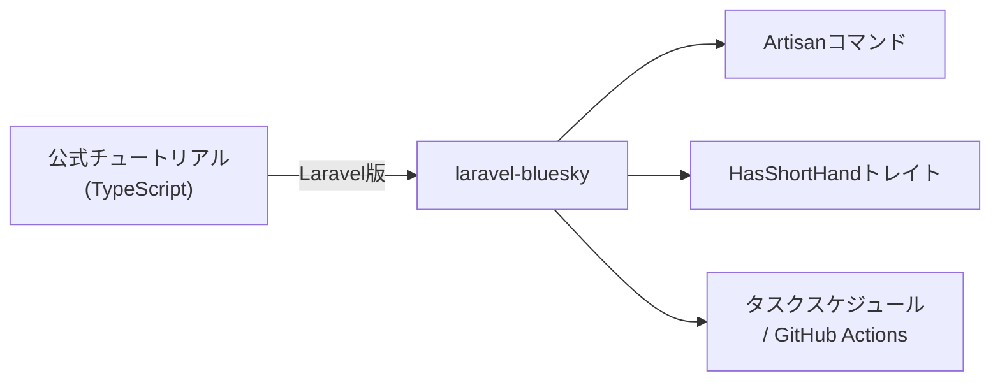

## 概要

このページは [AT Protocol 公式ボットチュートリアル](https://atproto.com/ja/guides/bot-tutorial) の Laravel 版です。TypeScript 向けの内容を `laravel-bluesky` パッケージを使って PHP/Laravel で実装する方法を解説します。

公式チュートリアルでは `lex` コマンドで Lexicon ファイルを都度ダウンロードしますが、`laravel-bluesky` では [atproto-lexicon-contracts](https://github.com/invokable/atproto-lexicon-contracts) から事前に全 Lexicon を取り込み済みのため、この手順は不要です。Artisan コマンドと `HasShortHand` トレイトのメソッドを使って、ほぼすべての操作が実現できます。



## 前提条件

- `laravel-bluesky` パッケージがインストール済みであること
- Bluesky のアカウントとアプリパスワードが用意されていること

インストール方法は [Laravel Bluesky](/jp/packages/laravel-bluesky/index) を参照してください。

```dotenv
BLUESKY_IDENTIFIER=yourbot.bsky.social
BLUESKY_APP_PASSWORD=xxxx-xxxx-xxxx-xxxx
```

---

## パート 1: 基本ボット（投稿）

### Artisan コマンドを作成する

`php artisan make:command` でボット用のコマンドを作成します。

```bash
php artisan make:command BotPostCommand
```

生成された `app/Console/Commands/BotPostCommand.php` を編集します。

```php
<?php

namespace App\Console\Commands;

use Illuminate\Console\Command;
use Revolution\Bluesky\Facades\Bluesky;

class BotPostCommand extends Command
{
    protected $signature = 'bot:post';

    protected $description = 'Post to Bluesky';

    public function handle(): void
    {
        Bluesky::login(
            identifier: config('bluesky.identifier'),
            password: config('bluesky.password'),
        )->post('🙂');

        $this->info('Posted successfully.');
    }
}
```

### 手動実行

```bash
php artisan bot:post
```

### タスクスケジュールで自動実行

`routes/console.php` に定期実行の設定を追加します。

```php
use Illuminate\Support\Facades\Schedule;

// 3時間ごとに投稿
Schedule::command('bot:post')->everyThreeHours();
```

スケジューラを有効にするには、cron に以下を設定してください。

```bash
* * * * * cd /path-to-your-project && php artisan schedule:run >> /dev/null 2>&1
```

### GitHub Actions で自動実行

サーバーを持たない場合は GitHub Actions でも自動実行できます。

```yaml
# .github/workflows/bot.yml
name: Bot Post

on:
  schedule:
    - cron: '0 */3 * * *'  # 3時間ごと
  workflow_dispatch:

jobs:
  post:
    runs-on: ubuntu-latest
    steps:
      - uses: actions/checkout@v4
      - uses: shivammathur/setup-php@v2
        with:
          php-version: '8.4'
      - run: composer install --no-dev --optimize-autoloader
      - run: php artisan bot:post
        env:
          BLUESKY_IDENTIFIER: ${{ secrets.BLUESKY_IDENTIFIER }}
          BLUESKY_APP_PASSWORD: ${{ secrets.BLUESKY_APP_PASSWORD }}
```

<Tip>
GitHub Actions のシークレットに `BLUESKY_IDENTIFIER` と `BLUESKY_APP_PASSWORD` を登録してください。
</Tip>

---

## パート 2: リプライボット（メンション監視）

メンションに自動返信するボットを作成します。AI を使ってリプライを生成する例も紹介します。

### 通知を取得してメンションに返信する

```bash
php artisan make:command BotReplyCommand
```

```php
<?php

namespace App\Console\Commands;

use Illuminate\Console\Command;
use Revolution\Bluesky\Facades\Bluesky;
use Revolution\Bluesky\Record\Post;
use Revolution\Bluesky\Types\ReplyRef;
use Revolution\Bluesky\Types\StrongRef;

class BotReplyCommand extends Command
{
    protected $signature = 'bot:reply';

    protected $description = 'Reply to mentions on Bluesky';

    public function handle(): void
    {
        Bluesky::login(
            identifier: config('bluesky.identifier'),
            password: config('bluesky.password'),
        );

        $notifications = Bluesky::listNotifications(limit: 20)->json('notifications', []);

        foreach ($notifications as $notification) {
            // メンション通知のみ処理
            if (data_get($notification, 'reason') !== 'mention') {
                continue;
            }

            // 既読の通知はスキップ（isRead が true のものは処理済み）
            if (data_get($notification, 'isRead')) {
                continue;
            }

            $uri = data_get($notification, 'uri');
            $cid = data_get($notification, 'cid');

            if (! $uri || ! $cid) {
                continue;
            }

            $ref = StrongRef::to(uri: $uri, cid: $cid);
            $reply = ReplyRef::to(root: $ref, parent: $ref);

            $post = Post::create('こんにちは！メンションありがとうございます。🙂')
                ->reply($reply);

            Bluesky::post($post);

            $this->info("Replied to: {$uri}");
        }

        // 通知を既読にする
        Bluesky::updateSeenNotifications(now()->toISOString());
    }
}
```

<Info>
スレッドの root が異なる場合は `app.bsky.feed.getPostThread` でスレッド情報を取得して `root` に設定してください。簡易実装では親投稿を root として扱っています。
</Info>

### ポーリングをスケジュールする

```php
// routes/console.php
use Illuminate\Support\Facades\Schedule;

Schedule::command('bot:reply')->everyFiveMinutes();
```

### AI を使ってリプライを生成する

`laravel/ai` パッケージと `laravel-amazon-bedrock` ドライバーを組み合わせると、メンション内容に応じた AI リプライを生成できます。

```bash
composer require laravel/ai revolution/laravel-amazon-bedrock
```

AI エージェントを作成します。

```php
<?php

namespace App\Ai\Agents;

use Laravel\Ai\Contracts\Agent;
use Laravel\Ai\Promptable;

class BotReplyAgent implements Agent
{
    use Promptable;

    public function instructions(): string
    {
        return 'あなたは Bluesky 上で活動するフレンドリーなボットです。'
            . 'ユーザーのメッセージに対して、短く親しみやすい返信を日本語で生成してください。'
            . '返信は 200 文字以内にしてください。';
    }
}
```

コマンドで AI リプライを使用します。

```php
<?php

namespace App\Console\Commands;

use App\Ai\Agents\BotReplyAgent;
use Illuminate\Console\Command;
use Revolution\Bluesky\Facades\Bluesky;
use Revolution\Bluesky\Record\Post;
use Revolution\Bluesky\Types\ReplyRef;
use Revolution\Bluesky\Types\StrongRef;

class BotReplyCommand extends Command
{
    protected $signature = 'bot:reply';

    protected $description = 'Reply to mentions on Bluesky using AI';

    public function handle(): void
    {
        Bluesky::login(
            identifier: config('bluesky.identifier'),
            password: config('bluesky.password'),
        );

        $notifications = Bluesky::listNotifications(limit: 20)->json('notifications', []);

        foreach ($notifications as $notification) {
            if (data_get($notification, 'reason') !== 'mention') {
                continue;
            }

            if (data_get($notification, 'isRead')) {
                continue;
            }

            $uri = data_get($notification, 'uri');
            $cid = data_get($notification, 'cid');
            $mentionText = data_get($notification, 'record.text', '');

            if (! $uri || ! $cid) {
                continue;
            }

            // AI でリプライを生成
            $replyText = (new BotReplyAgent)->prompt($mentionText)->text;

            $ref = StrongRef::to(uri: $uri, cid: $cid);
            $reply = ReplyRef::to(root: $ref, parent: $ref);

            $post = Post::create($replyText)->reply($reply);

            Bluesky::post($post);

            $this->info("AI replied to: {$uri}");
        }

        Bluesky::updateSeenNotifications(now()->toISOString());
    }
}
```

<Tip>
`laravel-amazon-bedrock` の設定方法は [Amazon Bedrock ドライバー](/jp/packages/laravel-amazon-bedrock) を参照してください。
</Tip>

---

## パート 3: ラベルボット

公式チュートリアルの `labelAsBot` に相当する機能です。ボットアカウントのプロフィールにセルフラベルを付与して、自動化アカウントであることを明示します。

<Info>
ラベル付けは初回セットアップ時に一度だけ実行します。パート 1・2 のコマンドとは独立した別のコマンドとして実装します。
</Info>

### ラベルボットコマンドを作成する

```bash
php artisan make:command BotLabelCommand
```

```php
<?php

namespace App\Console\Commands;

use Illuminate\Console\Command;
use Revolution\Bluesky\Facades\Bluesky;
use Revolution\Bluesky\Record\Profile;
use Revolution\Bluesky\Types\SelfLabels;

class BotLabelCommand extends Command
{
    protected $signature = 'bot:label';

    protected $description = 'Add bot self-label to the Bluesky profile';

    public function handle(): void
    {
        Bluesky::login(
            identifier: config('bluesky.identifier'),
            password: config('bluesky.password'),
        )->upsertProfile(function (Profile $profile) {
            // !bot ラベルを設定する
            $profile->labels(SelfLabels::make(['!bot']));
        });

        $this->info('Bot label applied successfully.');
    }
}
```

### 実行する

```bash
php artisan bot:label
```

このコマンドはボットの初回セットアップ時に一度だけ実行してください。ラベルはプロフィールに永続的に保存されます。

<Warning>
`!bot` は Bluesky の標準セルフラベルです。ボットアカウントには必ず設定することが推奨されています。
</Warning>

---

## 他の公式チュートリアルについて

AT Protocol の公式チュートリアルには他にもいくつかのトピックがあります。`laravel-bluesky` での対応状況をまとめます。

### カスタムフィード

[feed-generator.mdx](/jp/packages/laravel-bluesky/feed-generator) で Laravel を使ったカスタムフィードジェネレーターの実装方法を詳しく解説しています。

### OAuth 認証

[socialite.mdx](/jp/packages/laravel-bluesky/socialite) で Laravel Socialite を使った OAuth 認証の実装方法を解説しています。公式チュートリアルより簡単に実装できます。

### ソーシャルアプリ（statusphere）

Laravel 版の statusphere が [invokable/statusphere](https://github.com/invokable/statusphere) として公開されています。`lex` や `tap` コマンドを使っていない以前の statusphere をベースにしているため、最新の公式チュートリアルとは若干異なる点があります。

## 参考リンク

- [AT Protocol 公式ボットチュートリアル（英語）](https://atproto.com/guides/bot-tutorial)
- [AT Protocol 公式ボットチュートリアル（日本語）](https://atproto.com/ja/guides/bot-tutorial)
- [laravel-bluesky](https://github.com/invokable/laravel-bluesky)
- [BlueskyManager と HasShortHand](/jp/packages/laravel-bluesky/bluesky-manager)
- [通知チャンネル](/jp/packages/laravel-bluesky/notification)
- [Amazon Bedrock ドライバー](/jp/packages/laravel-amazon-bedrock)
