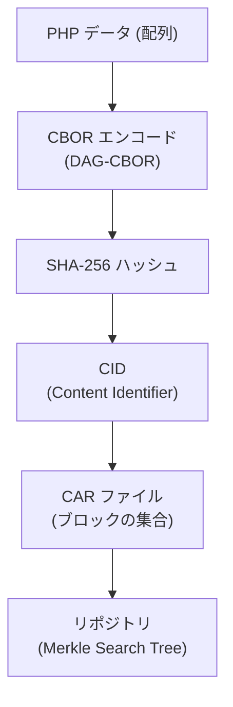
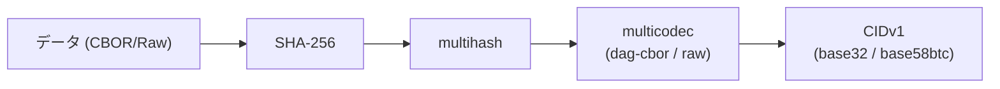
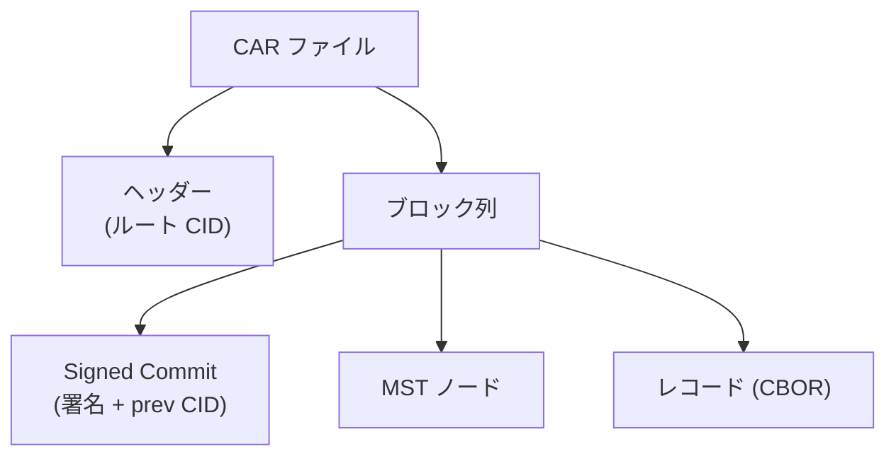
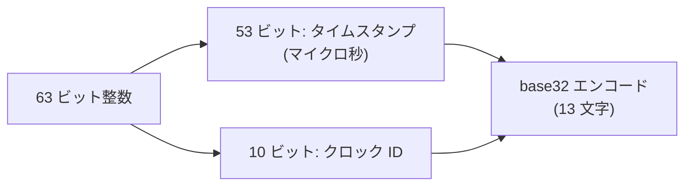

<Warning>
Core は高度な内部実装です。通常の投稿・フィード取得・通知などには必要ありません。AT Protocol のデータ構造を直接操作する場合に参照してください。
</Warning>

## AT Protocol のデータモデル概要

AT Protocol のリポジトリはコンテンツアドレス型のデータ構造を採用しています。データの保存・転送・検証に以下の要素が使われます。



| クラス | 役割 |
|---|---|
| `CBOR` | バイナリシリアライゼーション |
| `CID` | コンテンツアドレス (ハッシュ識別子) |
| `CAR` | リポジトリアーカイブの読み書き |
| `TID` | 時系列レコードキー |
| `Varint` | 可変長整数エンコーディング (内部) |

---

## CBOR

`CBOR` クラスは AT Protocol が採用する [DAG-CBOR](https://ipld.io/specs/codecs/dag-cbor/spec/) 形式のエンコード・デコードを提供します。標準 CBOR の拡張として CID リンク（タグ 42）をサポートしています。

### エンコード

```php
use Revolution\Bluesky\Core\CBOR;

$record = [
    '$type'     => 'app.bsky.feed.post',
    'text'      => 'Hello, Bluesky!',
    'createdAt' => '2025-01-01T00:00:00.000Z',
];

$bytes = CBOR::encode($record); // バイナリ文字列
```

### デコード

```php
use Revolution\Bluesky\Core\CBOR;

// 単一アイテムをデコード
$data = CBOR::decode($bytes);

// ストリームの先頭アイテムをデコードして残りを返す
[$item, $remainder] = CBOR::decodeFirst($bytes);

// ストリームの全アイテムをデコード
$items = CBOR::decodeAll($bytes);
```

### 用途

投稿の CID を手動で計算・検証したい場合は CBOR エンコードが必要です（[verify ページ](/jp/packages/laravel-bluesky/verify)も参照）。

```php
use Revolution\Bluesky\Core\CBOR;
use Revolution\Bluesky\Core\CID;

$record = data_get($block, 'value');
$cbor   = CBOR::encode($record);
$bool   = CID::verify($cbor, data_get($block, 'cid'));
```

---

## CID (Content Identifier)

CID はデータのハッシュを元にした自己記述型の識別子です。AT Protocol では SHA-256 ハッシュを multihash でラップし、さらに multicodec と multibase でエンコードします。



### CIDv0 と CIDv1

| バージョン | エンコーディング | 先頭文字 | 用途 |
|---|---|---|---|
| v0 | base58btc | `Qm...` | 古い仕様 (ブロブ) |
| v1 | base32 | `bafy...` | 新しい仕様 (レコード) |

### 主要 API

```php
use Revolution\Bluesky\Core\CID;

// データから CID を生成
$cid = CID::encode($data, CID::DAG_CBOR); // レコード用
$cid = CID::encode($data, CID::RAW);      // バイナリ (画像など)

// CID を検証
$bool = CID::verify($data, $cid, CID::DAG_CBOR);
$bool = CID::verify($file, $cid, CID::RAW);

// CID を解析
$decoded = CID::decode($cid); // ['version', 'codec', 'hash']

// CID のバージョンを確認
$version = CID::version($cid); // 0 or 1

// バイト表現への変換
$bytes = CID::decodeBytes($cid);
$cid   = CID::encodeBytes($bytes);
```

---

## CAR (Content Addressable aRchive)

CAR ファイルは AT Protocol リポジトリをブロックの列として格納するバイナリフォーマットです。`com.atproto.sync.getRepo` で取得したデータがこの形式です。



### デコード

```php
use Revolution\Bluesky\Core\CAR;

// CAR ファイル全体をデコード (ルートと全ブロック)
['roots' => $roots, 'blocks' => $blocks] = CAR::decode($carData);

// ルート CID のみ取得
$roots = CAR::decodeRoots($carData);

// ブロックをイテレート
foreach (CAR::blockIterator($carData) as [$cid, $block]) {
    // $cid: CID 文字列, $block: バイナリデータ
}

// レコードマップとして取得
foreach (CAR::blockMap($carData) as $key => $record) {
    // $key: レコードキー, $record: デコード済み配列
}
```

### 署名付き Commit の検証

CAR ファイルがそのユーザーのものか確認するには、Signed Commit の署名を DID Document の公開鍵で検証します。

```php
use Revolution\Bluesky\Core\CAR;
use Revolution\Bluesky\Crypto\DidKey;
use Revolution\Bluesky\Facades\Bluesky;
use Revolution\Bluesky\Support\DidDocument;

$did = 'did:plc:***';

$didDoc    = DidDocument::make(Bluesky::identity()->resolveDID($did)->json());
$publicKey = DidKey::parse($didDoc->publicKey());

$signed    = CAR::signedCommit($carData);
$bool      = CAR::verifySignedCommit($signed, $publicKey);
```

サンプル実装: [DownloadRepoCommand](https://github.com/invokable/laravel-bluesky/blob/main/src/Console/DownloadRepoCommand.php)

---

## TID (Timestamp Identifier)

TID は AT Protocol のレコードキーに使われる時系列 ID です。マイクロ秒単位のタイムスタンプとクロック ID を組み合わせ、base32 でエンコードした 13 文字の文字列です。

```
例: 3jujm55ngfc24
```

### 生成・変換

```php
use Revolution\Bluesky\Core\TID;

// 次の TID を生成
$tid = TID::next();
echo $tid->toString(); // "3jujm55ngfc24" のような文字列

// 文字列から TID を作成
$tid = TID::fromStr('3jujm55ngfc24');

// タイムスタンプ (マイクロ秒) と クロック ID から作成
$tid = TID::fromTime(microtime(true) * 1000000, 0);
```

### TID の構造



`TID::s32encode()` と `TID::s32decode()` で整数と文字列の相互変換ができます。

---

## Varint (可変長整数)

`Varint` は CAR / CBOR のバイナリ解析で使用される内部ユーティリティです。通常は直接使用しません。

```php
use Revolution\Bluesky\Core\Varint;

// 整数をエンコード
$bytes = Varint::encode(1234);

// ストリームからデコード (値と消費バイト数を返す)
[$value, $bytesRead] = Varint::decodeStream($stream);
```

---

## Core 機能のモックについて

Core 機能 (CBOR/CID/CAR/TID) は外部アクセスを行わないため、テスト時にモックする必要はありません。

```php
// テストでも直接使用できる
$bytes = CBOR::encode(['text' => 'Hello']);
$cid   = CID::encode($bytes, CID::DAG_CBOR);
$bool  = CID::verify($bytes, $cid);
```

---

## 参考リンク

- [AT Protocol: Repository spec](https://atproto.com/specs/repository)
- [AT Protocol: CID spec](https://atproto.com/specs/data-model#cid-formats)
- [IPLD: DAG-CBOR spec](https://ipld.io/specs/codecs/dag-cbor/spec/)

<Info>
Source: [src/Core/](https://github.com/invokable/laravel-bluesky/tree/main/src/Core)
</Info>
