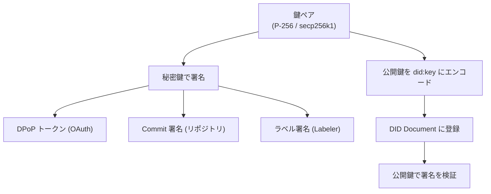
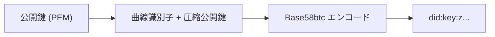
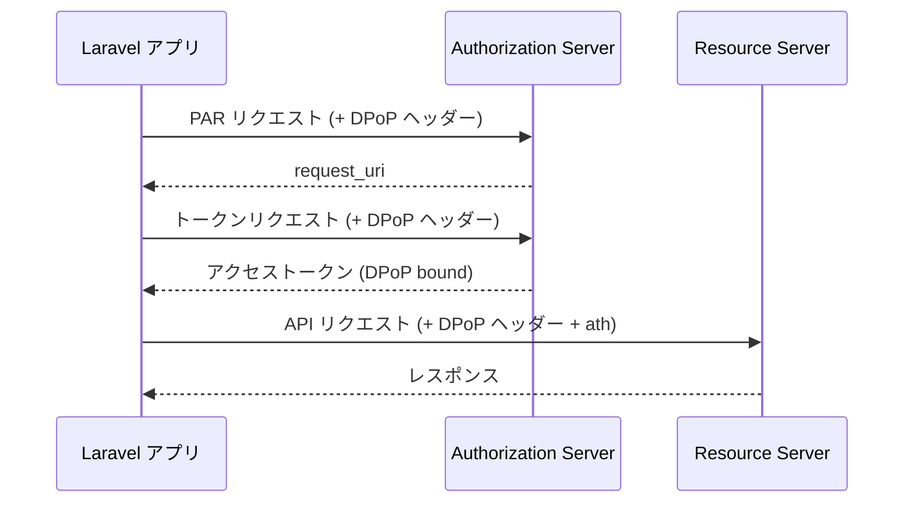

<Warning>
Crypto は高度な内部実装です。通常の投稿・フィード取得・通知などには必要ありません。AT Protocol の低レベルな署名検証や OAuth 実装を構築する場合に参照してください。
</Warning>

## AT Protocol における暗号化の概要

AT Protocol は分散型ソーシャルネットワークを実現するために、楕円曲線暗号（ECC）を全面的に採用しています。主な用途は次の通りです。



| 曲線 | アルゴリズム | 主な用途 |
|---|---|---|
| secp256r1 (P-256) | ES256 | OAuth (DPoP、Client Assertion) |
| secp256k1 (K256) | ES256K | Feed Generator、Labeler の署名検証 |

---

## 鍵ペアクラス

### AbstractKeypair

`AbstractKeypair` は P256 / K256 の共通基底クラスです。内部では [phpseclib3](https://phpseclib.com/) を使用しています。

```php
// 新しい鍵ペアを生成
$keypair = P256::create();
$keypair = K256::create();

// URL-safe Base64 エンコードの秘密鍵から読み込む
$keypair = P256::load($base64PrivateKey);

// PEM 形式で取得
$privatePem = $keypair->privatePEM();
$publicPem  = $keypair->publicPEM();

// JWK (JSON Web Key) に変換
$jwk = $keypair->toJWK();
```

### P256 (secp256r1)

```php
use Revolution\Bluesky\Crypto\P256;

$keypair = P256::create();
```

OAuth (DPoP / Client Assertion) で使用されます。`OAuthKey` は P256 を継承しており、`config('bluesky.oauth.private_key')` から秘密鍵を読み込みます。

新しい OAuth 秘密鍵を生成する Artisan コマンドも用意されています。

```bash
php artisan bluesky:new-private-key
```

### K256 (secp256k1)

```php
use Revolution\Bluesky\Crypto\K256;

$keypair = K256::create();
```

Feed Generator や Labeler の認証で使用されます。Bluesky の PDS / Relay がこの曲線で署名を検証します。

---

## DidKey

`DidKey` クラスは公開鍵を `did:key` 形式にエンコード・デコードします。

### did:key 形式とは

AT Protocol では公開鍵を `did:key:z...` という文字列で表現します。これは公開鍵に曲線識別子を付加して Base58btc でマルチベースエンコードしたものです。



### 公開鍵を did:key にエンコード

```php
use Revolution\Bluesky\Crypto\DidKey;
use Revolution\Bluesky\Crypto\K256;

$keypair = K256::create();
$publicPem = $keypair->publicPEM();

// did:key 形式に変換
$didKey = DidKey::format($publicPem);
// => "did:key:zQ3s..."
```

### DID Document から公開鍵をパース

```php
use Revolution\Bluesky\Crypto\DidKey;
use Revolution\Bluesky\Facades\Bluesky;
use Revolution\Bluesky\Support\DidDocument;

$didDoc = DidDocument::make(
    Bluesky::identity()->resolveDID('did:plc:***')->json()
);

// DID Document の publicKey (multibase) から phpseclib3 の公開鍵オブジェクトを生成
$publicKey = DidKey::parse($didDoc->publicKey());
```

---

## JsonWebToken (JWT)

`JsonWebToken` クラスは JWT のエンコード・デコードを提供します。

```php
use Revolution\Bluesky\Crypto\JsonWebToken;

// JWT を生成 (秘密鍵 PEM で署名)
$token = JsonWebToken::encode(
    payload: ['iss' => 'did:plc:***', 'aud' => 'https://bsky.social', 'exp' => time() + 60],
    key: $privatePem,
    alg: 'ES256',
);

// JWT をデコード (署名検証なし)
$payload = JsonWebToken::decode($token);
```

---

## DPoP (Demonstrated Proof of Possession)

DPoP は OAuth アクセストークンを特定のクライアント鍵ペアに紐付けるセキュリティ機構です。トークンのリプレイ攻撃を防ぎます。



`DPoP` クラスは内部で使用されており、通常は直接呼び出す必要はありません。`OAuthAgent` ミドルウェアが自動的に DPoP ヘッダーを付与します。

```php
// DPoP プルーフの生成 (OAuth トークンリクエスト用)
$proof = DPoP::authProof(
    jwk: $jsonWebKey,
    url: 'https://bsky.social/oauth/token',
    method: 'POST',
    nonce: $nonce,
);

// DPoP プルーフの生成 (API リクエスト用、ath を含む)
$proof = DPoP::apiProof(
    jwk: $jsonWebKey,
    url: 'https://api.bsky.app/xrpc/...',
    method: 'GET',
    token: $accessToken,
    nonce: $nonce,
);
```

---

## Signature (署名フォーマット変換)

AT Protocol は 64 バイトのコンパクト署名形式を使用しますが、phpseclib3 は ASN.1 DER 形式を返します。`Signature` クラスはこの変換を担います。

```php
use Revolution\Bluesky\Crypto\Signature;

// ASN.1 DER → コンパクト (64バイト)
$compact = Signature::toCompact($derSignature);

// コンパクト → ASN.1 DER
$der = Signature::fromCompact($compactSignature);
```

---

## JsonWebKey

`JsonWebKey` は JWK (JSON Web Key) を表すクラスです。DPoP プルーフの生成に使用されます。

```php
use Revolution\Bluesky\Crypto\JsonWebKey;

// 鍵ペアから JWK を生成
$jwk = $keypair->toJWK();

// または直接インスタンス化
$jwk = JsonWebKey::load(['kty' => 'EC', 'crv' => 'P-256', ...]);
```

---

## OAuthKey

`OAuthKey` は P256 を継承した OAuth 専用の鍵クラスで、`config('bluesky.oauth.private_key')` の値を秘密鍵として使用します。

```php
use Revolution\Bluesky\Crypto\OAuthKey;

// 設定から秘密鍵を読み込む
$oauthKey = OAuthKey::load();

// Client Assertion JWT の署名に使用される
$jwk = $oauthKey->toJWK();
```

通常は Bluesky Socialite 内部で自動的に処理されます。

---

## 参考リンク

- [AT Protocol: Identity](https://atproto.com/guides/identity)
- [AT Protocol: Cryptography spec](https://atproto.com/specs/cryptography)
- [phpseclib3](https://phpseclib.com/)

<Info>
Source: [src/Crypto/](https://github.com/invokable/laravel-bluesky/tree/main/src/Crypto)
</Info>
