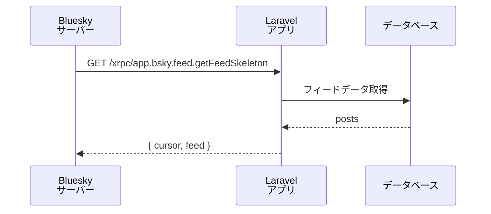

## 概要

Feed Generator は Bluesky 上で動作する「アルゴリズム的フィード」の仕組みです。特定のキーワードやユーザー条件に合わせた独自フィードを公開できます。`laravel-bluesky` を使うと、Laravel アプリケーション上に Feed Generator を簡単に実装できます。

<Info>
公式スターターキット: [bluesky-social/feed-generator](https://github.com/bluesky-social/feed-generator)
</Info>



## FeedGenerator アルゴリズムの登録

最もシンプルな使い方は `AppServiceProvider::boot()` でアルゴリズムをクロージャとして登録することです。

```php
// AppServiceProvider::boot() で登録

use Illuminate\Http\Request;
use Revolution\Bluesky\Facades\Bluesky;
use Revolution\Bluesky\FeedGenerator\FeedGenerator;

FeedGenerator::register(name: 'artisan', algo: function(int $limit, ?string $cursor, ?string $user, Request $request): array {
    // 実装は自由に決めてください。

    // API の一時的な制限により認証が必要
    $response = Bluesky::login(identifier: config('bluesky.identifier'), password: config('bluesky.password'))
                       ->searchPosts(q: '#laravel', until: $cursor, limit: $limit);

    $cursor = data_get($response->collect('posts')->last(), 'indexedAt');

    $feed = $response->collect('posts')->map(function(array $post) {
        return ['post' => data_get($post, 'uri')];
    })->toArray();

    // Request オブジェクトを使ってユーザーの状態に応じた結果を返すこともできます。
    info('user: '.$user); // リクエスト元ユーザーの DID。'did:plc:***'
    info('header', $request->header());

    return compact('cursor', 'feed');
});
```

`name` は URL セーフな文字列を使用してください。

アルゴリズムの戻り値は `cursor` と `feed` を含む配列です。

```php
[
    'cursor' => '',
    'feed' => [
       ['post' => 'at://'],
       ['post' => 'at://'],
    ],
]
```

パッケージが必要なルートはすべて自動で登録されます。

- `http://localhost/xrpc/app.bsky.feed.getFeedSkeleton?feed=at://did:web:example.com/app.bsky.feed.generator/artisan`
- `http://localhost/xrpc/app.bsky.feed.describeFeedGenerator`
- `http://localhost/.well-known/did.json`
- Service DID は現在の URL から自動生成されます（例: `did:web:example.com`）。

<Tip>
自分で決めるのは FeedGenerator の `name` と実装内容だけです。
</Tip>

## フィードの公開（コマンド作成）

Laravel アプリ上に FeedGenerator を実装しただけでは Bluesky には公開されません。`publishFeedGenerator` を呼び出すコマンドを作成して実行します。

<Steps>
  <Step title="コマンドを生成する">
    ```bash
    php artisan make:command PublishGeneratorCommand
    ```
  </Step>
  <Step title="コマンドを実装する">
    ```php
    namespace App\Console\Commands;

    use Illuminate\Console\Command;
    use Revolution\Bluesky\Facades\Bluesky;
    use Revolution\Bluesky\Record\Generator;

    class PublishGeneratorCommand extends Command
    {
        protected $signature = 'bluesky:publish-generator';

        protected $description = 'Bluesky に FeedGenerator を公開する';

        public function handle()
        {
            $generator = Generator::create(did: 'did:web:example.com', displayName: 'Feed name')
                                  ->description('Feed description');

            $res = Bluesky::login(identifier: config('bluesky.identifier'), password: config('bluesky.password'))
                          ->publishFeedGenerator(name: 'artisan', generator: $generator);

            dump($res->json());

            return 0;
        }
    }
    ```
  </Step>
  <Step title="コマンドを実行する">
    ```bash
    php artisan bluesky:publish-generator
    ```

    成功すると Bluesky プロフィールのフィード一覧にリンクが追加されます。`publishFeedGenerator` は情報を更新するだけなので何度でも実行できます。
  </Step>
</Steps>

## 複数 FeedGenerator の作成

`name` を変えて `register` を複数回呼び出すだけで複数のフィードを作成できます。

```php
// AppServiceProvider::boot()

use Revolution\Bluesky\FeedGenerator\FeedGenerator;

FeedGenerator::register(name: 'feed1', algo: function() {
    // feed1 の実装
});

FeedGenerator::register(name: 'feed2', algo: function() {
    // feed2 の実装
});
```

公開コマンドでも同様に複数回 `publishFeedGenerator` を呼び出します。

```php
// PublishGeneratorCommand

Bluesky::login(identifier: config('bluesky.identifier'), password: config('bluesky.password'));

$generator1 = Generator::create(did: 'did:web:example.com', displayName: 'Feed 1')
                       ->description('Feed 1');
Bluesky::publishFeedGenerator(name: 'feed1', generator: $generator1);

$generator2 = Generator::create(did: 'did:web:example.com', displayName: 'Feed 2')
                       ->description('Feed 2');
Bluesky::publishFeedGenerator(name: 'feed2', generator: $generator2);
```

## アルゴリズムクラスの分離

クロージャの代わりに独立したクラスを使うことで、コードを整理しやすくなります。`FeedGeneratorAlgorithm` コントラクトを実装した callable クラスを作成し、`AppServiceProvider` に登録します。

```php
// 任意の場所に作成

namespace App\FeedGenerator;

use Illuminate\Http\Request;
use Revolution\Bluesky\Facades\Bluesky;
use Revolution\Bluesky\Contracts\FeedGeneratorAlgorithm;

class ArtisanFeed implements FeedGeneratorAlgorithm
{
    public function __invoke(int $limit, ?string $cursor, ?string $user, Request $request): array
    {
        // API の一時的な制限により認証が必要
        $response = Bluesky::login(identifier: config('bluesky.identifier'), password: config('bluesky.password'))
            ->searchPosts(q: '#laravel', until: $cursor, limit: $limit);

        $cursor = data_get($response->collect('posts')->last(), 'indexedAt');

        $feed = $response->collect('posts')->map(function (array $post) {
            return ['post' => data_get($post, 'uri')];
        })->toArray();

        info('user: '.$user);
        info('header', $request->header());

        return compact('cursor', 'feed');
    }
}
```

```php
// AppServiceProvider::boot()

use Revolution\Bluesky\FeedGenerator\FeedGenerator;
use App\FeedGenerator\ArtisanFeed;

FeedGenerator::register(name: 'artisan', algo: ArtisanFeed::class);
```

## 認証

公式スターターキットの認証機能はデフォルトで有効になっています。無効化するには `validateAuthUsing` に単純にユーザー DID を返すクロージャを渡します。

```php
// AppServiceProvider::boot()

use Illuminate\Http\Request;
use Revolution\Bluesky\Crypto\JsonWebToken;
use Revolution\Bluesky\FeedGenerator\FeedGenerator;

FeedGenerator::validateAuthUsing(function (?string $jwt, Request $request): ?string {
    [, $payload] = JsonWebToken::explode($jwt);
    return data_get($payload, 'iss');
});
```

<Warning>
フィードがアカウントの「言語設定」に影響されます。FeedGenerator が投稿を取得しているにもかかわらず Bluesky 上でフィードが表示されない場合は、アカウントの言語設定を確認してください。
</Warning>

## 高度な使い方

Artisan コマンドとタスクスケジュールを使って投稿をデータベースに保存し、アルゴリズムでは DB から取得するだけにすると、API 呼び出しなしで高速なフィードを実現できます。

```php
// アルゴリズムで DB からフィードを返す例

FeedGenerator::register(name: 'cached-feed', algo: function(int $limit, ?string $cursor): array {
    $query = \App\Models\Post::query()
        ->orderByDesc('indexed_at')
        ->limit($limit);

    if ($cursor) {
        $query->where('indexed_at', '<', $cursor);
    }

    $posts = $query->get();

    $cursor = $posts->last()?->indexed_at;

    $feed = $posts->map(fn ($post) => ['post' => $post->uri])->toArray();

    return compact('cursor', 'feed');
});
```

```php
// スケジュールで定期的に投稿を収集する例（routes/console.php）

use Illuminate\Support\Facades\Schedule;

Schedule::command('bluesky:collect-posts')->everyFiveMinutes();
```

<Info>
Source: [docs/feed-generator.md](https://github.com/invokable/laravel-bluesky/blob/main/docs/feed-generator.md)
</Info>
