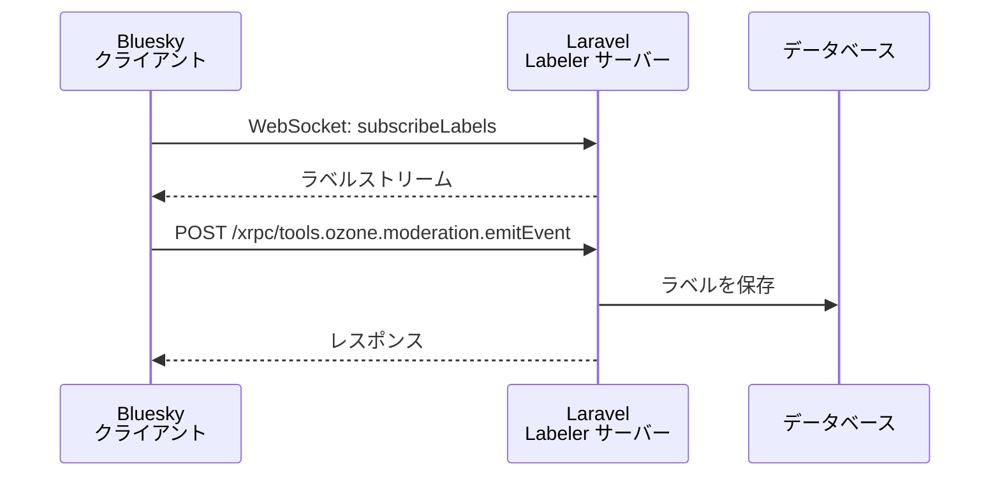

<Warning>
Labeler は上級者向け機能です。サーバーとして動かし続ける必要があるため、Laravel Forge を使っているか、自力でサーバーを構築できる方を対象にしています。Laravel 初心者には推奨しません。サポートはありません。

**Laravel Cloud は非対応です。** Labeler は WebSocket サーバーとして常時起動する必要がありますが、Laravel Cloud の制限により WebSocket サーバーを起動することができません。
</Warning>

## Labeler とは

Labeler は AT Protocol（Bluesky）上でコンテンツにラベルを付けるサービスです。モデレーション、コンテンツ分類、カスタムフィルタリングなどに活用できます。

Labeler の概念を事前に理解しておくことが必要です。

- [AT Protocol: Label spec](https://atproto.com/specs/label)
- [Bluesky's Moderation Architecture](https://docs.bsky.app/blog/blueskys-moderation-architecture)

他言語向けのスターターキットも参考になります。

- [skyware.js.org — Labeler guide](https://skyware.js.org/guides/labeler/introduction/getting-started/)
- [aliceisjustplaying/labeler-starter-kit-bsky](https://github.com/aliceisjustplaying/labeler-starter-kit-bsky)

サンプル実装:

- [laralabeler.bsky.social](https://bsky.app/profile/laralabeler.bsky.social)
- [invokable/laralabeler](https://github.com/invokable/laralabeler)



## 準備

Labeler を動かすには以下が必要です。

- **Labeler 専用の新しい Bluesky アカウント**（普段使いのアカウントは使用しないこと）
- **Labeler 専用の新しい Laravel プロジェクト**（プロジェクトは分けることを推奨）
- **（サブ）ドメイン**
- **VPS や AWS EC2 などの本番 Linux サーバー**（Laravel Cloud・Laravel Vapor・Vercel は不可）

<Info>
共有サーバーしか使えない場合は Labeler の運用は困難です。
</Info>

## 追加パッケージのインストール

```bash
composer require workerman/workerman revolt/event-loop
```

## 設定

最初に秘密鍵を生成します。

```bash
php artisan bluesky:labeler:new-private-key
```

生成した秘密鍵と関連する設定値を `.env` に追加します。

```dotenv
BLUESKY_LABELER_DID=did:plc:***
BLUESKY_LABELER_IDENTIFIER=***.bsky.social
BLUESKY_LABELER_APP_PASSWORD=

BLUESKY_LABELER_PRIVATE_KEY=""
```

## Labeler クラスの作成

`AbstractLabeler` を継承した独自の Labeler クラスを作成します。ファイルは任意の場所に置けます。

```php
namespace App\Labeler;

use Revolution\Bluesky\Labeler\AbstractLabeler;

readonly class ArtisanLabeler extends AbstractLabeler
{
    // 各メソッドを実装する
}
```

パッケージが Labeler の処理の大部分を担うので、カスタマイズが必要な部分だけを実装します。

<Info>
サンプル実装: [ArtisanLabeler.php](https://github.com/invokable/laralabeler/blob/main/app/Labeler/ArtisanLabeler.php)
</Info>

### labels()

ラベルの定義を返します。skyware スターターキットの定数定義が参考になります。

```php
use Revolution\Bluesky\Labeler\LabelDefinition;
use Revolution\Bluesky\Labeler\LabelLocale;

public function labels(): array
{
    return [
        new LabelDefinition(
            identifier: 'artisan',
            locales: [
                new LabelLocale(
                    lang: 'en',
                    name: 'artisan',
                    description: 'Web artisan',
                ),
            ],
            severity: 'inform',
            blurs: 'none',
            defaultSetting: 'warn',
            adultOnly: false,
        ),
    ];
}
```

### subscribeLabels()

WebSocket 接続直後に呼び出されます。`SubscribeLabelResponse` をイテレータで返します。

```php
use Revolution\Bluesky\Labeler\Labeler;
use Revolution\Bluesky\Labeler\LabelerException;
use Revolution\Bluesky\Labeler\Response\SubscribeLabelResponse;

/**
 * @return iterable<SubscribeLabelResponse>
 */
public function subscribeLabels(?int $cursor): iterable
{
    if (is_null($cursor)) {
        return null;
    }

    // エラーレスポンスを返す場合は必ず LabelerException をスローする
    if ($cursor > Label::max('id')) {
        throw new LabelerException('FutureCursor', 'Cursor is in the future');
    }

    foreach (Label::oldest()->where('id', '>', $cursor)->lazy() as $label) {
        $arr = $label->toArray();
        $arr = Labeler::formatLabel($arr);

        yield new SubscribeLabelResponse(
            seq: $label->id,
            labels: [$arr],
        );
    }
}
```

### emitEvent()

ラベルを追加または削除するリクエストが来たときに呼び出されます。`UnsignedLabel` をイテレータで返します。

```php
use Illuminate\Http\Request;
use Revolution\Bluesky\Labeler\LabelerException;
use Revolution\Bluesky\Labeler\UnsignedLabel;

/**
 * @return iterable<UnsignedLabel>
 *
 * @link https://docs.bsky.app/docs/api/tools-ozone-moderation-emit-event
 */
public function emitEvent(Request $request, ?string $did, ?string $token): iterable
{
    $type = data_get($request->input('event'), '$type');
    if ($type !== 'tools.ozone.moderation.defs#modEventLabel') {
        throw new LabelerException('InvalidRequest', 'Unsupported event type');
    }

    $subject = $request->input('subject');
    $uri = data_get($subject, 'uri', data_get($subject, 'did'));
    $cid = data_get($subject, 'cid');

    $createLabelVals = (array) data_get($request->input('event'), 'createLabelVals');
    $negateLabelVals = (array) data_get($request->input('event'), 'negateLabelVals');

    foreach ($createLabelVals as $val) {
        yield new UnsignedLabel(
            uri: $uri,
            cid: $cid,
            val: $val,
            src: config('bluesky.labeler.did'),
            cts: now()->micro(0)->toISOString(),
        );
    }

    foreach ($negateLabelVals as $val) {
        yield new UnsignedLabel(
            uri: $uri,
            cid: $cid,
            val: $val,
            src: config('bluesky.labeler.did'),
            cts: now()->micro(0)->toISOString(),
            neg: true,
        );
    }
}
```

### saveLabel()

署名済みラベルをデータベースに保存します。`SavedLabel` を返します。

```php
use Revolution\Bluesky\Labeler\SavedLabel;
use Revolution\Bluesky\Labeler\SignedLabel;

public function saveLabel(SignedLabel $signed, string $sign): ?SavedLabel
{
    // App\Models\Label は独自に作成する
    $saved = Label::create($signed->toArray());

    return new SavedLabel(
        $saved->id,
        $signed,
    );
}
```

マイグレーションと Eloquent モデルはパッケージ内のサンプルを参照してください。

- [マイグレーション](https://github.com/invokable/laravel-bluesky/blob/main/workbench/database/migrations/2024_12_31_000000_create_labels_table.php)
- [Eloquent モデル](https://github.com/invokable/laravel-bluesky/blob/main/workbench/app/Models/Label.php)

### createReport()

ユーザーからアピールなどが送られてきたときに呼び出されます。

```php
use Illuminate\Http\Request;

/**
 * @link https://docs.bsky.app/docs/api/com-atproto-moderation-create-report
 */
public function createReport(Request $request): array
{
    // レポートを処理して配列を返す
    // 必須フィールド: id, reasonType, reason, subject, reportedBy, createdAt

    return [
        'id' => 1,
        'reasonType' => $request->input('reasonType'),
        'reason' => $request->input('reason', ''),
        'subject' => $request->input('subject'),
        'reportedBy' => '',
        'createdAt' => now()->toISOString(),
    ];
}
```

### queryLabels()

WebSocket の代わりに HTTP API 経由でラベルをクエリします。Bluesky 公式では使用されず、サードパーティが使用します。不要な場合は空配列を返します。

```php
use Illuminate\Http\Request;

/**
 * @link https://docs.bsky.app/docs/api/com-atproto-label-query-labels
 */
public function queryLabels(Request $request): array
{
    return [];
}
```

## AppServiceProvider への登録

作成した Labeler クラスを `AppServiceProvider::boot()` に登録します。

```php
use Revolution\Bluesky\Labeler\Labeler;
use App\Labeler\ArtisanLabeler;

class AppServiceProvider extends ServiceProvider
{
    public function boot(): void
    {
        Labeler::register(ArtisanLabeler::class);
    }
}
```

## アカウントのセットアップ

Labeler アカウントとして初期化します。

<Warning>
このコマンドではアプリパスワードではなく実際のアカウントパスワードを入力します。処理中に「PLC Update Operation Requested」というメール確認が届くので、コマンドの指示に従って入力してください。
</Warning>

```bash
php artisan bluesky:labeler:setup
```

エンドポイント URL が正しく設定されていればローカル環境から実行することもできます。

## ラベル定義の宣言

Labeler アカウントにラベル定義を登録します。

```bash
php artisan bluesky:labeler:declare-labels
```

このコマンドもローカル環境から実行できます。

## その他のコマンド

ラベル定義の削除:

```bash
php artisan bluesky:labeler:delete-labels
```

Labeler アカウントを通常アカウントに戻す:

```bash
php artisan bluesky:labeler:restore
```

## Laravel Forge での実行

SSL を有効化した後、以下の設定で Labeler サーバーを起動します。

### nginx 設定

Forge の nginx 設定に 3 つの `location` ブロックを追加します。

```nginx
# WebSocket: ラベル購読
location /xrpc/com.atproto.label.subscribeLabels
{
    proxy_pass http://127.0.0.1:7000;
    proxy_http_version 1.1;
    proxy_set_header Upgrade $http_upgrade;
    proxy_set_header Connection "Upgrade";
    proxy_set_header X-Real-IP $remote_addr;
}

# HTTP: イベント送信
location /xrpc/tools.ozone.moderation.emitEvent
{
    proxy_pass http://127.0.0.1:7001;
    proxy_http_version 1.1;
    proxy_set_header X-Real-IP $remote_addr;
    proxy_set_header Connection "";
}

# ヘルスチェック
location /xrpc/_health
{
    proxy_pass http://127.0.0.1:7001;
    proxy_http_version 1.1;
    proxy_set_header X-Real-IP $remote_addr;
    proxy_set_header Connection "";
}
```

### デプロイスクリプト

デプロイ時に Labeler サーバーを停止します。停止後は Supervisor が自動的に再起動します。

```bash
# 通常のデプロイ手順
$FORGE_PHP artisan bluesky:labeler:server stop

# 上記が動作しない場合は直接デーモンを再起動
sudo -S supervisorctl restart daemon-{id}:*
```

### バックグラウンドプロセス（デーモン）の設定

Forge のバックグラウンドプロセス設定画面で、Queue Worker タブではなく **Custom** タブを選択します。

**コマンド:**

```bash
php artisan bluesky:labeler:server start
```

Jetstream や Firehose と同時に起動する場合はオプションを指定します。
`bluesky:ws` や `bluesky:firehose` コマンドと同時実行はできません。

```bash
# Jetstream と一緒に起動する場合
php artisan bluesky:labeler:server start --jetstream

# 特定のコレクションをフィルタリングする場合
php artisan bluesky:labeler:server start --jetstream -C app.bsky.graph.follow -C app.bsky.feed.like

# Firehose と一緒に起動する場合
php artisan bluesky:labeler:server start --firehose
```

## ラベルの追加

どのようにラベルを付けるかはアプリケーションの実装次第です。サンプルでは Laravel のイベント機能を使い「フォローされたとき」にラベルを付けています。

```php
// app/Listeners/FollowListener.php のイメージ

use Revolution\Bluesky\Facades\Bluesky;

public function handle(object $event): void
{
    $followerDid = $event->did;

    // Bluesky の Ozone API 経由でラベルを付与
    Bluesky::login(
        identifier: config('bluesky.labeler.identifier'),
        password: config('bluesky.labeler.password'),
    )->addLabels(
        subject: $followerDid,
        labels: ['artisan'],
    );
}
```

イベント取りこぼしに備えて、タスクスケジュールでもラベル付けを行うことを推奨します。

<Info>
Source: [docs/labeler.md](https://github.com/invokable/laravel-bluesky/blob/main/docs/labeler.md)  
Sample: [invokable/laralabeler](https://github.com/invokable/laralabeler)
</Info>
