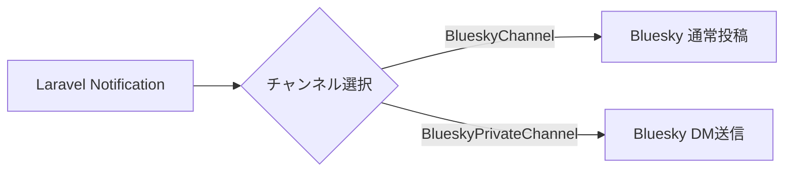

## 概要

`laravel-bluesky` は Laravel の Notification システムに統合できます。`BlueskyChannel` で通常投稿、`BlueskyPrivateChannel` でダイレクトメッセージ(DM)を送れます。



## 利用可能なチャンネル

| チャンネル | 用途 |
|---|---|
| `BlueskyChannel` | 通常の公開投稿として通知する |
| `BlueskyPrivateChannel` | 受信者へのDM(プライベートチャット)として通知する |

## Notification クラス

### BlueskyChannel

`via()` で `BlueskyChannel::class` を指定し、`toBluesky()` で送信内容を返します。

```php
use Illuminate\Notifications\Notification;
use Revolution\Bluesky\Notifications\BlueskyChannel;
use Revolution\Bluesky\Record\Post;
use Revolution\Bluesky\RichText\TextBuilder;
use Revolution\Bluesky\Embed\External;

class TestNotification extends Notification
{
    public function via(object $notifiable): array
    {
        return [
            BlueskyChannel::class
        ];
    }

    public function toBluesky(object $notifiable): Post
    {
        $external = External::create(title: 'Title', description: 'test', uri: 'https://');

        return Post::build(function (TextBuilder $builder) {
                   $builder->text('test')
                           ->newLine()
                           ->tag('#Laravel');
        })->embed($external);
    }
}
```

`Post` の使い方は [Basic client](/jp/packages/laravel-bluesky/basic-client) と同じです。TextBuilder、Embed なども同様に利用できます。

### BlueskyPrivateChannel

`BlueskyPrivateMessage` は `Post` とほぼ同じですが、text・facets・embed のみ対応しています。embed は `QuoteRecord` のみサポートします。

```php
use Illuminate\Notifications\Notification;
use Revolution\Bluesky\Notifications\BlueskyPrivateChannel;
use Revolution\Bluesky\Notifications\BlueskyPrivateMessage;
use Revolution\Bluesky\RichText\TextBuilder;
use Revolution\Bluesky\Embed\QuoteRecord;
use Revolution\Bluesky\Types\StrongRef;

class TestNotification extends Notification
{
    public function via(object $notifiable): array
    {
        return [
            BlueskyPrivateChannel::class
        ];
    }

    public function toBlueskyPrivate(object $notifiable): BlueskyPrivateMessage
    {
        $quote = QuoteRecord::create(StrongRef::to(uri: 'at://', cid: 'cid'));

        return BlueskyPrivateMessage::build(function (TextBuilder $builder) {
                   $builder->text('test')
                           ->newLine()
                           ->tag('#Laravel');
        })->embed($quote);
    }
}
```

## オンデマンド通知

モデルを使わずにその場で通知先を指定する場合は `Notification::route()` を使います。

### BlueskyChannel

```php
use Illuminate\Support\Facades\Notification;
use Revolution\Bluesky\Notifications\BlueskyRoute;
use Revolution\Bluesky\Session\OAuthSession;
use App\Models\User;

// App password
Notification::route('bluesky', BlueskyRoute::to(identifier: config('bluesky.identifier'), password: config('bluesky.password')))
            ->notify(new TestNotification());

// OAuth
$user = User::find(1);
$session = OAuthSession::create([
    'did' => $user->did,
    'iss' => $user->iss,
    'refresh_token' => $user->refresh_token,
]);
Notification::route('bluesky', BlueskyRoute::to(oauth: $session))
            ->notify(new TestNotification());
```

### BlueskyPrivateChannel

DM には `receiver`(送信先の DID またはハンドル)の指定が必須です。また、受信者側でDM受信が有効になっている必要があります。

- App password の場合は DM 送信権限が必要です。
- OAuth の場合は `transition:chat.bsky` スコープが必要です。

```php
use Illuminate\Support\Facades\Notification;
use Revolution\Bluesky\Notifications\BlueskyRoute;
use Revolution\Bluesky\Session\OAuthSession;
use App\Models\User;

// App password
Notification::route('bluesky-private', BlueskyRoute::to(identifier: config('bluesky.identifier'), password: config('bluesky.password'), receiver: 'did or handle'))
            ->notify(new TestNotification());

// OAuth
$user = User::find(1);
$session = OAuthSession::create([
    'did' => $user->did,
    'iss' => $user->iss,
    'refresh_token' => $user->refresh_token,
]);
Notification::route('bluesky-private', BlueskyRoute::to(oauth: $session, receiver: 'did or handle'))
            ->notify(new TestNotification());
```

<Info>
Bluesky では自分自身に DM を送ることができません。自分宛に通知したい場合は、送信用に別アカウントを用意してください。
</Info>

```php
// 自分宛に DM を送る場合

use Illuminate\Support\Facades\Notification;
use Revolution\Bluesky\Notifications\BlueskyRoute;

Notification::route('bluesky-private', BlueskyRoute::to(identifier: 'sender identifier', password: 'sender password', receiver: 'your did or handle'))
            ->notify(new TestNotification());
```

個人用途など、常に同じ送信者・受信者を使う場合は `.env` で設定できます。送信専用アカウントを作成してください。

```dotenv
BLUESKY_SENDER_IDENTIFIER=sender did or handle
BLUESKY_SENDER_APP_PASSWORD=sender password
BLUESKY_RECEIVER=your did or handle
```

```php
Notification::route('bluesky-private', BlueskyRoute::to(
    identifier: config('bluesky.notification.private.sender.identifier'),
    password: config('bluesky.notification.private.sender.password'),
    receiver: config('bluesky.notification.private.receiver'),
))->notify(new TestNotification());
```

## ユーザー通知

`Notifiable` トレイトを使うモデルに通知ルーティングを定義します。

### BlueskyChannel

```php
use Illuminate\Notifications\Notifiable;
use Revolution\Bluesky\Notifications\BlueskyRoute;
use Revolution\Bluesky\Session\OAuthSession;

class User
{
    use Notifiable;

    public function routeNotificationForBluesky($notification): BlueskyRoute
    {
        // App password
        return BlueskyRoute::to(identifier: $this->bluesky_identifier, password: $this->bluesky_password);

        // OAuth
        $session = OAuthSession::create([
            'did' => $this->did,
            'iss' => $this->iss,
            'refresh_token' => $this->refresh_token,
        ]);
        return BlueskyRoute::to(oauth: $session);
    }
}

$user->notify(new TestNotification());
```

### BlueskyPrivateChannel

```php
use Illuminate\Notifications\Notifiable;
use Revolution\Bluesky\Notifications\BlueskyRoute;
use Revolution\Bluesky\Session\OAuthSession;

class User
{
    use Notifiable;

    public function routeNotificationForBlueskyPrivate($notification): BlueskyRoute
    {
        // App password
        return BlueskyRoute::to(identifier: $this->bluesky_identifier, password: $this->bluesky_password, receiver: $this->receiver);

        // OAuth
        $session = OAuthSession::create([
            'did' => $this->did,
            'iss' => $this->iss,
            'refresh_token' => $this->refresh_token,
        ]);
        return BlueskyRoute::to(oauth: $session, receiver: $this->receiver);
    }
}

$user->notify(new TestNotification());
```

ユーザー自身を受信者にすることもできます。

```php
public function routeNotificationForBlueskyPrivate($notification): BlueskyRoute
{
    // App password
    return BlueskyRoute::to(identifier: 'sender identifier', password: 'sender password', receiver: $this->did);
}
```

## BlueskyRoute

認証方式(App password または OAuth)によって指定方法が異なります。名前付き引数を使うことを推奨します。

```php
use Revolution\Bluesky\Notifications\BlueskyRoute;
use Revolution\Bluesky\Session\OAuthSession;

// App password
BlueskyRoute::to(identifier: config('bluesky.identifier'), password: config('bluesky.password'))

// OAuth
$session = OAuthSession::create([
    'did' => '...',
    'iss' => '...',
    'refresh_token' => '...',
]);
BlueskyRoute::to(oauth: $session);
```

<Tip>
自分のアカウントへの通知だけであれば **App password** が最もシンプルです。refresh_token の更新を考慮する必要がなく、`.env` を設定するだけで使えます。

```dotenv
BLUESKY_IDENTIFIER=
BLUESKY_APP_PASSWORD=
```
</Tip>

## 通知結果の確認

通常の Laravel と同じように `NotificationSent` イベントで通知後のレスポンスを確認できます。

```php
use Illuminate\Notifications\Events\NotificationSent;
use Illuminate\Http\Client\Response;

class Listener
{
    public function handle(NotificationSent $event): void
    {
        // $event->channel  BlueskyChannel
        // $event->notifiable
        // $event->notification
        // $event->response  null|Response
    }
}
```

<Info>
Source: [docs/notification.md](https://github.com/invokable/laravel-bluesky/blob/main/docs/notification.md)
</Info>
