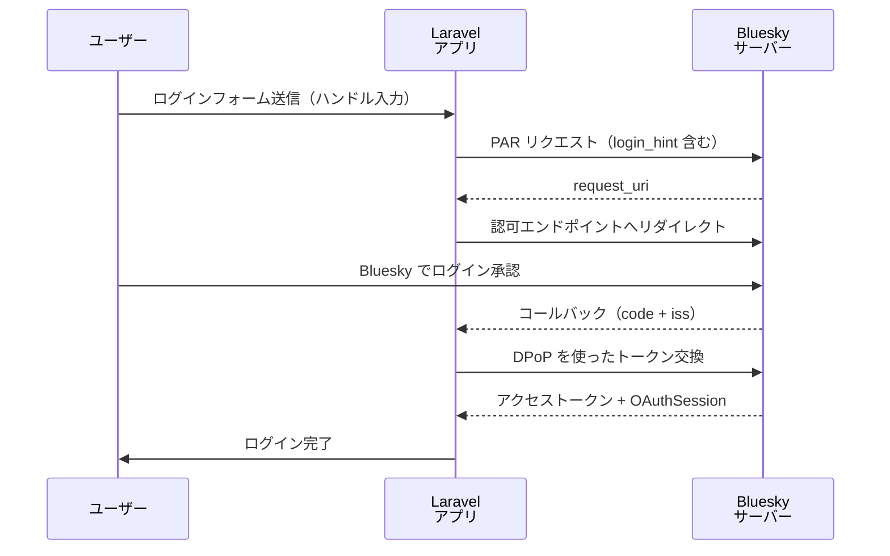

## 概要

Bluesky の OAuth は AT Protocol に基づいており、GitHub や Google などの通常の Socialite プロバイダーとは大きく異なります。

<Warning>
Bluesky の OAuth は他の Socialite プロバイダーとは実装が根本的に異なります。DPoP（Demonstrated Proof of Possession）と PAR（Pushed Authorization Requests）エンドポイントを使用します。`client_secret` は不要で、代わりに秘密鍵を使います。
</Warning>

### 通常の OAuth との違い

| 項目 | 通常の Socialite | Bluesky Socialite |
| --- | --- | --- |
| 認証方式 | OAuth 2.0 | AT Protocol OAuth（DPoP） |
| クライアント識別 | `client_id` + `client_secret` | 秘密鍵 + `client-metadata.json` URL |
| `client_id` | 登録済みの固定文字列 | `client-metadata.json` の URL |
| ユーザー識別子 | メールアドレス等 | DID（`did:plc:...`）またはハンドル |
| ログインヒント | 不要 | ハンドル / DID / PDS URL を渡せる |

### 認証フロー



## インストールと設定

### 秘密鍵の作成

まず秘密鍵を生成します。これは Bluesky への登録なしに行えます。

```bash
php artisan bluesky:new-private-key
```

```
Please set this private key in .env

BLUESKY_OAUTH_PRIVATE_KEY="...url-safe base64 encoded key..."
```

出力された値を `.env` にコピーします。

```dotenv
BLUESKY_OAUTH_PRIVATE_KEY="..."
```

<Info>
Bluesky の場合、`client_id` や `client_secret` の登録は不要です。秘密鍵の設定だけで OAuth 認証を使えます。
</Info>

### ローカル開発

デフォルトでは `http://localhost` と `http://127.0.0.1:8000/` が設定されているため、ローカル開発では追加の設定は不要です。

```dotenv
# ポートを変更している場合のみ設定
BLUESKY_CLIENT_ID=
BLUESKY_REDIRECT=http://127.0.0.1:8080/
```

### 本番環境

ルート名 `bluesky.oauth.redirect` が存在する場合、`.env` への設定は不要です。デフォルトのルート名を変更した場合は設定します。

```dotenv
BLUESKY_REDIRECT=/bluesky/callback
```

## ルート設定

コールバックルートのルート名は `bluesky.oauth.redirect` を推奨します。パッケージがこの名前を内部で使用します。

```php
// routes/web.php

use Illuminate\Support\Facades\Route;
use App\Http\Controllers\SocialiteController;

Route::get('login', [SocialiteController::class, 'login'])->name('login');
Route::match(['get', 'post'], 'redirect', [SocialiteController::class, 'redirect']);
Route::get('bluesky/callback', [SocialiteController::class, 'callback'])
     ->name('bluesky.oauth.redirect');
```

### ローカル開発でのコールバック処理

ローカル開発中は、Bluesky からのコールバック URL が `http://127.0.0.1:8000/` に固定されます。ルートレベルで振り分けると便利です。

```php
use Illuminate\Http\Request;
use Illuminate\Support\Facades\Route;

Route::get('/', function (Request $request) {
    if (app()->isLocal() && $request->has('iss')) {
        return to_route('bluesky.oauth.redirect', $request->query());
    }

    // ...
});
```

## コントローラー実装

```php
<?php

namespace App\Http\Controllers;

use App\Models\User;
use Illuminate\Http\Request;
use Laravel\Socialite\Facades\Socialite;
use Revolution\Bluesky\Session\OAuthSession;

class SocialiteController extends Controller
{
    public function login(Request $request)
    {
        // ログインヒントを入力するフォームページ
        return view('login');
    }

    public function redirect(Request $request)
    {
        // ハンドル、DID、または PDS URL を login_hint として渡せる（省略可）
        $hint = $request->input('login_hint');
        $request->session()->put('hint', $hint);

        return Socialite::driver('bluesky')
                        ->hint($hint)
                        ->redirect();
    }

    public function callback(Request $request)
    {
        if ($request->missing('code')) {
            dd($request);
        }

        $hint = $request->session()->pull('hint');

        /** @var \Laravel\Socialite\Two\User $user */
        $user = Socialite::driver('bluesky')
                         ->hint($hint)
                         ->user();

        /** @var OAuthSession $session */
        $session = $user->session;

        // OAuthSession を Laravel セッションに保存
        $request->session()->put('bluesky_session', $session->toArray());

        $loginUser = User::updateOrCreate([
            'did' => $session->did(),
        ], [
            'iss'           => $session->issuer(),
            'handle'        => $session->handle(),
            'name'          => $session->displayName(),
            'avatar'        => $session->avatar(),
            'access_token'  => $session->token(),
            'refresh_token' => $session->refresh(),
        ]);

        auth()->login($loginUser, true);

        return to_route('bluesky.dashboard');
    }
}
```

## ユーザー情報（OAuthSession）

`$user->session` から取得できる `OAuthSession` の主なメソッドを示します。

| メソッド | 説明 | 例 |
| --- | --- | --- |
| `did()` | Bluesky DID | `did:plc:xxxxxx` |
| `handle()` | Bluesky ハンドル | `alice.bsky.social` |
| `displayName()` | 表示名 | `Alice` |
| `avatar()` | アバター URL | `https://...` |
| `issuer()` | PDS の URL | `https://bsky.social` |
| `token()` | アクセストークン | |
| `refresh()` | リフレッシュトークン | |

全プロパティを確認するには `toArray()` を使います。

```php
/** @var OAuthSession $session */
dump($session->toArray());
```

## データベース設定

`users` テーブルに Bluesky 固有のカラムを追加します。DID が Bluesky ユーザーの一意識別子です。

```php
// database/migrations/xxxx_add_bluesky_columns_to_users_table.php

Schema::table('users', function (Blueprint $table) {
    $table->string('did')->nullable()->unique();
    $table->string('iss')->nullable();
    $table->string('handle')->nullable();
    $table->string('avatar')->nullable();
    $table->text('access_token')->nullable();
    $table->text('refresh_token')->nullable();
});
```

## OAuthSession の再利用

セッションに保存した OAuthSession を使って API を呼び出せます。

```php
use Revolution\Bluesky\Facades\Bluesky;
use Revolution\Bluesky\Session\OAuthSession;

$session = OAuthSession::create(session('bluesky_session'));

$timeline = Bluesky::withToken($session)->getTimeline();
```

Job や Console など Laravel セッションが使えない場合は、DBからデータを取得して OAuthSession を組み立てます。

```php
use Revolution\Bluesky\Facades\Bluesky;
use Revolution\Bluesky\Session\OAuthSession;

$session = OAuthSession::create([
    'did'           => $user->did,
    'refresh_token' => $user->refresh_token,
    // bsky.social 以外のアカウントは iss も指定
    // 'iss'        => $user->iss,
]);

$timeline = Bluesky::withToken($session)
                   ->refreshSession()
                   ->getTimeline();
```

## トークンの自動更新

リフレッシュトークンは一度しか使えないため、更新後は必ずDBに保存し直す必要があります。`OAuthSessionUpdated` イベントを使います。

```bash
php artisan make:listener OAuthSessionUpdatedListener
```

```php
namespace App\Listeners;

use App\Models\User;
use Revolution\Bluesky\Events\OAuthSessionUpdated;

class OAuthSessionUpdatedListener
{
    public function handle(OAuthSessionUpdated $event): void
    {
        if (empty($event->session->did())) {
            return;
        }

        session()->put('bluesky_session', $event->session->toArray());

        User::firstWhere('did', $event->session->did())
            ->fill([
                'iss'           => $event->session->issuer(),
                'handle'        => $event->session->handle(),
                'name'          => $event->session->displayName(),
                'avatar'        => $event->session->avatar(),
                'access_token'  => $event->session->token(),
                'refresh_token' => $event->session->refresh(),
            ])->save();
    }
}
```

リフレッシュ開始時には `OAuthSessionRefreshing` イベントも発行されます。この時点で `refresh_token` が無効になるため、DBから削除しておくと安全です。

```php
use Revolution\Bluesky\Events\OAuthSessionRefreshing;

public function handle(OAuthSessionRefreshing $event): void
{
    if (empty($event->session->did())) {
        return;
    }

    User::firstWhere('did', $event->session->did())
        ->fill(['refresh_token' => ''])
        ->save();
}
```

## WithBluesky トレイト

User モデルに `WithBluesky` トレイトを追加し `tokenForBluesky()` を実装すると、`$user->bluesky()` で認証済みクライアントを取得できます。

```php
namespace App\Models;

use Illuminate\Foundation\Auth\User as Authenticatable;
use Revolution\Bluesky\Session\OAuthSession;
use Revolution\Bluesky\Traits\WithBluesky;

class User extends Authenticatable
{
    use WithBluesky;

    protected function tokenForBluesky(): OAuthSession
    {
        return OAuthSession::create([
            'did'           => $this->did,
            'refresh_token' => $this->refresh_token,
            'iss'           => $this->iss,
        ]);
    }
}
```

```php
$profile = auth()->user()
                 ->bluesky()
                 ->refreshSession()
                 ->getProfile();
```

## client-metadata のカスタマイズ

パッケージは `bluesky.oauth.client-metadata` と `bluesky.oauth.jwks` のルートを自動で定義します。通常変更は不要ですが、`OAuthConfig` でカスタマイズできます。

```php
// AppServiceProvider

use Revolution\Bluesky\Socialite\OAuthConfig;

public function boot(): void
{
    OAuthConfig::clientMetadataUsing(function () {
        return collect(config('bluesky.oauth.metadata'))
            ->merge([
                'client_id'    => route('bluesky.oauth.client-metadata'),
                'jwks_uri'     => route('bluesky.oauth.jwks'),
                'redirect_uris' => [url('bluesky/callback')],
            ])
            ->reject(fn ($item) => is_null($item))
            ->toArray();
    });
}
```

## 未認証時の動作

`OAuthSession` が null またはリフレッシュトークンがない場合、`Unauthenticated` 例外がスローされ `login` ルートへリダイレクトされます。

```php
// bootstrap/app.php
->withMiddleware(function (Middleware $middleware) {
    $middleware->redirectGuestsTo('/bluesky/login');
})
```

<Info>
Source: [docs/socialite.md](https://github.com/invokable/laravel-bluesky/blob/main/docs/socialite.md)
</Info>
