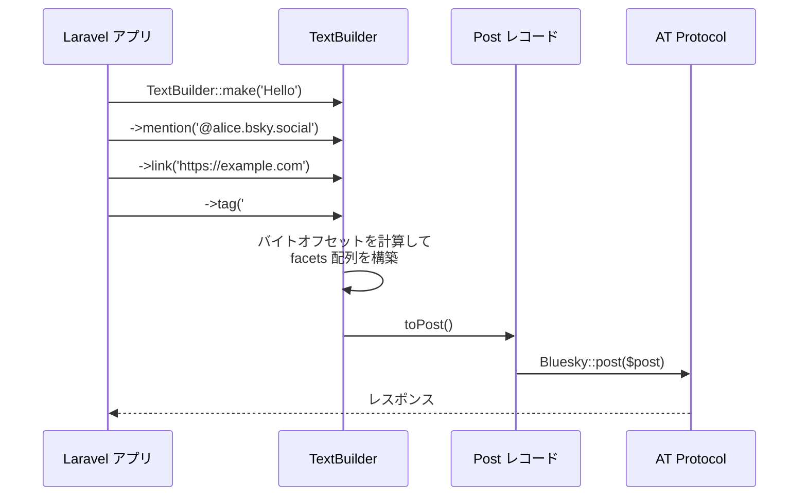

## TextBuilder とは

`TextBuilder` は、Bluesky の AT Protocol が定義する **facets**（リッチテキスト注釈）をメソッドチェーンで組み立てるためのクラスです。

Bluesky の投稿本文はプレーンテキストですが、メンション・リンク・ハッシュタグを表示するためにはテキスト中の位置（バイトオフセット）と種別を示す `facets` 配列を一緒に送る必要があります。`TextBuilder` はこのオフセット計算と配列構築を自動的に行います。



## 基本的なテキスト作成

### TextBuilder::make()

`TextBuilder::make()` で初期テキストを指定してインスタンスを生成します。初期テキストは省略可能です。

```php
use Revolution\Bluesky\RichText\TextBuilder;

$builder = TextBuilder::make(text: 'Hello Bluesky');
```

### text()

`text()` でテキストを末尾に追加します。

```php
$builder = TextBuilder::make()
    ->text('Hello ')
    ->text('Bluesky');

// $builder->text === 'Hello Bluesky'
```

### newLine()

改行を追加します。`count` で行数を指定できます（デフォルト: 1）。

```php
$builder = TextBuilder::make('1行目')
    ->newLine()
    ->text('2行目')
    ->newLine(count: 2)
    ->text('4行目');
```

### toPost()

`TextBuilder` インスタンスを `Post` レコードに変換します。`Bluesky::post()` に直接渡せます。

```php
use Revolution\Bluesky\Facades\Bluesky;
use Revolution\Bluesky\RichText\TextBuilder;

$post = TextBuilder::make('シンプルな投稿')->toPost();

$response = Bluesky::withToken()->post($post);
```

### Post::build()

`Post::build()` にクロージャを渡す方法でも使えます。戻り値が `Post` になります。

```php
use Revolution\Bluesky\Facades\Bluesky;
use Revolution\Bluesky\Record\Post;
use Revolution\Bluesky\RichText\TextBuilder;

$post = Post::build(function (TextBuilder $builder) {
    $builder->text('Hello Bluesky');
});

$response = Bluesky::withToken()->post($post);
```

## メンション（`@mention`）の追加

`mention()` でメンション facet を追加します。

```php
$builder->mention(text: '@alice.bsky.social');
```

### DID の自動解決

`did` を省略すると、ハンドルから DID を自動解決します（`Bluesky::resolveHandle()` が呼ばれます）。

```php
// DID を自動解決（API 呼び出しが発生します）
$builder->mention('@alice.bsky.social');
```

### DID を明示指定

DID が既にわかっている場合は明示的に渡すことで API 呼び出しを回避できます。

```php
// DID を直接指定（推奨: API 呼び出しなし）
$builder->mention(text: '@alice.bsky.social', did: 'did:plc:xxxxxxxxxxxxxxxxxxxx');
```

<Tip>
本番環境でメンションを多用する場合は、DID をキャッシュしておくと API 呼び出しを削減できます。
</Tip>

## リンク（URL）の埋め込み

`link()` でリンク facet を追加します。

```php
// URL そのものを表示テキストにする
$builder->link('https://laravel.com');

// 表示テキストと URL を別々に指定
$builder->link(text: 'Laravel 公式サイト', uri: 'https://laravel.com');
```

`uri` を省略すると `text` がそのまま URI として使われます。

## ハッシュタグの追加

`tag()` でハッシュタグ facet を追加します。

```php
// # から始まるテキストを渡すとタグを自動抽出
$builder->tag('#Laravel');

// タグ文字列を明示指定（# なしの文字列）
$builder->tag(text: '#Laravel', tag: 'Laravel');
```

## 複合テキストの構築

複数の facet を組み合わせてリッチな投稿テキストを作れます。

```php
use Revolution\Bluesky\Facades\Bluesky;
use Revolution\Bluesky\RichText\TextBuilder;

$post = TextBuilder::make('新しい記事を公開しました！')
    ->newLine(count: 2)
    ->mention('@alice.bsky.social', did: 'did:plc:xxxx')
    ->text(' さんにもぜひ読んでほしいです。')
    ->newLine()
    ->link(text: '記事を読む', uri: 'https://example.com/article/1')
    ->newLine()
    ->tag('#Laravel')
    ->text(' ')
    ->tag('#PHP')
    ->toPost();

$response = Bluesky::withToken()->post($post);
```

### Post::build() を使った記述

```php
use Revolution\Bluesky\Facades\Bluesky;
use Revolution\Bluesky\Record\Post;
use Revolution\Bluesky\RichText\TextBuilder;

$post = Post::build(function (TextBuilder $builder) {
    $builder->text('新しい記事を公開しました！')
            ->newLine(count: 2)
            ->mention('@alice.bsky.social', did: 'did:plc:xxxx')
            ->text(' さんにもぜひ読んでほしいです。')
            ->newLine()
            ->link(text: '記事を読む', uri: 'https://example.com/article/1')
            ->newLine()
            ->tag('#Laravel')
            ->text(' ')
            ->tag('#PHP');
});

$response = Bluesky::withToken()->post($post);
```

## 投稿との統合

### Bluesky::post() との組み合わせ

```php
use Revolution\Bluesky\Facades\Bluesky;
use Revolution\Bluesky\RichText\TextBuilder;

$post = TextBuilder::make('test')
    ->newLine()
    ->link('https://bsky.app/')
    ->toPost();

$response = Bluesky::withToken()->post($post);
```

### Notification チャンネルとの組み合わせ

`BlueskyChannel` の `toBluesky()` メソッドで `Post::build()` を使えます。

```php
use Illuminate\Notifications\Notification;
use Revolution\Bluesky\Notifications\BlueskyChannel;
use Revolution\Bluesky\Record\Post;
use Revolution\Bluesky\RichText\TextBuilder;

class DeployedNotification extends Notification
{
    public function __construct(
        private string $url,
    ) {}

    public function via(object $notifiable): array
    {
        return [BlueskyChannel::class];
    }

    public function toBluesky(object $notifiable): Post
    {
        return Post::build(function (TextBuilder $builder) {
            $builder->text('デプロイが完了しました')
                    ->newLine()
                    ->link(text: '確認する', uri: $this->url)
                    ->newLine()
                    ->tag('#Laravel');
        });
    }
}
```

## facets の自動検出

テキスト中の `@mention`・URL・`#hashtag` を自動で検出して facets を設定することもできます。

```php
use Revolution\Bluesky\RichText\TextBuilder;

$builder = TextBuilder::make('@alice.bsky.social test https://example.com #alice')
    ->detectFacets();

// detectFacets() 後にさらに facets を追加することも可能
$builder->newLine()->tag('#bob');

$post = $builder->toPost();
```

<Warning>
`detectFacets()` は正規表現ベースの検出です。確実にリンクしたい場合は `link()`・`mention()`・`tag()` を明示的に使う方が確実です。
</Warning>

## カスタム facet の追加

`facet()` メソッドで任意の facet 配列を直接追加できます。

```php
use Revolution\Bluesky\RichText\TextBuilder;

$builder = TextBuilder::make();

$builder->facet([
    'index' => [
        'byteStart' => 0,
        'byteEnd' => 5,
    ],
    'features' => [
        [
            '$type' => 'app.bsky.richtext.facet#link',
            'uri' => 'https://example.com',
        ],
    ],
]);
```

## 文字数制限と注意事項

### バイトオフセットと grapheme

AT Protocol の facet インデックスは **UTF-8 バイトオフセット**で指定します。`TextBuilder` は内部で `strlen()` を使ってバイト数を計算しています。

日本語・絵文字などのマルチバイト文字は 1 文字でも複数バイトを消費するため、**文字数ではなくバイト数**でオフセットが決まります。

```php
// 'Hello' は UTF-8 で 5 バイト（1 文字 = 1 バイト）
// '日本語' は UTF-8 で 9 バイト（1 文字 = 3 バイト）
$builder = TextBuilder::make('日本語');
// strlen($builder->text) === 9
```

### 投稿の文字数制限

Bluesky の投稿は **grapheme（表示上の文字数）で最大 300 文字**です。バイト数ではなく grapheme で制限されるため、日本語でも 300 文字書けます。

```php
use Illuminate\Support\Str;

$text = 'これが投稿テキストです。';

// grapheme での文字数確認
$length = Str::length($text); // mb_strlen() と同等
```

<Info>
`TextBuilder` 自体は文字数チェックを行いません。300 grapheme を超える投稿を送ると AT Protocol API がエラーを返します。
</Info>

## メソッド一覧

| メソッド | 説明 |
|---|---|
| `TextBuilder::make(string $text = '')` | インスタンスを生成 |
| `text(string $text)` | テキストを末尾に追加 |
| `newLine(int $count = 1)` | 改行を追加 |
| `mention(string $text, ?string $did = null)` | メンション facet を追加 |
| `link(string $text, ?string $uri = null)` | リンク facet を追加 |
| `tag(string $text, ?string $tag = null)` | ハッシュタグ facet を追加 |
| `detectFacets()` | テキストから facets を自動検出 |
| `facet(array $facet)` | カスタム facet を追加 |
| `resetFacets()` | 全 facets をリセット |
| `toPost()` | `Post` レコードへ変換 |
| `toArray()` | `['text' => ..., 'facets' => ...]` 配列へ変換 |

<Info>
Source: [src/RichText/TextBuilder.php](https://github.com/invokable/laravel-bluesky/blob/main/src/RichText/TextBuilder.php)
</Info>
