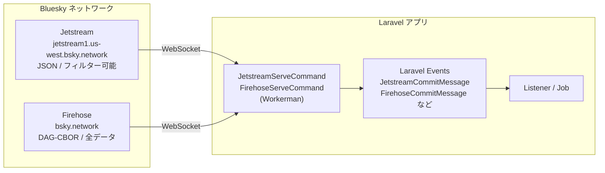

## 概要

`laravel-bluesky` は Bluesky のリアルタイムストリームに接続するための2つの WebSocket コマンドを提供します。

- **Jetstream** — Bluesky 独自のフィルタリング済み WebSocket エンドポイント。JSON 形式で軽量。
- **Firehose** — AT Protocol の生のイベントストリーム。DAG-CBOR バイナリ形式で全データを受信。



<Warning>
WebSocket による長時間実行プロセスは **VPS や EC2 などの常時起動サーバー** または **Laravel Cloud のカスタムワーカー** が必要です。Laravel Vapor や Vercel などのサーバーレス環境では動作しません。
</Warning>

## インストール

WebSocket 機能には [Workerman](https://github.com/walkor/workerman) が必要です。

```bash
composer require workerman/workerman
```

## Jetstream

### 概要

Jetstream は Bluesky が提供するフィルタリング済みの WebSocket サービスです。コレクション種別やユーザー DID でフィルタリングできるため、必要なイベントだけを効率的に受信できます。

| 特徴 | 説明 |
|------|------|
| データ形式 | JSON |
| フィルタリング | コレクション・DID でフィルター可能 |
| データ量 | フィルター次第で軽量 |
| 用途 | 投稿・いいね・フォロー等の監視 |

### 起動方法

```bash
# すべてのメッセージを受信（フィルターなし）
php artisan bluesky:ws start

# デバッグ: 受信したすべてのメッセージを表示
php artisan bluesky:ws start -v
```

### コレクションフィルター

`-C` オプションで受信するコレクションを絞り込みます。複数指定可能です。

```bash
# 投稿といいねのみ受信
php artisan bluesky:ws start -C app.bsky.feed.post -C app.bsky.feed.like

# フォローのみ受信
php artisan bluesky:ws start -C app.bsky.graph.follow
```

主なコレクション:

| コレクション | 内容 |
|-------------|------|
| `app.bsky.feed.post` | 投稿の作成・削除 |
| `app.bsky.feed.like` | いいね |
| `app.bsky.feed.repost` | リポスト |
| `app.bsky.graph.follow` | フォロー |
| `app.bsky.graph.block` | ブロック |

### DID フィルター

`-D` オプションで特定ユーザーのイベントのみ受信します。

```bash
# 特定ユーザーの投稿のみ受信
php artisan bluesky:ws start -C app.bsky.feed.post -D did:plc:xxx -D did:plc:yyy
```

### イベント処理

Jetstream コマンドは受信したメッセージの種別に応じて Laravel イベントを発火します。

| イベントクラス | タイミング |
|--------------|-----------|
| `JetstreamMessageReceived` | 全メッセージ受信時 |
| `JetstreamCommitMessage` | レコードの作成・更新・削除時 |
| `JetstreamIdentityMessage` | ハンドル変更などの identity イベント時 |
| `JetstreamAccountMessage` | アカウント有効化・無効化時 |

イベントリスナーを作成してイベントを処理します。

```bash
php artisan make:listener JetstreamPostListener
```

```php
namespace App\Listeners;

use Revolution\Bluesky\Events\Jetstream\JetstreamCommitMessage;

class JetstreamPostListener
{
    public function handle(JetstreamCommitMessage $event): void
    {
        // コレクション種別を確認
        $collection = data_get($event->message, 'commit.collection');

        if ($collection !== 'app.bsky.feed.post') {
            return;
        }

        // 操作種別: create / update / delete
        $operation = $event->operation;

        // 投稿者の DID
        $did = $event->message['did'];

        // レコードの内容
        $record = data_get($event->message, 'commit.record');
        $text = data_get($record, 'text', '');

        info("[$operation] $did: $text");
    }
}
```

`AppServiceProvider` またはイベントサービスプロバイダーでリスナーを登録します。

```php
use Illuminate\Support\Facades\Event;
use Revolution\Bluesky\Events\Jetstream\JetstreamCommitMessage;
use App\Listeners\JetstreamPostListener;

Event::listen(JetstreamCommitMessage::class, JetstreamPostListener::class);
```

## Firehose

### 概要

Firehose は AT Protocol の生のイベントストリームです。Bluesky ネットワーク上のすべてのレコード操作をバイナリ（DAG-CBOR）形式で受信します。

| 特徴 | 説明 |
|------|------|
| データ形式 | DAG-CBOR バイナリ（パッケージが自動デコード） |
| フィルタリング | なし（全データを受信） |
| データ量 | 非常に大量 |
| 用途 | 全データの収集・アーカイブ |

<Info>
DAG-CBOR のデコードはパッケージが自動的に行います。イベントリスナーでは通常の PHP 配列としてデータを受け取れます。
</Info>

### 起動方法

```bash
php artisan bluesky:firehose start

# デバッグ: 受信したメッセージを表示
php artisan bluesky:firehose start -v
```

### イベント処理

Firehose コマンドも Laravel イベントを使ってメッセージを処理します。

| イベントクラス | タイミング |
|--------------|-----------|
| `FirehoseMessageReceived` | 全メッセージ受信時（生データ含む） |
| `FirehoseCommitMessage` | レコードの作成・更新・削除時 |
| `FirehoseIdentityMessage` | identity イベント時 |
| `FirehoseAccountMessage` | アカウントイベント時 |
| `FirehoseSyncMessage` | リポジトリ同期イベント時 |

```bash
php artisan make:listener FirehosePostListener
```

```php
namespace App\Listeners;

use Revolution\Bluesky\Events\Firehose\FirehoseCommitMessage;

class FirehosePostListener
{
    public function handle(FirehoseCommitMessage $event): void
    {
        // コレクション種別を確認
        if ($event->collection !== 'app.bsky.feed.post') {
            return;
        }

        // 操作種別: create / update / delete
        $action = $event->action;

        // 投稿者の DID
        $did = $event->did;

        // レコードの内容（デコード済み配列）
        $record = $event->record;
        $text = data_get($record, 'value.text', '');

        info("[$action] $did: $text");
    }
}
```

```php
use Illuminate\Support\Facades\Event;
use Revolution\Bluesky\Events\Firehose\FirehoseCommitMessage;
use App\Listeners\FirehosePostListener;

Event::listen(FirehoseCommitMessage::class, FirehosePostListener::class);
```

## 設定

`config/bluesky.php` で接続先ホストやログ設定を変更できます。

```php
// Jetstream
'jetstream' => [
    'host' => env('BLUESKY_JETSTREAM_HOST', 'jetstream1.us-west.bsky.network'),
    'max' => env('BLUESKY_JETSTREAM_MAX', 0), // maxMessageSizeBytes (0 = 無制限)
    'logging' => [
        'driver' => env('BLUESKY_JETSTREAM_LOG_DRIVER', 'daily'),
        'days' => 7,
        'path' => env('BLUESKY_JETSTREAM_LOG_PATH', storage_path('logs/jetstream.log')),
    ],
],

// Firehose
'firehose' => [
    'host' => env('BLUESKY_FIREHOSE_HOST', 'bsky.network'),
    'logging' => [
        'driver' => env('BLUESKY_FIREHOSE_LOG_DRIVER', 'daily'),
        'days' => 7,
        'path' => env('BLUESKY_FIREHOSE_LOG_PATH', storage_path('logs/firehose.log')),
    ],
],
```

`.env` での設定例:

```ini
BLUESKY_JETSTREAM_HOST=jetstream2.us-east.bsky.network
BLUESKY_JETSTREAM_MAX=1000000
```

## Labeler との組み合わせ

Labeler サーバーと Jetstream / Firehose を同時に起動できます。Labeler が受け取ったラベリングリクエストの処理に Jetstream や Firehose のデータを利用できます。

```bash
# Labeler + Jetstream（フォローイベントを監視）
php artisan bluesky:labeler:server start --jetstream -C app.bsky.graph.follow

# Labeler + Firehose（全データを受信）
php artisan bluesky:labeler:server start --firehose
```

<Info>
Labeler の詳細は [Labeler ページ](/jp/packages/laravel-bluesky/labeler) を参照してください。
</Info>

## 長時間実行プロセスの運用

WebSocket コマンドは長時間起動し続けるプロセスです。本番環境では Supervisor などのプロセス管理ツールを使用してください。

### Supervisor 設定例

`/etc/supervisor/conf.d/bluesky-jetstream.conf`:

```ini
[program:bluesky-jetstream]
process_name=%(program_name)s_%(process_num)02d
command=php /var/www/html/artisan bluesky:ws start -C app.bsky.feed.post
autostart=true
autorestart=true
stopasgroup=true
killasgroup=true
user=www-data
numprocs=1
redirect_stderr=true
stdout_logfile=/var/www/html/storage/logs/jetstream-worker.log
stopwaitsecs=3600
```

```bash
# Supervisor を再読み込みして起動
sudo supervisorctl reread
sudo supervisorctl update
sudo supervisorctl start bluesky-jetstream:*
```

### Laravel Forge のデーモン設定

Laravel Forge を使用している場合は、**Daemons** セクションからデーモンを追加します。

- **Command**: `php artisan bluesky:ws start -C app.bsky.feed.post`
- **Directory**: `/var/www/html`
- **User**: `forge`

### Laravel Cloud でのバックグラウンドプロセス設定

WebSocket コマンドは **WebSocket クライアント** として Bluesky のストリームに接続するため、Laravel Cloud でも動作します。Laravel Cloud のバックグラウンドプロセス（カスタムワーカー）として設定してください。

Laravel Cloud のバックグラウンドプロセス設定で **Custom Worker** を追加します。

**Jetstream の場合:**

```bash
php artisan bluesky:ws start
```

**Firehose の場合:**

```bash
php artisan bluesky:firehose start
```

<Info>
デプロイ時のプロセス停止・再起動などはすべて Laravel Cloud 側で自動的に処理されます。バックグラウンドプロセスの設定以外に追加の設定は不要です。
</Info>

### 注意事項

- プロセスが予期せず終了した場合、`autorestart=true` で自動再起動されます。
- メモリリークを防ぐため、定期的な再起動を検討してください。
- 大量のメッセージを受信する Firehose では、リスナー内の処理は非同期（Queue Job）にすることを推奨します。

```php
// リスナーで Queue Job にディスパッチする例

namespace App\Listeners;

use App\Jobs\ProcessFirehosePost;
use Revolution\Bluesky\Events\Firehose\FirehoseCommitMessage;

class FirehosePostListener
{
    public function handle(FirehoseCommitMessage $event): void
    {
        if ($event->collection !== 'app.bsky.feed.post') {
            return;
        }

        // 重い処理は Queue Job に委譲
        ProcessFirehosePost::dispatch($event->did, $event->record, $event->action);
    }
}
```

<Info>
Source: [src/Console/WebSocket](https://github.com/invokable/laravel-bluesky/tree/main/src/Console/WebSocket)
</Info>
