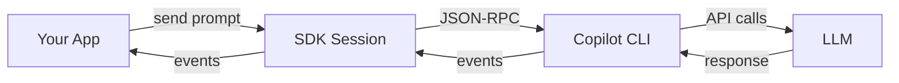
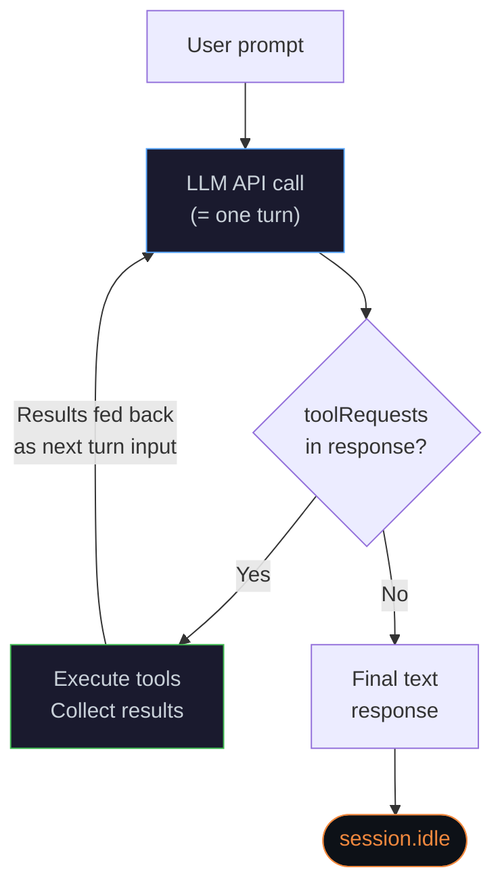
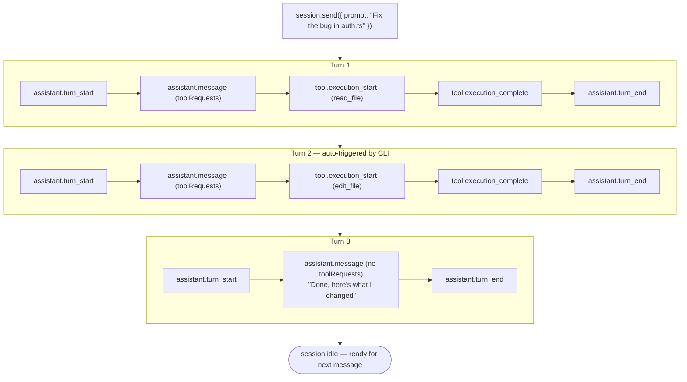

## エージェントループ

Copilot CLI がユーザーメッセージをどのように end-to-end で処理するか（プロンプト送信から `session.idle` まで）を説明します。

## アーキテクチャ



**SDK** はトランスポート層です。JSON-RPC で **Copilot CLI** にプロンプトを送り、イベントをアプリに中継します。エージェント的なツール利用ループを実行し、タスク完了まで 1 回以上の LLM API 呼び出しをオーケストレーションするのは **CLI** 側です。

## ツール利用ループ

`session.send({ prompt })` を呼ぶと、CLI は次のループに入ります。



モデルは各呼び出しで **会話履歴全体**（system prompt / user message / それまでの全ツール呼び出しと結果）を参照します。

**重要:** このループの 1 反復は LLM API 呼び出し 1 回と完全に一致し、イベントログ上では `assistant.turn_start` / `assistant.turn_end` の 1 ペアとして見えます。隠れた呼び出しはありません。

## Turn（ターン）とは何か

**Turn** は、LLM API 呼び出し 1 回とその結果のことです。

1. CLI が会話履歴を LLM に送る
2. LLM が応答する（ツール要求を含む場合あり）
3. ツール要求があれば CLI が実行する
4. `assistant.turn_end` が発行される

1 回のユーザーメッセージで、通常は **複数ターン** 発生します。例えば「このコードベースで X はどう動く？」のような質問では次のようになります。

| Turn | モデルの動作 | toolRequests? |
|---|---|---|
| 1 | `grep` と `glob` でコードベースを検索 | ✅ Yes |
| 2 | 検索結果に基づいて特定ファイルを読む | ✅ Yes |
| 3 | さらに深い文脈のために追加で読む | ✅ Yes |
| 4 | 最終テキスト回答を生成 | ❌ No → loop ends |

モデルは各ターンで「さらにツールを使うか」「最終回答に進むか」を判断します。各呼び出しは **蓄積済みの全コンテキスト**（過去のツール呼び出しと結果を含む）を見られるため、十分な情報があるかを判断できます。

## 複数ターン時のイベントフロー



## 各ターンを誰が開始するか

| Actor | Responsibility |
|---|---|
| **Your app** | `session.send()` で最初のプロンプトを送る |
| **Copilot CLI** | ツール利用ループを実行し、ツール実行結果を次ターン入力として LLM に返す |
| **LLM** | ツール要求して継続するか、最終応答を返して終了するかを決める |
| **SDK** | イベントを中継するのみ。ループ制御はしない |

CLI の挙動は機械的です（「モデルがツール要求 → 実行 → 再度モデル呼び出し」）。停止判定の意思決定者は **モデル** です。

## `session.idle` と `session.task_complete` の違い

この 2 つは完了シグナルですが、保証内容が大きく異なります。

### `session.idle`

- ツール利用ループ終了時に **必ず発行** される
- **揮発的（ephemeral）**。ディスク永続化されず、セッション再開時に再生されない
- 意味: 「エージェントは処理を止め、次のメッセージを受け付け可能」
- 信頼できる「完了」シグナルとしてはこちらを使う

SDK の `sendAndWait()` はこのイベントを待機します。

```typescript
// session.idle が発行されるまで待機
const response = await session.sendAndWait({ prompt: "Fix the bug" });
```

### `session.task_complete`

- **任意発行**（モデルが明示的にシグナルした場合のみ）
- **永続化** される（セッションイベントログに保存される）
- 意味: 「エージェント自身が全体タスク達成と判断した」
- 任意の `summary` を含められる

```typescript
session.on("session.task_complete", (event) => {
    console.log("Task done:", event.data.summary);
});
```

### Autopilot モード: CLI が `task_complete` を促す

**autopilot mode**（headless / autonomous）では、CLI はモデルが `task_complete` を呼んだかを追跡します。ツール利用ループが `task_complete` なしで終わると、CLI は次の合成ユーザーメッセージを挿入してモデルに促します。

> *"You have not yet marked the task as complete using the task_complete tool. If you were planning, stop planning and start implementing. You aren't done until you have fully completed the task."*

これによりツール利用ループが実質的に再開します。モデルはこの促しを新しいユーザーメッセージとして受け取り、作業を続行します。促しには「早すぎる `task_complete` を呼ばないこと」も含まれます。

- 未解決の疑問があるなら呼ばない。判断して作業を続ける
- エラーに遭遇しただけなら呼ばない。解決を試みる
- 残タスクがあるなら呼ばない。先に完了させる

autopilot では次の **2 段階完了メカニズム** になります。
1. モデルが summary 付きで `task_complete` を呼ぶ → CLI が `session.task_complete` を発行 → 完了
2. モデルが呼ばずに停止 → CLI が促す → モデルが継続または `task_complete` を呼ぶ

### `task_complete` が出ない理由

**interactive mode**（通常チャット）では、CLI は `task_complete` を促しません。モデルが省略することがあります。主な理由は次のとおりです。

- **会話型 Q&A**: 質問に答えて終了し、離散的な「完了タスク」がない
- **モデル判断**: `task_complete` を呼ばずに最終テキストを返す
- **中断セッション**: モデルが完了点に達する前にセッションが終了する

一方で CLI は常に `session.idle` を発行します。これは意味論的シグナル（モデルが完了と判断）ではなく、機械的シグナル（ループ終了）だからです。

### どちらを使うべきか

| Use case | Signal |
|---|---|
| 「エージェントの処理終了を待つ」 | `session.idle` ✅ |
| 「コーディングタスクが完了したことを知る」 | `session.task_complete`（best-effort） |
| 「タイムアウト/エラー処理」 | `session.idle` + `session.error` ✅ |

## LLM 呼び出し回数を数える

イベントログ上の `assistant.turn_start` / `assistant.turn_end` ペア数は、LLM API 呼び出し総数と一致します。計画・評価・完了確認の隠れた呼び出しはありません。

セッションのターン数確認例:

```bash
# セッションイベントログ内の turn 数をカウント
grep -c "assistant.turn_start" ~/.copilot/session-state/<sessionId>/events.jsonl
```

## 関連ドキュメント

- [ストリーミングイベント](/jp/packages/laravel-copilot-sdk/streaming-events) — 各イベントタイプのフィールドレベル参照
- [セッション再開](/jp/packages/laravel-copilot-sdk/resume) — セッション保存と再開
- [セッションフック](/jp/packages/laravel-copilot-sdk/hooks) — ループ内イベントのインターセプト（権限・ツール）
