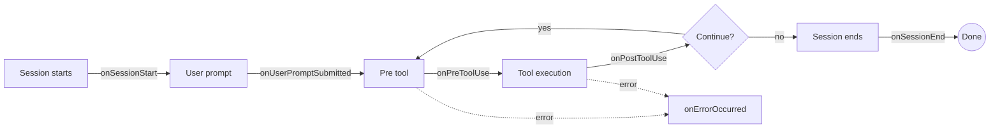

## セッションフック

`hooks` を使うと、Copilot セッションの各ライフサイクルで処理を差し込めます。  
ツール実行制御、監査ログ、プロンプト補強、エラーハンドリングなどを、コア実装を変更せずに追加できます。

## フックの流れ



## 基本的な使い方

```php
use Revolution\Copilot\Contracts\CopilotSession;
use Revolution\Copilot\Facades\Copilot;
use Revolution\Copilot\Types\SessionHooks;
use Revolution\Copilot\Types\Hooks\ErrorOccurredHookInput;
use Revolution\Copilot\Types\Hooks\ErrorOccurredHookOutput;
use Revolution\Copilot\Types\Hooks\PostToolUseHookInput;
use Revolution\Copilot\Types\Hooks\PostToolUseHookOutput;
use Revolution\Copilot\Types\Hooks\PreToolUseHookInput;
use Revolution\Copilot\Types\Hooks\PreToolUseHookOutput;
use Revolution\Copilot\Types\Hooks\SessionEndHookInput;
use Revolution\Copilot\Types\Hooks\SessionEndHookOutput;
use Revolution\Copilot\Types\Hooks\SessionStartHookInput;
use Revolution\Copilot\Types\Hooks\SessionStartHookOutput;
use Revolution\Copilot\Types\Hooks\UserPromptSubmittedHookInput;
use Revolution\Copilot\Types\Hooks\UserPromptSubmittedHookOutput;

Copilot::start(function (CopilotSession $session) {
    $response = $session->sendAndWait(prompt: 'READMEの要点をまとめて');
    dump($response->content());
}, config: [
    'model' => 'gpt-5',
    'hooks' => new SessionHooks(
        onSessionStart: function (SessionStartHookInput $input): ?SessionStartHookOutput {
            return new SessionStartHookOutput(
                additionalContext: "Project root: {$input->cwd}",
            );
        },

        onUserPromptSubmitted: function (UserPromptSubmittedHookInput $input): ?UserPromptSubmittedHookOutput {
            if (str_starts_with($input->prompt, '/fix')) {
                return new UserPromptSubmittedHookOutput(
                    modifiedPrompt: '現在のエラーを修正して、変更点を要約して。',
                );
            }

            return null;
        },

        onPreToolUse: function (PreToolUseHookInput $input): ?PreToolUseHookOutput {
            $blocked = ['bash', 'shell', 'delete_file'];

            if (in_array($input->toolName, $blocked, true)) {
                return new PreToolUseHookOutput(
                    permissionDecision: 'deny',
                    permissionDecisionReason: "{$input->toolName} はこの環境では許可されていません",
                );
            }

            return new PreToolUseHookOutput(permissionDecision: 'allow');
        },

        onPostToolUse: function (PostToolUseHookInput $input): ?PostToolUseHookOutput {
            if ($input->toolName === 'read_file') {
                return new PostToolUseHookOutput(
                    additionalContext: '必要なら関連ファイルも探索して比較してください。',
                );
            }

            return null;
        },

        onErrorOccurred: function (ErrorOccurredHookInput $input): ?ErrorOccurredHookOutput {
            if ($input->errorContext === 'model_call' && $input->recoverable) {
                return new ErrorOccurredHookOutput(
                    errorHandling: 'retry',
                    retryCount: 2,
                    userNotification: '一時的なモデルエラーのためリトライします。',
                );
            }

            return null;
        },

        onSessionEnd: function (SessionEndHookInput $input): ?SessionEndHookOutput {
            if ($input->reason !== 'complete') {
                return new SessionEndHookOutput(
                    sessionSummary: "Session ended with reason: {$input->reason}",
                );
            }

            return null;
        },
    ),
]);
```

## 利用可能なフック

| Hook | 発火タイミング | 主な用途 |
|---|---|---|
| `onSessionStart` | セッション開始（`new` / `resume` / `startup`） | 初期コンテキスト注入、設定上書き |
| `onUserPromptSubmitted` | ユーザープロンプト送信時 | プロンプト補強、テンプレート展開、入力フィルタ |
| `onPreToolUse` | ツール実行前 | 許可/拒否/要確認、引数改変、出力抑制 |
| `onPostToolUse` | ツール実行後 | 結果改変、機密情報マスク、監査ログ |
| `onErrorOccurred` | セッション内エラー発生時 | リトライ、通知、エラー分類 |
| `onSessionEnd` | セッション終了時 | クリーンアップ、メトリクス、終了サマリ |

`null` を返すとデフォルト動作が継続されます。

## 代表的なユースケース

### 1) Permission control（実行制御）

- `onPreToolUse` で許可ツールを allow-list 方式にする
- 破壊的操作は `permissionDecision: 'ask'` で人間承認
- `permissionDecisionReason` で拒否理由を明示
- `toolName` の候補は [Tools](/jp/packages/laravel-copilot-sdk/tools) の一覧で確認する（例: `view`, `glob`, `bash`）

### 2) Auditing / compliance（監査）

- ライフサイクルフックを組み合わせて監査イベントを収集
- 収集データはセッションID単位で永続化

### 3) Prompt enrichment（入力補強）

- `onSessionStart` でプロジェクト情報（言語、FW、規約）を `additionalContext` に追加
- `onUserPromptSubmitted` でショートカット（`/fix`, `/test`）を展開

### 4) Result filtering（結果整形）

- `onPostToolUse` で API key / token / password などをマスク
- 長すぎる結果は要約化し、必要時のみ詳細を返す

### 5) Error recovery（障害復旧）

- `onErrorOccurred` で `model_call` かつ `recoverable=true` のときだけ `retry`
- 非回復系は `userNotification` で利用者向けに簡潔に通知

### 6) Session metrics（計測）

- `onSessionStart` で開始時刻を記録
- `onPreToolUse` / `onUserPromptSubmitted` でカウンタ更新
- `onSessionEnd` で所要時間・ツール回数・終了理由を出力

## Hook input / output 型

### 共通入力（`BaseHookInput`）

| プロパティ | 型 | 説明 |
|---|---|---|
| `timestamp` | `int` | フック発火時刻（Unix ms） |
| `cwd` | `string` | 現在の作業ディレクトリ |

### `PreToolUseHookInput`

| プロパティ | 型 | 説明 |
|---|---|---|
| `toolName` | `string` | 実行予定ツール名 |
| `toolArgs` | `mixed` | 実行予定引数 |

### `PreToolUseHookOutput`

| プロパティ | 型 | 説明 |
|---|---|---|
| `permissionDecision` | `?string` | `allow` / `deny` / `ask` |
| `permissionDecisionReason` | `?string` | 拒否/確認時の理由 |
| `modifiedArgs` | `mixed` | 上書き後の引数 |
| `additionalContext` | `?string` | 追加コンテキスト |
| `suppressOutput` | `?bool` | ツール出力を抑制 |

### `PostToolUseHookInput`

| プロパティ | 型 | 説明 |
|---|---|---|
| `toolName` | `string` | 実行済みツール名 |
| `toolArgs` | `mixed` | 実行時引数 |
| `toolResult` | `ToolResultObject\|array` | ツール結果 |

### `PostToolUseHookOutput`

| プロパティ | 型 | 説明 |
|---|---|---|
| `modifiedResult` | `ToolResultObject\|array\|null` | 改変後の結果 |
| `additionalContext` | `?string` | 追加コンテキスト |
| `suppressOutput` | `?bool` | ツール結果表示を抑制 |

### `UserPromptSubmittedHookInput`

| プロパティ | 型 | 説明 |
|---|---|---|
| `prompt` | `string` | ユーザー入力プロンプト |

### `UserPromptSubmittedHookOutput`

| プロパティ | 型 | 説明 |
|---|---|---|
| `modifiedPrompt` | `?string` | 改変後プロンプト |
| `additionalContext` | `?string` | 補足コンテキスト |
| `suppressOutput` | `?bool` | 応答表示の抑制 |

### `SessionStartHookInput`

| プロパティ | 型 | 説明 |
|---|---|---|
| `source` | `string` | `startup` / `resume` / `new` |
| `initialPrompt` | `?string` | 初期プロンプト |

### `SessionStartHookOutput`

| プロパティ | 型 | 説明 |
|---|---|---|
| `additionalContext` | `?string` | セッション初期コンテキスト |
| `modifiedConfig` | `?array` | セッション設定の部分上書き |

### `SessionEndHookInput`

| プロパティ | 型 | 説明 |
|---|---|---|
| `reason` | `string` | `complete` / `error` / `abort` / `timeout` / `user_exit` |
| `finalMessage` | `?string` | 最終メッセージ |
| `error` | `?string` | 終了時エラー |

### `SessionEndHookOutput`

| プロパティ | 型 | 説明 |
|---|---|---|
| `suppressOutput` | `?bool` | 最終出力の抑制 |
| `cleanupActions` | `?array` | 実行したクリーンアップ情報 |
| `sessionSummary` | `?string` | セッション要約 |

### `ErrorOccurredHookInput`

| プロパティ | 型 | 説明 |
|---|---|---|
| `error` | `string` | エラーメッセージ |
| `errorContext` | `?string` | `model_call` / `tool_execution` / `system` / `user_input` のいずれか |
| `recoverable` | `bool` | 回復可能か |

### `ErrorOccurredHookOutput`

| プロパティ | 型 | 説明 |
|---|---|---|
| `suppressOutput` | `?bool` | エラー表示の抑制 |
| `errorHandling` | `?string` | `retry` / `skip` / `abort` |
| `retryCount` | `?int` | リトライ回数 |
| `userNotification` | `?string` | 利用者への通知文 |

## ToolResultObject

ツール実行結果の標準オブジェクトです。

| プロパティ | 型 | 説明 |
|---|---|---|
| `textResultForLlm` | `?string` | LLM に渡すテキスト結果 |
| `resultType` | `?string` | `success` / `failure` / `rejected` / `denied` |
| `resultForAssistant` | `?array` | アシスタント向け結果データ |

## ベストプラクティス

1. 重い同期処理はフック内で直接実行しすぎない。必要なら非同期化する。  
2. 変更不要なときは `null` を返してデフォルト動作に任せる。  
3. `permissionDecision` は可能な限り明示する。  
4. クリティカルエラーは抑制しすぎず、ログ/通知経路を持つ。  
5. セッション単位の状態は session id ベースで管理し、`onSessionEnd` で掃除する。

<Info>
最新情報は [GitHub リポジトリ](https://github.com/invokable/laravel-copilot-sdk) を参照してください。
</Info>
