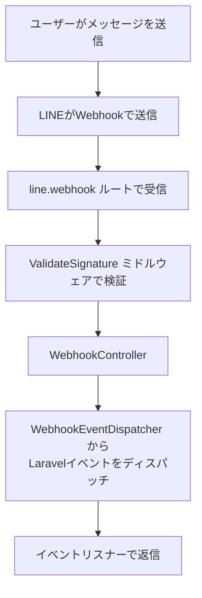

## Webhook

パッケージはWebhookルーティングとコントローラーを提供しています。



### Webhook URL

デフォルトのWebhook URLは次のとおりです。

```
https://example.com/line/webhook
```

`.env` でパスを変更できます。

```dotenv
LINE_BOT_WEBHOOK_PATH=webhook
```

### Laravelイベントシステムとの連携

Webhookイベントを受信するとLaravelイベントがディスパッチされます。イベントディスカバリーはデフォルトで有効です。

<Info>
  本番環境では `php artisan event:cache` を実行してください。
</Info>

### デフォルト Listener の公開

```shell
php artisan vendor:publish --tag=line-listeners
```

`app/Listeners/Line/` に `MessageListener` が生成されます。

```php
namespace App\Listeners\Line;

use LINE\Clients\MessagingApi\ApiException;
use LINE\Webhook\Model\MessageEvent;
use LINE\Webhook\Model\StickerMessageContent;
use LINE\Webhook\Model\TextMessageContent;
use Revolution\Line\Facades\Bot;

class MessageListener
{
    protected string $token;

    public function handle(MessageEvent $event): void
    {
        $message = $event->getMessage();
        $this->token = $event->getReplyToken();

        match ($message::class) {
            TextMessageContent::class => $this->text($message),
            StickerMessageContent::class => $this->sticker($message),
        };
    }

    protected function text(TextMessageContent $message): void
    {
        Bot::reply($this->token)->text($message->getText());
    }

    protected function sticker(StickerMessageContent $message): void
    {
        Bot::reply($this->token)->sticker(
            $message->getPackageId(),
            $message->getStickerId()
        );
    }
}
```

## Bot Facade

`Revolution\Line\Facades\Bot` は公式SDK `MessagingApiApi` クラスのすべてのメソッドに委譲します。

```php
use Revolution\Line\Facades\Bot;

Bot::replyMessage();
Bot::pushMessage();
```

### reply メソッド

`Bot::reply()` を使うと、リプライトークンを渡してメッセージを返信できます。

<Info>
  `Bot::pushMessage()` によるプッシュ配信は料金プランごとに通数制限があります。一方、ユーザーからのメッセージに対するリプライ（`Bot::reply()`）は通数制限がなく無料で利用できます。
</Info>

```php
use Revolution\Line\Facades\Bot;

// テキストを返信する
Bot::reply($token)->text('text');

// 送信者名を変えて複数のテキストを返信する
Bot::reply($token)->withSender('alt-name')->text('text1', 'text2');

// スタンプを返信する
Bot::reply($token)->sticker(package: 1, sticker: 1);
```

## カスタマイズ

### Bot マクロ

`Bot` は `Macroable` を実装しているため、任意のメソッドを追加できます。

`AppServiceProvider@boot` で登録します。

```php
use Revolution\Line\Facades\Bot;

public function boot(): void
{
    Bot::macro('foo', function () {
        return $this->bot()->...;
    });
}
```

```php
$foo = Bot::foo();
```

### MessagingApiApi インスタンスの差し替え

`Bot::bot()` は `MessagingApiApi` インスタンスを返します。`Bot::botUsing()` でインスタンスを差し替えられます。

```php
$bot = new MyBot();

Bot::botUsing($bot);
```

Callableも受け付けます。

```php
Bot::botUsing(function () {
    return new MyBot();
});
```

### WebhookHandler の差し替え

Laravelイベントシステムを使わずに独自のWebhook処理を書きたい場合は、`WebhookHandler` interfaceを実装して差し替えます。

`app/Actions/LineWebhook.php` を作成します。

```php
<?php

namespace App\Actions;

use Illuminate\Http\Request;
use LINE\Webhook\Model\MessageEvent;
use Revolution\Line\Contracts\WebhookHandler;
use Revolution\Line\Facades\Bot;

class LineWebhook implements WebhookHandler
{
    public function __invoke(Request $request): mixed
    {
        Bot::parseEvent($request)->each(function ($event) {
            if ($event instanceof MessageEvent) {
                //
            }
        });

        return response('OK');
    }
}
```

`AppServiceProvider@register` で登録します。

```php
use App\Actions\LineWebhook;
use Revolution\Line\Contracts\WebhookHandler;

public function register(): void
{
    $this->app->scoped(WebhookHandler::class, LineWebhook::class);
}
```

### デフォルトルートのミドルウェア

デフォルトで `throttle` ミドルウェアが有効です。`.env` で変更できます。

```dotenv
# 無効にする
LINE_BOT_WEBHOOK_MIDDLEWARE=null

# throttle 設定を変更する
LINE_BOT_WEBHOOK_MIDDLEWARE=throttle:120,1
```

### Http::line()

パッケージは `Http` クラスを拡張しているため、`Bot` Facade を使わず直接APIリクエストを送ることもできます。

```php
use Illuminate\Support\Facades\Http;

$response = Http::line()->post('/v2/bot/channel/webhook/test', [
    'endpoint' => '',
]);
```

<Info>
  最新情報は [GitHub リポジトリ](https://github.com/invokable/laravel-line-sdk) を参照してください。
</Info>
