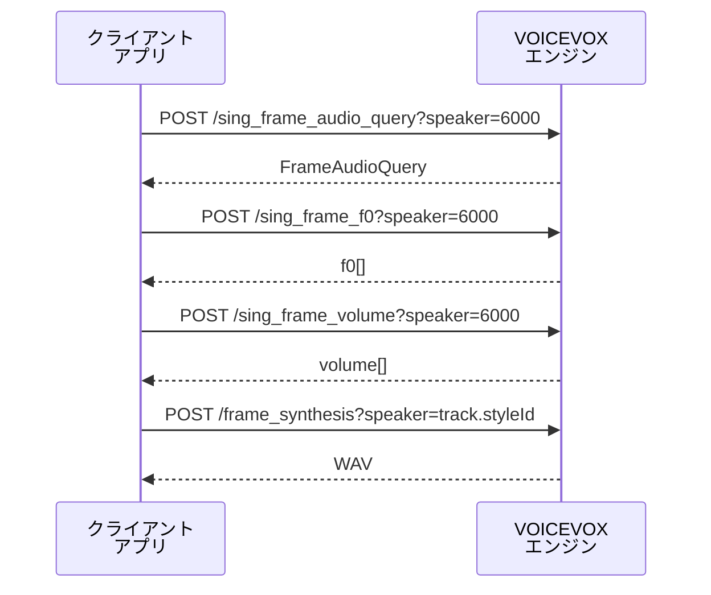

# VOICEVOXエンジンAPI連携アプリ開発ガイド

VOICEVOXエンジンAPIを呼び出すクライアントアプリを作るときの実装メモ。  
macOS用ソングアプリの実装記録をもとに、公式VOICEVOXエディターの内部構成をそのまま移植するのではなく、外部アプリとして安定してエンジンAPIを使うための項目を整理する。

Xcode/Swift以外の環境でも使えるように汎用方針を先に書き、各項目の末尾にXcode向けの補足を置く。

<Info>
  このページは [原文ガイド](https://github.com/invokable/laravel-voicevox/blob/main/docs/develop/voicevox-engine-api-app-guide.md) をもとに、内容を省略せずにドキュメント化しています。
</Info>

## 1. 最初にエンジンをURLで登録する

公式VOICEVOXエディターは、同梱または指定されたエンジン実行ファイルをアプリ側から起動し、エンジン設定や `engine_manifest.json` を前提に管理する。一方、外部クライアントアプリでは、まず「起動済みのHTTP APIサーバーのURL」を登録する方式にした方が扱いやすい。

代表的なURLは次の通り。

| エンジン | 例 |
|---|---|
| 公式VOICEVOXエンジン | `http://127.0.0.1:50021` |
| Laravel版エンジン | `http://127.0.0.1:50513` |

登録時はURL文字列だけを保存するのではなく、接続確認として最低限次のAPIを呼び、取得したメタ情報と一緒に保存する。

| API | 用途 |
|---|---|
| `GET /engine_manifest` | `uuid`, エンジン名, `frame_rate`, 既定サンプリングレートなどを取得する |
| `GET /version` | 表示・互換性確認用のバージョンを取得する |
| `GET /singers` | 歌唱スタイル一覧を取得する |
| `GET /singer_info?speaker_uuid=...&resource_format=...` | アイコンや追加情報を取得する |

重要なのは、プロジェクトやトラックにはURLではなく `engineId` と `styleId` を保存すること。URLはユーザー環境ごとに変わるが、`engineId` は `/engine_manifest` の `uuid` と対応し、`.vvproj` の `singer.engineId` にも合わせやすい。

**Xcode向け補足:** ソングアプリでは `RegisteredEngine` に `baseURL`, `engineId`, `name`, `frameRate`, `defaultSamplingRate`, `version`, `singers` を保持し、`UserDefaults` に保存している。URLは末尾スラッシュ、クエリ、フラグメントを正規化してから使うと、`http://127.0.0.1:50021/` と `http://127.0.0.1:50021` を同一扱いにできる。macOSアプリでHTTPのローカル接続を使う場合は、サンドボックスやApp Transport Securityの設定も確認する。

## 2. 公式アプリと同じ「エンジン起動」まで抱え込まない

外部アプリで最初から公式エディターと同じエンジン起動管理を実装しようとすると、OS別のプロセス起動、同梱バイナリ、ポート競合、アップデート、ログ管理まで扱う必要がある。特に公式エンジン以外の実装を使う場合、エンジン実行ファイルの場所を指定して起動する方式は噛み合いにくい。

まずは次の運用に固定するのが安全。

1. ユーザーがエンジンを先に起動する。
2. アプリでURLを入力する。
3. アプリがメタ情報を取得して登録する。
4. レンダリング時は登録済み `engineId` からURLへ解決する。

この方式なら、公式エンジン、Laravel版エンジン、Docker上のエンジン、別ホストのエンジンを同じ抽象で扱える。接続できない場合は「エンジンを起動してから再接続してください」のように、ユーザーが次に取る操作を明示する。

**Xcode向け補足:** SwiftUIでは「エンジン接続」画面を独立させ、`TextField` にURL、`登録 / 再接続` ボタン、公式/Laravel版のプリセットボタン、登録済みエンジン一覧を置くと運用しやすい。非同期接続中は `ProgressView` を表示し、接続エラーは `LocalizedError` の文言をそのまま出すより、ユーザー向けの説明を前置きするとよい。

## 3. 歌手・スタイルはエンジン登録後に選ばせる

VOICEVOXのAPIでは、最終的に音声生成に使う声は `speaker` クエリパラメータに渡すstyle IDで決まる。ソングではトラックごとに歌手スタイルを持つため、UI上では登録済みエンジンから `singers` を展開し、歌手名・スタイル名・style IDを選択肢にする。

保存する値は次の2つで十分。

```jsonc
{
  "singer": {
    "engineId": "engine-uuid",
    "styleId": 6000
  }
}
```

この構造にしておくと、`.vvproj` 互換のソングデータと合わせやすく、マルチエンジンにも対応しやすい。プロジェクトを開いたときに該当 `engineId` が未登録なら、「未登録エンジン」として表示し、URL登録を促す。

**Xcode向け補足:** Swiftでは `Singer(engineId: String, styleId: Int)` をトラックに持たせ、表示用には `RegisteredEngine.singers` から `SingerStyleOption` のようなViewModel用配列へ平坦化するとよい。歌手割り当てを変えたら、レンダリング済み音声は無効化する。

## 4. `.vvproj`互換を考えるならtick基準のソングモデルにする

VOICEVOXエディターのソングデータは、音符やテンポをtick基準で持つ。エンジンAPI自体は最終的にフレーム長を必要とするが、アプリ内の編集モデルはtick基準にしておく方が、ピアノロール、テンポ変更、拍子、Undo/Redo、`.vvproj` 読み書きに向いている。

最低限の構造は次の通り。

| 要素 | 主なフィールド |
|---|---|
| Song | `tpqn`, `tempos`, `timeSignatures`, `tracks`, `trackOrder` |
| Track | `name`, `singer`, `notes`, `gain`, `pan`, `solo`, `mute` |
| Note | `id`, `position`, `duration`, `noteNumber`, `lyric` |
| Tempo | `position`, `bpm` |
| TimeSignature | `measureNumber`, `beats`, `beatType` |

レンダリング時だけ、テンポマップを使ってtickを秒へ変換し、エンジンの `frame_rate` に合わせて `frame_length` を計算する。

**Xcode向け補足:** `Codable` で `.vvproj` 風のJSONを読み書きする場合、`tracks` はIDをキーにしたDictionary、`trackOrder` は表示順配列として分ける。保存前に `trackOrder` の重複、存在しないID、未並び替えのトラックを検証すると、読み込み後のUI崩れを防げる。

## 5. ソング合成は4段階APIとして実装する

ソングのレンダリングは、トークの `/audio_query` → `/synthesis` より手順が多い。基本パイプラインは次の4段階。



`/sing_frame_audio_query`, `/sing_frame_f0`, `/sing_frame_volume` では singing teacher のstyle IDである `6000` を使い、最後の `/frame_synthesis` だけ実際に選択された歌手の `styleId` を使う。この値は公式エンジンでもLaravel版エンジンでも同じ前提で扱える。

各APIのリクエストでは、`Score` と `FrameAudioQuery` の対応を崩さないことが重要。`Score.notes[].frame_length` はエンジンの `frame_rate` から算出し、無音は `key: null`, `lyric: ""` として表現する。

**Xcode向け補足:** Swiftでは `VoicevoxEngineSongAPI` のようなprotocolを作り、実装を `URLSession` クライアントにするとテストしやすい。JSONを返すエンドポイントでは `Content-Type` / `Accept` を `application/json` にし、`/frame_synthesis` のレスポンスはWAVのバイナリ `Data` として扱う。HTTP 2xx以外はステータスコードとレスポンス本文を含むエラーにする。

## 6. フレーズ単位で分割してキャッシュする

ソング全体を毎回1回で合成すると、少し編集しただけでも全トラック再生成になり、UIの応答が悪くなる。公式エディターと同様に、連続するノート群をフレーズとして分け、休符で分割する設計が扱いやすい。

フレーズごとに次の段階をキャッシュする。

| キャッシュ | 入力に含めるもの |
|---|---|
| AudioQuery | エンジンID、frame rate、テンポ、Score、音域調整 |
| F0 | AudioQuery、ピッチ編集、フレーズ位置 |
| Volume | AudioQuery、F0、音量生成に影響する値 |
| Voice/WAV | 合成用Query、最終style ID |

初期実装では、編集が入ったら対象トラックのレンダリング済み音声を丸ごと無効化してもよい。後からフレーズ単位の差分無効化を足せるように、入力ハッシュでキャッシュキーを作る。

**Xcode向け補足:** `actor` にレンダリングキャッシュを持たせると、Swift Concurrency上で状態管理しやすい。新しいレンダリングが始まったら世代番号を進め、古いAPIレスポンスが返ってきても採用しない。`Task.checkCancellation()` と世代チェックを組み合わせると、キャンセルと再レンダリングの両方を扱える。

## 7. フレームレートと休符をエンジンメタ情報から決める

`ScoreNote.frame_length` は秒数と `frame_rate` から計算する。`frame_rate` を固定値として埋め込むのではなく、登録時に `/engine_manifest` から取得して保存する。

ソング合成では、フレーズ先頭と末尾に休符を入れる。先頭休符が短すぎると音素生成が不安定になることがあるため、実装では「実際の休符」「4分音符」「最低秒数から逆算したtick」のバランスを取る。末尾にも短い無音を追加し、必要なら最後の無音区間をフェードアウトする。

また、フレーム長は丸めの結果0以下にならないよう補正する。短いノートやテンポ変更直後では、丸め誤差で0フレームが発生しやすい。

**Xcode向け補足:** `tickToSecond` / `secondToTick` を純粋関数にしてテストしておくと、ピアノロール、再生ヘッド、レンダリング、動画出力で同じ変換を使える。`frameLength = Int(round(seconds * frameRate))` の結果は、隣接ノートへ差分を逃がすなどして最低1フレームを保証する。

## 8. パラメータ編集は「生成前」と「合成前」のどこで効くかを分ける

ソングでは、音域・声量・ピッチ・ボリューム・音素タイミング編集がそれぞれ別の段階に影響する。

| 編集 | 反映タイミング |
|---|---|
| `keyRangeAdjustment` | Score生成時のキー、F0生成後のピッチシフト |
| `volumeRangeAdjustment` | `/frame_synthesis` 前の音量配列 |
| ピッチ編集 | `/sing_frame_f0` 後のF0配列 |
| ボリューム編集 | `/sing_frame_volume` 後のvolume配列 |
| 音素タイミング編集 | `FrameAudioQuery.phonemes` |

どの編集がどのキャッシュを無効化するかを早めに決めておくと、後からUI編集機能を追加してもレンダリング結果が破綻しにくい。

**Xcode向け補足:** パラメータ編集の適用はViewModelに散らさず、`SongParameterEditApplicator` のような純粋ロジックに寄せるとテストしやすい。配列の範囲外アクセスや負の音量は明示的に補正・エラー化する。

## 9. 再生・ミックス・書き出しは同じトラック判定を使う

レンダリング後は、フレーズごとのWAVをタイムライン上に配置して再生する。マルチトラック対応では、通常再生、全体WAV書き出し、ステム書き出しでsolo/mute/gain/panの判定がずれると、ユーザーにとって予測しづらい挙動になる。

共通ルールとして、soloトラックが1つでもある場合はsoloトラックだけを出し、soloがない場合はmuteされていないトラックを出す。ステム書き出しでは対象トラックを単独で出力し、通常のsolo/mute状態とは切り離して考える。

**Xcode向け補足:** macOSでは `AVAudioEngine`, `AVAudioPlayerNode`, `AVAudioMixerNode` で再生グラフを作れる。書き出しは通常再生とは別にオフラインレンダリング用の経路を用意し、WAVエンコードを共通化するとよい。再生中に編集が入ってレンダリング済み音声が無効になったら、再生を停止して状態を明示する。

## 10. UIは「未登録・未割り当て・未レンダリング」を区別する

VOICEVOXエンジンAPI連携アプリでは、失敗理由がいくつかに分かれる。

| 状態 | 表示すべき案内 |
|---|---|
| エンジン未登録 | エンジン接続画面でURLを登録する |
| エンジン未起動 | エンジンを起動して再接続する |
| プロジェクトの `engineId` が未登録 | 対応するエンジンURLを追加登録する |
| トラックに歌手未割り当て | 登録済み歌手スタイルを選ぶ |
| 編集後で音声が古い | 再レンダリングが必要 |
| レンダリング中 | キャンセル可能にする |

これらを全部「再生できません」にまとめると原因が分からない。状態を分け、次の操作をUIに出す。

**Xcode向け補足:** SwiftUIのViewModelでは `renderingState` を `idle`, `rendering`, `rendered`, `stale`, `failed` のようなenumにすると、ボタンのdisabled制御とステータス表示を一貫させやすい。エラーメッセージはステータスバーだけでなくアラートにも出せるようにしておく。

## 11. マルチエンジンでは「URL」と「engineId」の寿命を分ける

マルチエンジン対応で混乱しやすいのは、URLと `engineId` の役割が違うこと。

| 値 | 寿命 | 使い方 |
|---|---|---|
| URL | ユーザー環境ごとに変わる | API呼び出し先として使う |
| `engineId` | エンジン実装・モデル側の識別子 | プロジェクト内の参照として使う |
| `styleId` | エンジン内のスタイル識別子 | `speaker` パラメータとして使う |

プロジェクトファイルにはURLを埋め込まず、`engineId` と `styleId` を保存する。アプリ設定側に `engineId -> URL` の対応を持たせる。これにより、他人から受け取ったプロジェクトでも、自分の環境で同じエンジンをURL登録すればレンダリングできる。

**Xcode向け補足:** `Dictionary(uniqueKeysWithValues: registeredEngines.map { ($0.engineID, $0) })` のようにレンダリング前に `engineId` から `RegisteredEngine` を解決する。見つからない場合はHTTPリクエストを投げず、事前に「歌手のエンジンが登録されていません」と失敗させる。

## 12. テストはHTTPクライアント・モデル変換・レンダリング計画を分ける

VOICEVOXエンジン本体を常に起動してテストするのは重いので、通常の自動テストではHTTPをモックし、アプリ側のリクエスト生成と状態遷移を確認する。

優先してテストしたい項目は次の通り。

| 対象 | 確認すること |
|---|---|
| URL正規化 | 末尾スラッシュやパス付きURLが期待通り扱われる |
| エンジン登録 | `/engine_manifest`, `/version`, `/singers`, `/singer_info` を呼び、保存用モデルを作れる |
| `.vvproj` I/O | trackOrderとtracksの整合性、古い/未来バージョンの扱い |
| tick/second変換 | テンポ変更をまたぐ変換が往復できる |
| Score生成 | 休符、frame_length、デフォルト歌詞、音域調整 |
| レンダリング計画 | 未登録エンジン、歌手未設定、engineId不一致をAPI呼び出し前に検出する |
| キャッシュ | 同じ入力で再利用し、編集後に無効化される |

**Xcode向け補足:** `URLProtocol` を差し替えた `URLSessionConfiguration.ephemeral` を使うと、実HTTPサーバーなしで `URLSession` クライアントをテストできる。レンダラーはprotocol越しにAPIを注入し、`actor` のキャッシュ状態はスナップショットを返すメソッドを用意すると検証しやすい。

## 実装順のおすすめ

最小構成から始めるなら、次の順がよい。

<Steps>
  <Step title="エンジンURL登録とメタ情報保存">
    URLを登録し、`/engine_manifest` や `/version` から取得したメタ情報を一緒に保存する。
  </Step>
  <Step title="歌手スタイル一覧と割り当て">
    歌手スタイル一覧を表示し、トラックへ `engineId + styleId` を割り当てる。
  </Step>
  <Step title="tick基準モデル">
    tick基準のSong/Track/Noteモデルを先に固める。
  </Step>
  <Step title="4段階APIクライアント">
    `Score` 生成と4段階ソングAPIクライアントを実装する。
  </Step>
  <Step title="フレーズ分割レンダリング">
    フレーズ単位レンダリングとキャッシュを導入する。
  </Step>
  <Step title="再生機能">
    レンダリング済みWAVをタイムライン上で再生できるようにする。
  </Step>
  <Step title="マルチトラック判定">
    マルチトラックのsolo/mute/gain/pan判定を統一する。
  </Step>
  <Step title="書き出し">
    WAV書き出しとステム書き出しを追加する。
  </Step>
  <Step title="編集機能">
    ピッチ・ボリューム・音素タイミング編集を追加する。
  </Step>
  <Step title="発展機能">
    `.vvproj` 互換読み書きや動画出力などの発展機能へ進む。
  </Step>
</Steps>

最初から公式エディターの全機能を追うより、URL登録・歌手割り当て・4段階API・再レンダリング状態を先に固めると、公式エンジンにもLaravel版エンジンにも寄せやすい。

## 関連リンク

- [VOICEVOX Core for PHP パッケージページ](/jp/packages/voicevox-core-php)
- [エンジン API モード:トーク](/jp/packages/laravel-voicevox/engine-talk)
- [エンジン API モード:ソング](/jp/packages/laravel-voicevox/engine-song)
- [Score と Note 詳細解説](/jp/packages/laravel-voicevox/song-score-note)
- [.vvproj ファイル仕様](/jp/packages/laravel-voicevox/vvproj)
