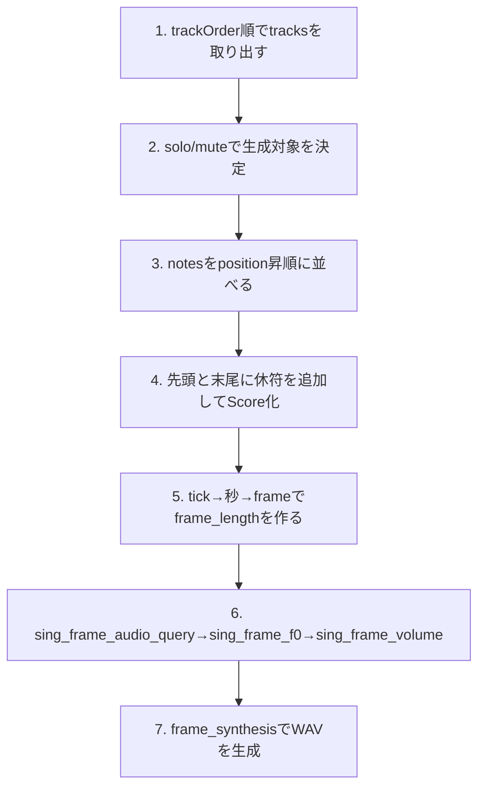

## 目的

VOICEVOXエディターの `.vvproj` をそのまま活用して、Laravel でトーク・ソングを再生成できるようにします。

## トップレベル構造

`.vvproj` は UTF-8 JSON です。トークとソングを同じファイルに保存します。

```json
{
  "appVersion": "0.25.2",
  "talk": {
    "audioKeys": [],
    "audioItems": {}
  },
  "song": {
    "tpqn": 480,
    "tempos": [],
    "timeSignatures": [],
    "tracks": {},
    "trackOrder": []
  }
}
```

| キー | 内容 |
| --- | --- |
| `appVersion` | 保存時のエディターバージョン |
| `talk` | トーク用データ (`audioKeys` + `audioItems`) |
| `song` | ソング用データ (テンポ・拍子・トラック群) |

## `talk` セクション

`talk.audioKeys` は順序配列、`talk.audioItems` は ID をキーにした Record です。

```json
{
  "audioKeys": ["audio-item-uuid"],
  "audioItems": {
    "audio-item-uuid": {
      "text": "ずんだもんなのだ",
      "voice": {
        "engineId": "engine-uuid",
        "speakerId": "speaker-uuid",
        "styleId": 3
      },
      "query": {
        "accentPhrases": [],
        "speedScale": 1,
        "pitchScale": 0
      },
      "presetKey": "preset-uuid"
    }
  }
}
```

### TalkAudioItem

| キー | 内容 |
| --- | --- |
| `text` | 入力テキスト |
| `voice.engineId` | エンジン ID (`/engine_manifest` と対応) |
| `voice.speakerId` | 話者 UUID |
| `voice.styleId` | スタイル ID。`/synthesis?speaker={styleId}` にそのまま渡す |
| `query` | `AudioQuery` 相当 |
| `presetKey` | エディターのプリセット ID。Laravel 側プリセットは [プリセット](/jp/packages/laravel-voicevox/presets) を参照 |

`.vvproj` に `query` が保存済みなら、`/audio_query` を再実行せずにそのまま合成へ進めます。

### `accentPhrases`

| キー | 内容 |
| --- | --- |
| `moras` | モーラ配列 (`consonant` 系は省略される場合あり) |
| `accent` | アクセント位置 (1始まり) |
| `pauseMora` | 句読点などで無音を入れるときに付くことがある |
| `isInterrogative` | 疑問文フラグ |

## `song` セクション

```json
{
  "tpqn": 480,
  "tempos": [{ "position": 0, "bpm": 120 }],
  "timeSignatures": [{ "measureNumber": 1, "beats": 4, "beatType": 4 }],
  "tracks": {
    "track-uuid": {
      "name": "無名トラック",
      "singer": { "engineId": "engine-uuid", "styleId": 3003 },
      "notes": []
    }
  },
  "trackOrder": ["track-uuid"]
}
```

| キー | 内容 |
| --- | --- |
| `tpqn` | Ticks Per Quarter Note。標準は 480 |
| `tempos` | テンポマップ (`position` は tick) |
| `timeSignatures` | 拍子マップ (`measureNumber` は 1 始まり) |
| `tracks` | Track ID をキーにした Record |
| `trackOrder` | 表示・再生順。`tracks` のキー集合と一致させる |

### Track

| キー | 内容 |
| --- | --- |
| `singer.styleId` | 最終的に `/frame_synthesis?speaker={styleId}` へ渡す ID |
| `notes` | ノート配列 |
| `keyRangeAdjustment` | 半音単位のキー調整 |
| `volumeRangeAdjustment` | 音量調整 |
| `pitchEditData` / `volumeEditData` | フレーム単位の編集データ |
| `phonemeTimingEditData` | Note ID ごとの音素タイミング編集 |
| `solo` / `mute` | 再生対象トラック判定に使う |

### Note

| キー | 内容 |
| --- | --- |
| `id` | ノート ID (一意) |
| `position` | ノート開始 tick |
| `duration` | ノート長 tick |
| `noteNumber` | MIDI ノート番号 |
| `lyric` | 歌詞 |

## tick・秒・フレーム変換

単一テンポでは次で変換します。

```text
seconds = ticks / tpqn * 60 / bpm
frames = round(seconds * frameRate)
```

テンポ変更ありでは、`tempos` を `position` 昇順で区間積算します。

```php
function ticksToSeconds(int $targetTick, int $tpqn, array $tempos): float
{
    $seconds = 0.0;
    $currentTick = 0;

    foreach ($tempos as $index => $tempo) {
        $nextTick = $tempos[$index + 1]['position'] ?? $targetTick;
        $segmentEnd = min($targetTick, $nextTick);

        if ($segmentEnd <= $currentTick) {
            break;
        }

        $bpm = $tempo['bpm'];
        $seconds += (($segmentEnd - $currentTick) / $tpqn) * (60 / $bpm);
        $currentTick = $segmentEnd;
    }

    return $seconds;
}
```

`Note::len()` ヘルパーで tick からフレーム長へ変換する実装は [Score と Note 詳細](/jp/packages/laravel-voicevox/song-score-note) を参照してください。

## ソング音声生成の流れ



## 直接編集時の注意点

- `tracks` のキー集合と `trackOrder` を必ず一致させる
- `talk.audioKeys` と `talk.audioItems` も同様に同期する
- `position >= 0`、`duration >= 1`、`noteNumber` は `0..127` を維持する
- `tempos[0].position` は通常 `0`、`timeSignatures[0].measureNumber` は通常 `1`
- 未知キーは可能なら保持して再保存し、将来バージョンとの互換性を壊さない

## Laravel コード例

`.vvproj` を読み込み、トークとソングを生成する最小例です。

```php
use Illuminate\Support\Facades\Storage;
use Revolution\Voicevox\Client\TalkAudioQuery;
use Revolution\Voicevox\Song\Note;
use Revolution\Voicevox\Song\Score;
use Revolution\Voicevox\Voicevox;

$project = json_decode(
    Storage::disk('local')->get('voicevox/sample.vvproj'),
    true,
    flags: JSON_THROW_ON_ERROR,
);

// Talk: 保存済み query をそのまま合成
foreach ($project['talk']['audioKeys'] as $audioKey) {
    $item = $project['talk']['audioItems'][$audioKey];

    Voicevox::talk($item['text'], id: $item['voice']['styleId'])
        ->tap(fn (TalkAudioQuery $talk) => $talk->audioQuery = array_replace($talk->audioQuery, $item['query']))
        ->generate(id: $item['voice']['styleId'])
        ->storeAs('vvproj/talk', "{$audioKey}.wav");
}

// Song: ここでは先頭トラックの duration を frame_length に変換して生成
$trackId = $project['song']['trackOrder'][0];
$track = $project['song']['tracks'][$trackId];
$bpm = $project['song']['tempos'][0]['bpm'] ?? 120;

$score = Score::make([
    Note::make(length: 15, lyric: '', key: null),
    ...collect($track['notes'])->map(
        fn (array $note) => Note::make(
            length: Note::len(ticks: $note['duration'], bpm: $bpm),
            lyric: $note['lyric'] ?? 'ら',
            key: $note['noteNumber'],
            id: $note['id'] ?? null,
        ),
    )->all(),
    Note::make(length: 2, lyric: '', key: null),
]);

Voicevox::song($score, teacher: 6000)
    ->generate(id: $track['singer']['styleId'])
    ->storeAs('vvproj/song', "{$trackId}.wav");
```
