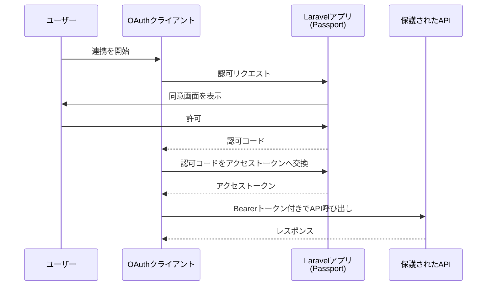

## Passportとは

Laravel Passport は、Laravel アプリを OAuth2 認可サーバーとして動かすための公式パッケージです。
サードパーティアプリ連携や、厳密な OAuth2 フローが必要な API で使います。



## Passport vs Sanctum

OAuth2 が必須なら Passport を選びます。
単純な API トークン認証や SPA / モバイル認証が目的なら Sanctum を選びます。

| 観点 | Passport | Sanctum |
| --- | --- | --- |
| 目的 | OAuth2サーバー実装 | シンプルなAPI認証 |
| 向いているケース | 外部アプリ連携、OAuth2標準準拠 | 自社SPA、モバイル、個人用トークン |
| 複雑さ | 高い | 低い |

## インストール

Laravel 13 の公式推奨は `install:api --passport` です。

```shell
php artisan install:api --passport
```

既存プロジェクトで手動導入する場合は、次のコマンドでもセットアップできます。

```shell
composer require laravel/passport
php artisan passport:install
```

初回デプロイ時は鍵生成だけ実行したいケースもあります。

```shell
php artisan passport:keys
```

## 設定

### Userモデル

`User` モデルに `HasApiTokens` トレイトと `OAuthenticatable` インターフェースを追加します。

```php
use Laravel\Passport\Contracts\OAuthenticatable;
use Laravel\Passport\HasApiTokens;

class User extends Authenticatable implements OAuthenticatable
{
    use HasApiTokens, HasFactory, Notifiable;
}
```

### authガード

`config/auth.php` の `api` ガードで `passport` ドライバーを使います。

```php
'guards' => [
    'api' => [
        'driver' => 'passport',
        'provider' => 'users',
    ],
],
```

### サービスプロバイダー設定

`AppServiceProvider` の `boot()` でスコープ定義とトークン有効期限を設定できます。

```php
use Carbon\CarbonInterval;
use Laravel\Passport\Passport;

public function boot(): void
{
    Passport::tokensCan([
        'orders:read' => '注文の参照',
        'orders:create' => '注文の作成',
    ]);

    Passport::defaultScopes(['orders:read']);

    Passport::tokensExpireIn(CarbonInterval::days(15));
    Passport::refreshTokensExpireIn(CarbonInterval::days(30));
    Passport::personalAccessTokensExpireIn(CarbonInterval::months(6));
}
```

## クライアント管理

### 認可コードグラント用クライアント

```shell
php artisan passport:client
```

このクライアントは、ユーザー同意画面を伴う OAuth2 の標準フローで使います。

### クライアントクレデンシャルグラント用クライアント

```shell
php artisan passport:client --client
```

マシン間通信のエンドポイントでは `EnsureClientIsResourceOwner` ミドルウェアを使います。

```php
use Laravel\Passport\Http\Middleware\EnsureClientIsResourceOwner;

Route::get('/orders', function () {
    // ...
})->middleware(EnsureClientIsResourceOwner::using('orders:read'));
```

## トークン管理

### スコープ付与

```php
$accessToken = $user->createToken(
    'dashboard-token',
    ['orders:read', 'orders:create']
)->accessToken;
```

### スコープチェック

```php
use Laravel\Passport\Http\Middleware\CheckToken;

Route::get('/orders', function () {
    // ...
})->middleware(['auth:api', CheckToken::using('orders:read')]);
```

### 失効

```php
use Laravel\Passport\Passport;

$token = Passport::token()->find($tokenId);
$token?->revoke();
```

## APIルートの保護

ユーザーアクセストークンで保護する API には `auth:api` を付けます。

```php
Route::middleware('auth:api')->group(function () {
    Route::get('/user', fn (Request $request) => $request->user());
    Route::get('/orders', [OrderController::class, 'index']);
});
```

<Warning>
  クライアントクレデンシャルグラントのルートは `auth:api` ではなく `EnsureClientIsResourceOwner` を使ってください。
</Warning>

## Personal Access Token

OAuth2 の完全フローを使わず、ユーザー自身が API トークンを発行する用途に向いています。

```shell
php artisan passport:client --personal
```

```php
$token = $request->user()->createToken('cli-token', ['orders:read'])->accessToken;
```

<Info>
  Personal Access Token が主用途なら、Laravel公式でも Sanctum を検討することが推奨されています。
</Info>

## 関連リンク

- [Laravel公式ドキュメント: Passport](https://laravel.com/docs/13.x/passport)
- [Laravel公式ドキュメント: Sanctum](https://laravel.com/docs/13.x/sanctum)
