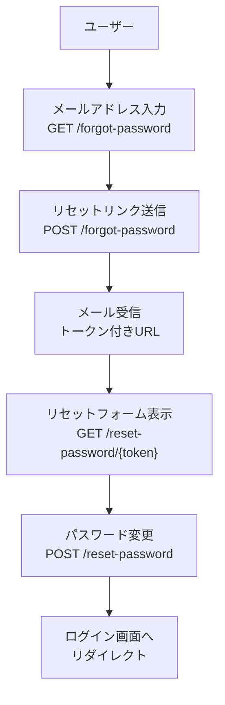

## はじめに

パスワードリセットはWebアプリケーションに欠かせない認証フローです。スターターキットを使えばこの機能は自動的に構築されますが、APIのみのプロジェクトや独自UIを構築するプロジェクトでは手動実装が必要です。

**手動実装が必要なケース:**

- API専用バックエンド(フロントエンドがSPA・モバイルアプリ)
- スターターキットを使わずに認証UIを自前で構築する場合
- メール通知やリセットURLのデザインを完全にカスタマイズしたい場合

<Info>
  スターターキット(`laravel new`)を使ってプロジェクトを作成した場合、パスワードリセット機能はすでに実装済みです。このページはスターターキットなしで実装する方法を説明します。
</Info>

パスワードリセットの全体フローは次のとおりです。



## 設定

パスワードリセットの設定は `config/auth.php` の `passwords` キーで管理します。

```php
// config/auth.php

'passwords' => [
    'users' => [
        'driver' => 'database',
        'provider' => 'users',
        'table' => env('AUTH_PASSWORD_RESET_TOKEN_TABLE', 'password_reset_tokens'),
        'expire' => 60,
        'throttle' => 60,
    ],
],
```

- `driver` — データ保存方式(`database` または `cache`)
- `expire` — トークンの有効期限(分)。デフォルトは60分
- `throttle` — 再送信を制限するまでの待機時間(秒)

## ドライバー

### database ドライバー

デフォルトのドライバーです。パスワードリセットトークンをデータベースの `password_reset_tokens` テーブルに保存します。このテーブルはLaravelのデフォルトマイグレーション(`0001_01_01_000000_create_users_table.php`)に含まれています。

```php
'passwords' => [
    'users' => [
        'driver' => 'database',
        'provider' => 'users',
        'table' => env('AUTH_PASSWORD_RESET_TOKEN_TABLE', 'password_reset_tokens'),
        'expire' => 60,
        'throttle' => 60,
    ],
],
```

### cache ドライバー

<Tip>
  Laravel 11以降で利用可能な新しいオプションです。データベーステーブルが不要なため、シンプルな構成でパスワードリセットを実装できます。
</Tip>

`cache` ドライバーはキャッシュストアにトークンを保存します。`password_reset_tokens` テーブルのマイグレーションが不要になります。トークンはユーザーのメールアドレスをキーとして保存されるため、アプリ内の他の場所でメールアドレスをキャッシュキーとして使用しないよう注意してください。

```php
'passwords' => [
    'users' => [
        'driver' => 'cache',
        'provider' => 'users',
        'store' => 'passwords', // オプション: 専用のキャッシュストア
        'expire' => 60,
        'throttle' => 60,
    ],
],
```

`store` キーに専用のキャッシュストアを指定すると、`php artisan cache:clear` でリセットデータが消去されるのを防げます。指定する値は `config/cache.php` で設定されているストア名に対応させます。

## モデルの準備

パスワードリセット機能を使うには、`App\Models\User` モデルに2つのトレイトが必要です。

```php
<?php

namespace App\Models;

use Illuminate\Auth\Passwords\CanResetPassword;
use Illuminate\Foundation\Auth\User as Authenticatable;
use Illuminate\Notifications\Notifiable;

class User extends Authenticatable
{
    use Notifiable, CanResetPassword;

    // ...
}
```

- `Notifiable` — メール通知を送信するために必要
- `CanResetPassword` — パスワードリセットトークンの生成・検証に必要なメソッドを提供する

<Info>
  Laravelのデフォルト `User` モデルにはすでにこれらのトレイトが含まれています。新規インストールの場合は追加不要です。
</Info>

## ルーティングの実装

パスワードリセットには4つのルートが必要です。

### 1. リセットリンクのリクエストフォーム

メールアドレスを入力するフォームを表示します。

```php
// routes/web.php

Route::get('/forgot-password', function () {
    return view('auth.forgot-password');
})->middleware('guest')->name('password.request');
```

対応するBladeビュー:

```blade
{{-- resources/views/auth/forgot-password.blade.php --}}

<form method="POST" action="/forgot-password">
    @csrf

    <div>
        <label for="email">メールアドレス</label>
        <input id="email" type="email" name="email" value="{{ old('email') }}" required autofocus>
        @error('email')
            <span>{{ $message }}</span>
        @enderror
    </div>

    @if (session('status'))
        <div>{{ session('status') }}</div>
    @endif

    <button type="submit">リセットリンクを送信</button>
</form>
```

### 2. リセットリンクの送信処理

フォームの送信を受け取り、`Password::sendResetLink()` でリセットメールを送信します。

```php
use Illuminate\Http\Request;
use Illuminate\Support\Facades\Password;

Route::post('/forgot-password', function (Request $request) {
    $request->validate(['email' => 'required|email']);

    $status = Password::sendResetLink(
        $request->only('email')
    );

    return $status === Password::ResetLinkSent
        ? back()->with(['status' => __($status)])
        : back()->withErrors(['email' => __($status)]);
})->middleware('guest')->name('password.email');
```

`Password::sendResetLink()` はステータスの文字列を返します。

| ステータス定数 | 説明 |
| --- | --- |
| `Password::ResetLinkSent` | リセットリンクを送信した |
| `Password::INVALID_USER` | 指定メールアドレスのユーザーが見つからない |
| `Password::RESET_THROTTLED` | 送信が制限されている(スロットリング) |

### 3. パスワードリセットフォーム

メール内のリンクをクリックしたユーザーに新しいパスワードを入力させるフォームを表示します。

```php
Route::get('/reset-password/{token}', function (string $token) {
    return view('auth.reset-password', ['token' => $token]);
})->middleware('guest')->name('password.reset');
```

対応するBladeビュー:

```blade
{{-- resources/views/auth/reset-password.blade.php --}}

<form method="POST" action="/reset-password">
    @csrf

    <input type="hidden" name="token" value="{{ $token }}">

    <div>
        <label for="email">メールアドレス</label>
        <input id="email" type="email" name="email" value="{{ old('email') }}" required autofocus>
        @error('email')
            <span>{{ $message }}</span>
        @enderror
    </div>

    <div>
        <label for="password">新しいパスワード</label>
        <input id="password" type="password" name="password" required>
        @error('password')
            <span>{{ $message }}</span>
        @enderror
    </div>

    <div>
        <label for="password_confirmation">パスワードの確認</label>
        <input id="password_confirmation" type="password" name="password_confirmation" required>
    </div>

    <button type="submit">パスワードをリセット</button>
</form>
```

### 4. パスワードリセット実行処理

フォームを受け取り、`Password::reset()` でパスワードを更新します。

```php
use App\Models\User;
use Illuminate\Auth\Events\PasswordReset;
use Illuminate\Http\Request;
use Illuminate\Support\Facades\Hash;
use Illuminate\Support\Facades\Password;
use Illuminate\Support\Str;

Route::post('/reset-password', function (Request $request) {
    $request->validate([
        'token' => 'required',
        'email' => 'required|email',
        'password' => 'required|min:8|confirmed',
    ]);

    $status = Password::reset(
        $request->only('email', 'password', 'password_confirmation', 'token'),
        function (User $user, string $password) {
            $user->forceFill([
                'password' => Hash::make($password),
            ])->setRememberToken(Str::random(60));

            $user->save();

            event(new PasswordReset($user));
        }
    );

    return $status === Password::PasswordReset
        ? redirect()->route('login')->with('status', __($status))
        : back()->withErrors(['email' => [__($status)]]);
})->middleware('guest')->name('password.update');
```

`Password::reset()` のステータス定数:

| ステータス定数 | 説明 |
| --- | --- |
| `Password::PasswordReset` | パスワードリセット成功 |
| `Password::INVALID_TOKEN` | トークンが無効または期限切れ |
| `Password::INVALID_USER` | 指定メールアドレスのユーザーが見つからない |

## トークンの有効期限

`config/auth.php` の `expire` オプションでトークンの有効期限を分単位で設定できます。デフォルトは60分です。

```php
'passwords' => [
    'users' => [
        'driver' => 'database',
        'expire' => 60, // 60分後に期限切れ
        'throttle' => 60,
    ],
],
```

`database` ドライバーを使用している場合、期限切れトークンはデータベースに残り続けます。定期的にクリーンアップするには次のArtisanコマンドを使います。

```shell
php artisan auth:clear-resets
```

スケジューラーで自動化することをおすすめします。

```php
use Illuminate\Support\Facades\Schedule;

Schedule::command('auth:clear-resets')->everyFifteenMinutes();
```

## カスタマイズ

### カスタム通知の使用

パスワードリセットメールをカスタマイズするには、`User` モデルで `sendPasswordResetNotification` メソッドをオーバーライドします。

```php
use App\Notifications\ResetPasswordNotification;

class User extends Authenticatable
{
    use Notifiable, CanResetPassword;

    /**
     * パスワードリセット通知を送信する
     */
    public function sendPasswordResetNotification($token): void
    {
        $url = 'https://example.com/reset-password?token='.$token;

        $this->notify(new ResetPasswordNotification($url));
    }
}
```

### リセットリンクURLのカスタマイズ

`AppServiceProvider` の `boot` メソッドで `ResetPassword::createUrlUsing()` を使うと、リセットリンクのURLを変更できます。SPAなど別オリジンのフロントエンドにリダイレクトしたい場合に便利です。

```php
use App\Models\User;
use Illuminate\Auth\Notifications\ResetPassword;

public function boot(): void
{
    ResetPassword::createUrlUsing(function (User $user, string $token) {
        return 'https://example.com/reset-password?token='.$token;
    });
}
```

### Trusted Hostsの設定

パスワードリセットリンクはHTTPリクエストの `Host` ヘッダーを使って生成されます。不正なホストからのリクエストを防ぐために、`bootstrap/app.php` でTrusted Hostsを設定することを推奨します。

```php
->withMiddleware(function (Middleware $middleware) {
    $middleware->trustHosts(at: ['example.com']);
})
```

<Warning>
  パスワードリセット機能を実装する場合は、Trusted Hostsの設定を必ず確認してください。設定が不十分だとホストヘッダーインジェクション攻撃のリスクがあります。
</Warning>

## まとめ

| やりたいこと | 方法 |
| --- | --- |
| リセットリンクを送信する | `Password::sendResetLink(['email' => $email])` |
| パスワードをリセットする | `Password::reset($credentials, $callback)` |
| テーブルを使わずリセットする | `cache` ドライバーを設定 |
| 期限切れトークンを削除する | `php artisan auth:clear-resets` |
| メール通知をカスタマイズする | `sendPasswordResetNotification` をオーバーライド |
| リセットURLをカスタマイズする | `ResetPassword::createUrlUsing()` |

## 次のステップ

<Columns cols={2}>
  <Card title="認証入門" icon="lock" href="/jp/authentication">
    Laravelの認証システム全体の仕組みを学びます。
  </Card>
  <Card title="通知" icon="bell" href="/jp/notifications">
    メール通知のカスタマイズ方法を詳しく学びます。
  </Card>
</Columns>
