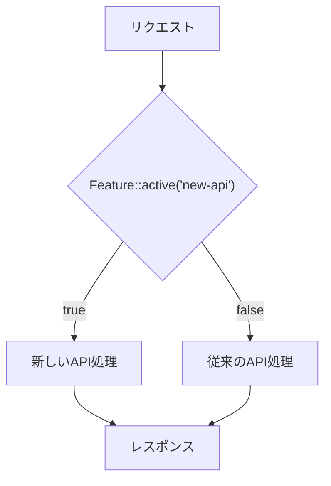

## Laravel Pennantとは

[Laravel Pennant](https://github.com/laravel/pennant) は、シンプルで軽量な機能フラグ(Feature Flag)パッケージです。機能フラグを使うと、新機能を段階的にロールアウトしたり、A/Bテストを実施したり、トランクベース開発を補完したりできます。

### 機能フラグとは



機能フラグを使うことで、コードのデプロイとリリースを分離できます。コードは本番環境にデプロイしておきながら、機能のON/OFFを設定で制御できます。

---

## インストール

<Steps>
  <Step title="パッケージのインストール">
    Composerを使ってPennantをインストールします。

    ```bash
    composer require laravel/pennant
    ```
  </Step>

  <Step title="設定ファイルとマイグレーションの公開">
    `vendor:publish` Artisanコマンドでファイルを公開します。

    ```bash
    php artisan vendor:publish --provider="Laravel\Pennant\PennantServiceProvider"
    ```

    これにより `config/pennant.php` と `database/migrations` にマイグレーションファイルが生成されます。
  </Step>

  <Step title="マイグレーションの実行">
    Pennantがフィーチャーフラグの値を保存する `features` テーブルを作成します。

    ```bash
    php artisan migrate
    ```
  </Step>
</Steps>

---

## 設定

`config/pennant.php` で使用するストレージドライバーを設定できます。Pennantは2種類のドライバーをサポートしています。

| ドライバー | 説明 |
| --- | --- |
| `database` | リレーショナルDBに値を永続保存（デフォルト） |
| `array` | インメモリに保存（テストや一時的な利用向け） |

```php
// config/pennant.php
'default' => env('PENNANT_STORE', 'database'),
```

---

## フィーチャーの定義

### クロージャーベースの定義

フィーチャーは `Feature` ファサードの `define` メソッドで定義します。通常はサービスプロバイダーの `boot` メソッドで定義します。クロージャーには「スコープ」（通常は認証済みユーザー）が渡されます。

```php
<?php

namespace App\Providers;

use App\Models\User;
use Illuminate\Support\Lottery;
use Illuminate\Support\ServiceProvider;
use Laravel\Pennant\Feature;

class AppServiceProvider extends ServiceProvider
{
    public function boot(): void
    {
        Feature::define('new-api', fn (User $user) => match (true) {
            $user->isInternalTeamMember() => true,
            $user->isHighTrafficCustomer() => false,
            default => Lottery::odds(1 / 100),
        });
    }
}
```

このフィーチャーのロジックは以下の通りです。

- 社内チームメンバーは必ずON
- 高トラフィック顧客はOFF
- それ以外は1%の確率でON

フィーチャーが初めてチェックされたとき、クロージャーの結果がストレージドライバーに保存されます。次回以降は保存された値が使われます。

<Info>
  定義がLotteryを返すだけの場合、クロージャーを省略できます。

  ```php
  Feature::define('site-redesign', Lottery::odds(1, 1000));
  ```
</Info>

### クラスベースの定義

Pennantはクラスベースのフィーチャー定義もサポートしています。クラスベースの場合、サービスプロバイダーへの登録は不要です。

```bash
php artisan pennant:feature NewApi
```

生成されたクラスは `app/Features` ディレクトリに配置されます。`resolve` メソッドを実装するだけです。

```php
<?php

namespace App\Features;

use App\Models\User;
use Illuminate\Support\Lottery;

class NewApi
{
    /**
     * フィーチャーの初期値を解決する
     */
    public function resolve(User $user): mixed
    {
        return match (true) {
            $user->isInternalTeamMember() => true,
            $user->isHighTrafficCustomer() => false,
            default => Lottery::odds(1 / 100),
        };
    }
}
```

#### 保存名のカスタマイズ

デフォルトでは完全修飾クラス名が保存されます。`Name` アトリビュートで名前をカスタマイズできます。

```php
use Laravel\Pennant\Attributes\Name;

#[Name('new-api')]
class NewApi
{
    // ...
}
```

#### フィーチャーチェックの傍受 (`before` メソッド)

クラスベースのフィーチャーには `before` メソッドを定義できます。このメソッドはストレージから値を取得する前にインメモリで実行され、`null` 以外の値を返すとその値が使われます。

```php
class NewApi
{
    public function before(User $user): mixed
    {
        if (Config::get('features.new-api.disabled')) {
            return $user->isInternalTeamMember();
        }
    }

    public function resolve(User $user): mixed
    {
        // ...
    }
}
```

<Tip>
  `before` メソッドはバグ発生時に機能を緊急無効化したり、特定日時にロールアウトをスケジュールしたりする際に役立ちます。
</Tip>

---

## フィーチャーの確認

### `Feature::active()` / `Feature::inactive()`

`active` メソッドでフィーチャーがアクティブかどうかを確認できます。デフォルトでは現在認証済みのユーザーに対してチェックが行われます。

```php
use Laravel\Pennant\Feature;

if (Feature::active('new-api')) {
    // 新しいAPIを使う処理
}
```

クラスベースのフィーチャーの場合はクラス名を渡します。

```php
use App\Features\NewApi;

if (Feature::active(NewApi::class)) {
    // ...
}
```

その他の便利なメソッドも用意されています。

```php
// すべてのフィーチャーがアクティブか
Feature::allAreActive(['new-api', 'site-redesign']);

// いずれかのフィーチャーがアクティブか
Feature::someAreActive(['new-api', 'site-redesign']);

// フィーチャーが非アクティブか
Feature::inactive('new-api');

// すべてのフィーチャーが非アクティブか
Feature::allAreInactive(['new-api', 'site-redesign']);

// いずれかのフィーチャーが非アクティブか
Feature::someAreInactive(['new-api', 'site-redesign']);
```

### 条件付き実行 (`when` / `unless`)

`when` メソッドを使うと、フィーチャーがアクティブな場合のみクロージャーを実行できます。

```php
return Feature::when(NewApi::class,
    fn () => $this->resolveNewApiResponse($request),
    fn () => $this->resolveLegacyApiResponse($request),
);
```

`unless` は `when` の逆で、フィーチャーが非アクティブな場合に最初のクロージャーを実行します。

```php
return Feature::unless(NewApi::class,
    fn () => $this->resolveLegacyApiResponse($request),
    fn () => $this->resolveNewApiResponse($request),
);
```

### `HasFeatures` トレイト

`HasFeatures` トレイトを `User` モデルに追加すると、モデルから直接フィーチャーをチェックできます。

```php
use Laravel\Pennant\Concerns\HasFeatures;

class User extends Authenticatable
{
    use HasFeatures;
}
```

```php
if ($user->features()->active('new-api')) {
    // ...
}

// 値の取得
$value = $user->features()->value('purchase-button');

// 条件付き実行
$user->features()->when('new-api',
    fn () => /* ... */,
    fn () => /* ... */,
);
```

### Bladeディレクティブ

Bladeテンプレートでは `@feature` ディレクティブを使えます。

```blade
@feature('site-redesign')
    {{-- 'site-redesign' がアクティブの場合 --}}
@else
    {{-- 'site-redesign' が非アクティブの場合 --}}
@endfeature

@featureany(['site-redesign', 'beta'])
    {{-- どちらかがアクティブの場合 --}}
@endfeatureany
```

### ミドルウェア

`EnsureFeaturesAreActive` ミドルウェアを使うと、ルートへのアクセスにフィーチャーが必要であることを指定できます。フィーチャーが非アクティブな場合は `400 Bad Request` が返されます。

```php
use Laravel\Pennant\Middleware\EnsureFeaturesAreActive;

Route::get('/api/servers', function () {
    // ...
})->middleware(EnsureFeaturesAreActive::using('new-api', 'servers-api'));
```

レスポンスをカスタマイズするには `whenInactive` メソッドを使います。

```php
EnsureFeaturesAreActive::whenInactive(
    function (Request $request, array $features) {
        return new Response(status: 403);
    }
);
```

### インメモリキャッシュ

Pennantは1リクエスト内でフィーチャーの結果をインメモリにキャッシュします。同じフィーチャーフラグを複数回チェックしても追加のDBクエリは発生しません。

キャッシュを手動でクリアするには `flushCache` メソッドを使います。

```php
Feature::flushCache();
```

---

## スコープ

### スコープの指定

デフォルトでは認証済みユーザーがスコープになりますが、`for` メソッドで任意のスコープを指定できます。

```php
// 特定ユーザーに対してチェック
Feature::for($user)->active('new-api');

// チームに対してチェック
Feature::for($user->team)->active('billing-v2');
```

チームごとにフィーチャーを管理する例です。

```php
Feature::define('billing-v2', function (Team $team) {
    if ($team->created_at->isAfter(new Carbon('1st Jan, 2023'))) {
        return true;
    }

    if ($team->created_at->isAfter(new Carbon('1st Jan, 2019'))) {
        return Lottery::odds(1 / 100);
    }

    return Lottery::odds(1 / 1000);
});
```

### デフォルトスコープのカスタマイズ

`Feature::resolveScopeUsing` でデフォルトスコープをカスタマイズできます。

```php
Feature::resolveScopeUsing(fn ($driver) => Auth::user()?->team);
```

設定後は `for` を省略するとデフォルトスコープが使われます。

```php
Feature::active('billing-v2');
// 上記は以下と同等
Feature::for($user->team)->active('billing-v2');
```

### Nullable Scope

スコープが `null` の場合（未認証ルート、Artisanコマンドなど）、フィーチャー定義がnullに対応していないと自動的に `false` が返されます。nullを扱う場合はnullable型で定義してください。

```php
Feature::define('new-api', fn (User|null $user) => match (true) {
    $user === null => true,
    $user->isInternalTeamMember() => true,
    $user->isHighTrafficCustomer() => false,
    default => Lottery::odds(1 / 100),
});
```

---

## リッチフィーチャー値

フィーチャーはboolean以外の値も返せます。例えばA/Bテストでボタンの色を制御する場合です。

```php
Feature::define('purchase-button', fn (User $user) => Arr::random([
    'blue-sapphire',
    'seafoam-green',
    'tart-orange',
]));
```

値を取得するには `value` メソッドを使います。

```php
$color = Feature::value('purchase-button');
```

Bladeでは値を使った条件分岐もできます。

```blade
@feature('purchase-button', 'blue-sapphire')
    {{-- blue-sapphire がアクティブ --}}
@elsefeature('purchase-button', 'seafoam-green')
    {{-- seafoam-green がアクティブ --}}
@elsefeature('purchase-button', 'tart-orange')
    {{-- tart-orange がアクティブ --}}
@endfeature
```

<Info>
  リッチ値を使う場合、`false` 以外のすべての値がアクティブとみなされます。
</Info>

`when` メソッドにリッチ値が渡される場合、最初のクロージャーに値が渡されます。

```php
Feature::when('purchase-button',
    fn ($color) => /* $color に値が入る */,
    fn () => /* 非アクティブ時 */,
);
```

---

## 複数フィーチャーの取得

`values` メソッドで複数のフィーチャーの値を一度に取得できます。

```php
Feature::values(['billing-v2', 'purchase-button']);

// [
//     'billing-v2' => false,
//     'purchase-button' => 'blue-sapphire',
// ]
```

`all` メソッドで定義済みのすべてのフィーチャーの値を取得できます。

```php
Feature::all();
```

クラスベースのフィーチャーを `all` の結果に含めるには、サービスプロバイダーで `discover` を呼び出します。

```php
Feature::discover();
```

これにより `app/Features` ディレクトリのすべてのフィーチャークラスが登録されます。

---

## Eager Loading

ループ内でフィーチャーチェックを行う場合、パフォーマンスの問題が発生することがあります。`load` メソッドを使って事前に値を取得しておくことで解決できます。

```php
// NG: ループごとにDBクエリが発生
foreach ($users as $user) {
    if (Feature::for($user)->active('notifications-beta')) {
        $user->notify(new RegistrationSuccess);
    }
}

// OK: 事前に一括取得
Feature::for($users)->load(['notifications-beta']);

foreach ($users as $user) {
    if (Feature::for($user)->active('notifications-beta')) {
        $user->notify(new RegistrationSuccess);
    }
}
```

未取得の値のみを取得するには `loadMissing` を使います。

```php
Feature::for($users)->loadMissing([
    'new-api',
    'purchase-button',
    'notifications-beta',
]);
```

---

## 値の更新

### 手動での更新

`activate` / `deactivate` メソッドでフィーチャーのON/OFFを切り替えられます。

```php
// デフォルトスコープでアクティブにする
Feature::activate('new-api');

// 特定スコープで非アクティブにする
Feature::for($user->team)->deactivate('billing-v2');

// リッチ値を設定する
Feature::activate('purchase-button', 'seafoam-green');
```

保存された値を忘れさせるには `forget` メソッドを使います。次回チェック時に定義から再評価されます。

```php
Feature::forget('purchase-button');
```

### 一括更新

`activateForEveryone` / `deactivateForEveryone` でストレージ内のすべてのスコープに一括適用できます。

```php
Feature::activateForEveryone('new-api');
Feature::activateForEveryone('purchase-button', 'seafoam-green');
Feature::deactivateForEveryone('new-api');
```

### フィーチャーのパージ

フィーチャーをアプリケーションから削除した場合や定義を変更した場合、ストレージから値を削除(パージ)できます。

```php
// 単一フィーチャーをパージ
Feature::purge('new-api');

// 複数フィーチャーをパージ
Feature::purge(['new-api', 'purchase-button']);

// すべてのフィーチャーをパージ
Feature::purge();
```

Artisanコマンドでもパージできます。デプロイパイプラインに組み込むと便利です。

```bash
php artisan pennant:purge new-api

# 複数指定
php artisan pennant:purge new-api purchase-button

# 指定フィーチャー以外をすべてパージ
php artisan pennant:purge --except=new-api --except=purchase-button

# サービスプロバイダーに登録済みのフィーチャー以外をパージ
php artisan pennant:purge --except-registered
```

---

## テスト

### フィーチャーの再定義

テストでは `Feature::define` でフィーチャーを再定義することで、返り値を制御できます。

```php tab=Pest
use Laravel\Pennant\Feature;

test('it can control feature values', function () {
    Feature::define('purchase-button', 'seafoam-green');

    expect(Feature::value('purchase-button'))->toBe('seafoam-green');
});
```

```php tab=PHPUnit
use Laravel\Pennant\Feature;

public function test_it_can_control_feature_values(): void
{
    Feature::define('purchase-button', 'seafoam-green');

    $this->assertSame('seafoam-green', Feature::value('purchase-button'));
}
```

クラスベースのフィーチャーも同様に扱えます。

```php tab=Pest
test('it can control feature values', function () {
    Feature::define(NewApi::class, true);

    expect(Feature::value(NewApi::class))->toBeTrue();
});
```

```php tab=PHPUnit
use App\Features\NewApi;

public function test_it_can_control_feature_values(): void
{
    Feature::define(NewApi::class, true);

    $this->assertTrue(Feature::value(NewApi::class));
}
```

### テスト用ストアの設定

テスト中に使用するストアを `phpunit.xml` の環境変数で指定できます。

```xml
<?xml version="1.0" encoding="UTF-8"?>
<phpunit colors="true">
    <php>
        <env name="PENNANT_STORE" value="array"/>
    </php>
</phpunit>
```

---

## カスタムドライバー

既存のドライバーが要件に合わない場合、カスタムドライバーを作成できます。`Laravel\Pennant\Contracts\Driver` インターフェースを実装します。

```php
<?php

namespace App\Extensions;

use Laravel\Pennant\Contracts\Driver;

class RedisFeatureDriver implements Driver
{
    public function define(string $feature, callable $resolver): void {}
    public function defined(): array {}
    public function getAll(array $features): array {}
    public function get(string $feature, mixed $scope): mixed {}
    public function set(string $feature, mixed $scope, mixed $value): void {}
    public function setForAllScopes(string $feature, mixed $value): void {}
    public function delete(string $feature, mixed $scope): void {}
    public function purge(array|null $features): void {}
}
```

サービスプロバイダーの `boot` メソッドで `extend` を呼び出して登録します。

```php
Feature::extend('redis', function (Application $app) {
    return new RedisFeatureDriver($app->make('redis'), $app->make('events'), []);
});
```

登録後は `config/pennant.php` でドライバーを指定できます。

```php
'stores' => [
    'redis' => [
        'driver' => 'redis',
        'connection' => null,
    ],
],
```

---

## まとめ

| やりたいこと | 方法 |
| --- | --- |
| フィーチャーをインストール | `composer require laravel/pennant` |
| フィーチャーを定義 | `Feature::define('name', fn ($user) => ...)` |
| フィーチャーを確認 | `Feature::active('name')` |
| Bladeで確認 | `@feature('name') ... @endfeature` |
| 値を更新 | `Feature::activate('name')` / `deactivate` |
| 全スコープに適用 | `Feature::activateForEveryone('name')` |
| テストで制御 | `Feature::define('name', true)` で再定義 |
| ストレージからパージ | `Feature::purge('name')` |

## 次のステップ

<Columns cols={2}>
  <Card title="デバッグとエラーハンドリング" icon="circle-x" href="/jp/error-handling">
    アプリケーションの例外処理とレポートの仕組みを学びます。
  </Card>
  <Card title="Laravel Pulse" icon="chart-line" href="/jp/pulse">
    アプリケーションのパフォーマンス監視ダッシュボードを導入します。
  </Card>
</Columns>
