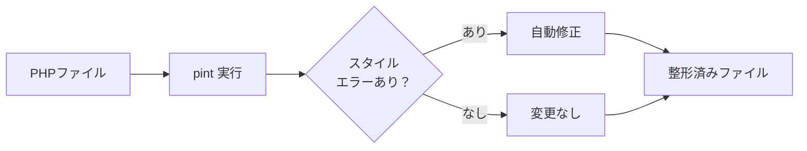

## Laravel Pintとは

[Laravel Pint](https://github.com/laravel/pint) は、PHP CS Fixer 上に構築されたコードスタイル自動修正ツールです。設定なしですぐに使えるよう設計されており、Laravelのコーディングスタイルに従ってコードを自動的に整形します。

チーム開発でよくある「コードスタイルのレビューコメント」を自動化することで、本質的なコードレビューに集中できるようになります。



## インストール

新しく作成したLaravelアプリケーションにはPintが自動でインストールされています。古いバージョンのプロジェクトには Composer でインストールしてください。

```shell
composer require laravel/pint --dev
```

## 実行方法

### 基本的な使い方

プロジェクト内のすべての `.php` ファイルを自動修正します。

```shell
./vendor/bin/pint
```

特定のファイルやディレクトリだけを対象にすることもできます。

```shell
./vendor/bin/pint app/Models
./vendor/bin/pint app/Models/User.php
```

### オプション一覧

| オプション | 説明 |
| --- | --- |
| `--test` | ファイルを変更せずスタイルエラーを検出するだけ。エラーがあれば非ゼロの終了コードを返す |
| `--dirty` | Gitで未コミットの変更があるファイルだけを対象にする |
| `--diff=[branch]` | 指定ブランチとの差分があるファイルだけを対象にする |
| `--repair` | スタイルエラーを修正しつつ、修正があれば非ゼロの終了コードを返す |
| `--parallel` | 並列実行モード（実験的）でパフォーマンスを向上させる |
| `--max-processes=4` | `--parallel` と組み合わせて最大プロセス数を指定する |
| `-v` | 変更内容の詳細を表示する |
| `--config` | 使用する `pint.json` のパスを指定する |
| `--preset` | 使用するプリセットを指定する |

```shell
# ファイルを変更せずチェックのみ
./vendor/bin/pint --test

# 未コミットのファイルだけ対象
./vendor/bin/pint --dirty

# 並列実行
./vendor/bin/pint --parallel
```

## 設定

プロジェクトルートに `pint.json` を作成することで動作をカスタマイズできます。

```json
{
    "preset": "laravel"
}
```

設定ファイルのパスを明示的に指定することもできます。

```shell
./vendor/bin/pint --config vendor/my-company/coding-style/pint.json
```

### プリセット

プリセットはルールのセットです。デフォルトは `laravel` プリセットで、Laravelプロジェクトに最適なルールが適用されます。

| プリセット | 説明 |
| --- | --- |
| `laravel` | Laravelの推奨コーディングスタイル（デフォルト） |
| `psr12` | PSR-12 コーディング標準 |
| `per` | PER Coding Style |
| `symfony` | Symfony のコーディングスタイル |
| `empty` | ルールなし。個別にルールを定義して使う |

```shell
# コマンドラインでプリセットを指定
./vendor/bin/pint --preset psr12
```

### ルールのカスタマイズ

`pint.json` でルールを個別に有効・無効にできます。利用できるルールは [PHP CS Fixer Configurator](https://mlocati.github.io/php-cs-fixer-configurator) を参照してください。

```json
{
    "preset": "laravel",
    "rules": {
        "simplified_null_return": true,
        "array_indentation": false,
        "new_with_parentheses": {
            "anonymous_class": true,
            "named_class": true
        }
    }
}
```

### ファイル・フォルダの除外

特定のフォルダをチェック対象から除外できます。

```json
{
    "exclude": [
        "my-specific/folder"
    ]
}
```

ファイル名のパターンで除外する場合は `notName` を使います。

```json
{
    "notName": [
        "*-my-file.php"
    ]
}
```

特定のファイルパスで除外する場合は `notPath` を使います。

```json
{
    "notPath": [
        "path/to/excluded-file.php"
    ]
}
```

## 推奨設定

実際の開発現場で効果的な `pint.json` の設定例を紹介します。

```json
{
    "preset": "laravel",
    "rules": {
        "no_unused_imports": true,
        "strict_comparison": true,
        "declare_strict_types": true
    }
}
```

各ルールを追加する理由は次のとおりです。

| ルール | 効果 |
| --- | --- |
| `no_unused_imports` | 使われていない `use` 文を自動削除してコードをすっきりさせる |
| `strict_comparison` | `==` を `===` に、`!=` を `!==` に変換して予期しない型変換のバグを防ぐ |
| `declare_strict_types` | ファイル先頭に `declare(strict_types=1);` を自動追加して型の安全性を高める |

<Tip>
  `strict_comparison` と `declare_strict_types` は型に厳格なコードを強制するため、既存プロジェクトに追加する際は初回の修正量が多くなることがあります。新規プロジェクトでは最初から導入することをお勧めします。
</Tip>

<Info>
  **パッケージ開発では `no_unused_imports` に注意してください。** トレイトやインターフェースをインポートすることで機能をオン/オフするパターンがあり、そのような場合は未使用に見える `use` 文も意図的なものです。パッケージを開発する場合はこのルールを外すか `false` に設定することを検討してください。通常のLaravelアプリケーションであれば `true` のままで問題ありません。
</Info>

## composer.json への scripts 設定

`composer.json` に `pint` 用のスクリプトを登録すると、`composer pint` だけで実行できるようになります。

```json
{
    "scripts": {
        "pint": "./vendor/bin/pint",
        "pint:test": "./vendor/bin/pint --test"
    }
}
```

登録後は次のように実行できます。

```shell
# コードを自動修正
composer pint

# チェックのみ（修正しない）
composer pint:test
```

<Info>
  CI環境では `composer pint:test` を使うとファイルを変更せずスタイル違反を検出できます。`--test` オプションはエラーがあれば非ゼロの終了コードを返すので、CI のパスチェックに使えます。
</Info>

## GitHub Actions での自動実行

GitHub Actions を使ってプッシュのたびにコードスタイルを自動修正・コミットできます。

<Steps>
  <Step title="Workflowの権限を設定する">
    GitHubリポジトリの **Settings > Actions > General > Workflow permissions** で「Read and write permissions」を有効にします。
  </Step>

  <Step title="Workflow ファイルを作成する">
    `.github/workflows/lint.yml` を作成します。

    ```yaml
    name: Fix Code Style

    on: [push]

    jobs:
      lint:
        runs-on: ubuntu-latest
        strategy:
          fail-fast: true
          matrix:
            php: [8.4]

        steps:
          - name: Checkout code
            uses: actions/checkout@v5

          - name: Setup PHP
            uses: shivammathur/setup-php@v2
            with:
              php-version: ${{ matrix.php }}
              tools: pint

          - name: Run Pint
            run: pint

          - name: Commit linted files
            uses: stefanzweifel/git-auto-commit-action@v6
    ```
  </Step>
</Steps>

このワークフローは、プッシュのたびに Pint を実行し、スタイル違反を修正したファイルを自動的にコミットします。

<Tip>
  Pull Request のレビュー前に自動修正が入るため、コードスタイルに関するレビューコメントが減ります。チームで導入する際は最初に全ファイルをローカルで修正してからワークフローを追加すると、余分なコミットを防げます。
</Tip>
