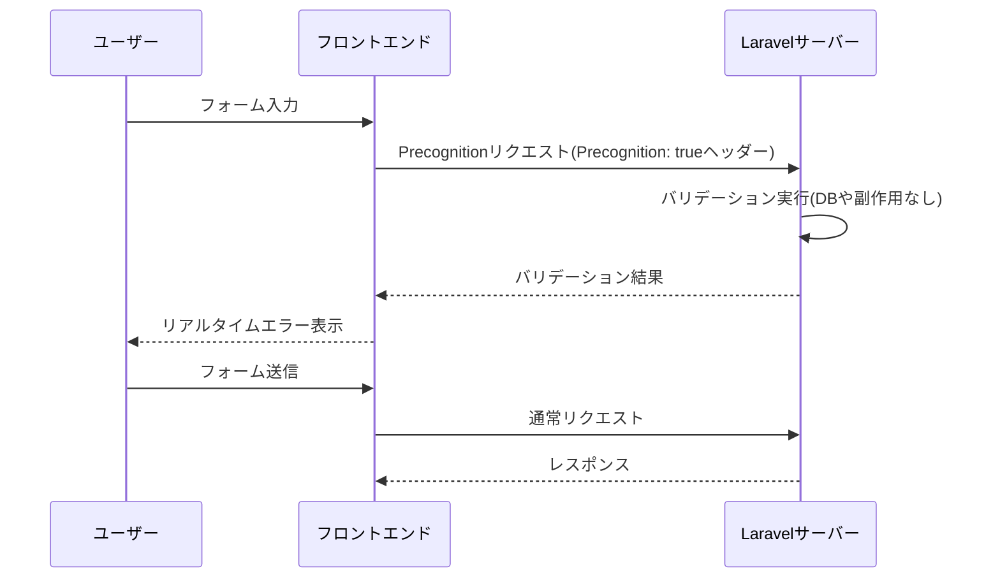

## Precognitionとは

Precognitionは、フォーム送信前にサーバー側バリデーションを実行する仕組みです。
フロントエンドでバリデーションルールを重複定義せずに、Laravelのルールをそのまま使えます。

通常リクエストと違い、Precognitionリクエストではルートのミドルウェアやフォームリクエストの検証は実行されますが、コントローラーメソッド本体は実行されません。
そのため、入力中のリアルタイム検証に向いています。

## インストール

Laravel 13ではバックエンド側の `laravel/precognition` を追加インストールする必要はありません。
必要なのはフロントエンド向けヘルパーパッケージです。

- Vue: `laravel-precognition-vue`
- React: `laravel-precognition-react`
- Alpine.js: `laravel-precognition-alpine`

```shell
npm install laravel-precognition-vue
```

```shell
npm install laravel-precognition-react
```

```shell
npm install laravel-precognition-alpine
```

<Info>
  Inertiaは2.3以降でPrecognitionサポートが組み込みです。Inertia 3でもそのまま利用できます。
</Info>

## バックエンド設定

ルートに `HandlePrecognitiveRequests` ミドルウェアを追加します。
バリデーションルールはフォームリクエストに集約するのが実践的です。

```php
use App\Http\Requests\StoreUserRequest;
use Illuminate\Foundation\Http\Middleware\HandlePrecognitiveRequests;
use Illuminate\Support\Facades\Route;

Route::post('/users', function (StoreUserRequest $request) {
    // 通常送信時のみここが実行される
})->middleware([HandlePrecognitiveRequests::class]);
```

副作用のある独自ミドルウェアがある場合は、Precognition時にスキップしてください。

```php
public function handle(Request $request, Closure $next): mixed
{
    if (! $request->isPrecognitive()) {
        Interaction::incrementFor($request->user());
    }

    return $next($request);
}
```

## フロントエンド連携

### Alpine.js（Blade）

```html
<form x-data="{
    form: $form('post', '/users', { name: '', email: '' }),
}">
    @csrf
    <input x-model="form.name" @change="form.validate('name')" />
    <template x-if="form.invalid('name')">
        <div x-text="form.errors.name"></div>
    </template>
</form>
```

### Vue（Inertia.js）

```vue
<script setup>
import { useForm } from 'laravel-precognition-vue';

const form = useForm('post', '/users', {
    name: '',
    email: '',
});
</script>

<template>
    <input v-model="form.name" @change="form.validate('name')" />
    <div v-if="form.invalid('name')">{{ form.errors.name }}</div>
</template>
```

### React（Inertia.js）

```jsx
import { useForm } from 'laravel-precognition-react';

const form = useForm('post', '/users', {
    name: '',
    email: '',
});

<input
    value={form.data.name}
    onChange={(e) => form.setData('name', e.target.value)}
    onBlur={() => form.validate('name')}
/>
```

### Axiosを使ったバニラJS

PrecognitionライブラリはAxiosを使います。
既存のAxiosインスタンスを使う場合は `client.use()` で差し替えます。

```js
import Axios from 'axios';
import { client } from 'laravel-precognition-vue';

window.axios = Axios.create();
window.axios.defaults.headers.common['Authorization'] = authToken;

client.use(window.axios);
```

## バリデーションのタイミング制御

入力ごとの検証は `validate()` を使います。

```js
form.validate('email');
```

デバウンス時間は `setValidationTimeout()` で調整できます。

```js
form.setValidationTimeout(3000);
```

ファイルも毎回検証したい場合は `validateFiles()` を使います。

```js
form.validateFiles();
```

配列入力はワイルドカードで検証できます。

```js
form.validate('users.*.email');
```

## フォームヘルパー

`useForm()` は送信状態やエラー状態をまとめて扱えます。

- `validating`: バリデーションリクエスト中
- `processing`: 送信中
- `errors`: エラー一覧
- `valid('field')` / `invalid('field')`: フィールドの検証状態
- `submit()`: 通常送信

```js
const submit = () => form.submit()
    .then(() => form.reset());
```

## 通常リクエストとPrecognitionリクエストの比較



## 関連リンク

- [Laravel公式: Precognition](https://laravel.com/docs/precognition)
- [Laravel公式: Validation](https://laravel.com/docs/validation)
