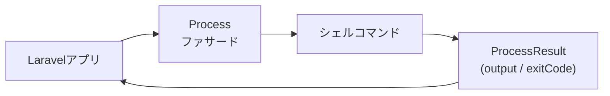

## はじめに

LaravelのProcessファサードは、[Symfony Processコンポーネント](https://symfony.com/doc/current/components/process.html)の薄いラッパーです。
シェルコマンドをLaravelアプリケーションから呼び出し、その結果を扱うための簡潔なAPIを提供します。



## プロセスの起動

`Process::run()` を使うと、コマンドを同期的に実行して結果を取得できます。

```php
use Illuminate\Support\Facades\Process;

$result = Process::run('ls -la');

return $result->output();
```

`ProcessResult` インスタンスには、結果を確認するための各種メソッドが用意されています。

```php
$result = Process::run('ls -la');

$result->command();       // 実行したコマンド
$result->successful();    // 成功したか(終了コード 0)
$result->failed();        // 失敗したか(終了コード 0 以外)
$result->output();        // 標準出力(stdout)
$result->errorOutput();   // 標準エラー出力(stderr)
$result->exitCode();      // 終了コード
```

### 失敗時に例外をスローする

終了コードが 0 より大きい場合に `Illuminate\Process\Exceptions\ProcessFailedException` をスローさせるには、`throw()` または `throwIf()` を使います。

```php
$result = Process::run('ls -la')->throw();

$result = Process::run('ls -la')->throwIf($condition);
```

## プロセスオプション

### 作業ディレクトリ

`path()` で作業ディレクトリを指定できます。省略すると現在のPHPスクリプトの作業ディレクトリが使われます。

```php
$result = Process::path(__DIR__)->run('ls -la');
```

### 標準入力

`input()` でプロセスの標準入力にデータを渡せます。

```php
$result = Process::input('Hello World')->run('cat');
```

### タイムアウト

デフォルトは60秒です。`timeout()` で変更できます。タイムアウトするとプロセスが中断され、`ProcessTimedOutException` がスローされます。

```php
$result = Process::timeout(120)->run('bash import.sh');
```

`CarbonInterval` ヘルパー関数も使えます。

```php
use function Illuminate\Support\minutes;

$result = Process::timeout(minutes(2))->run('bash import.sh');
```

タイムアウトを無効にするには `forever()` を使います。

```php
$result = Process::forever()->run('bash import.sh');
```

アイドルタイムアウト(出力がない状態が続く秒数)を設定することもできます。

```php
$result = Process::timeout(60)->idleTimeout(30)->run('bash import.sh');
```

### 環境変数

`env()` で環境変数を追加または上書きできます。システムの環境変数は自動的に継承されます。

```php
$result = Process::forever()
    ->env(['IMPORT_PATH' => __DIR__])
    ->run('bash import.sh');
```

継承した変数を除外するには `false` を指定します。

```php
$result = Process::forever()
    ->env(['LOAD_PATH' => false])
    ->run('bash import.sh');
```

### 出力の無効化

大量の出力が不要な場合は `quietly()` でメモリ消費を抑えられます。

```php
$result = Process::quietly()->run('bash import.sh');
```

### リアルタイム出力

`run()` の第2引数にクロージャを渡すと、出力をリアルタイムに受け取れます。

```php
$result = Process::run('ls -la', function (string $type, string $output) {
    echo $output;
});
```

## パイプライン

`Process::pipe()` を使うと、あるコマンドの出力を次のコマンドの入力として渡せます。

```php
use Illuminate\Process\Pipe;
use Illuminate\Support\Facades\Process;

$result = Process::pipe(function (Pipe $pipe) {
    $pipe->command('cat example.txt');
    $pipe->command('grep -i "laravel"');
});

if ($result->successful()) {
    // ...
}
```

コマンド文字列の配列を渡すこともできます。

```php
$result = Process::pipe([
    'cat example.txt',
    'grep -i "laravel"',
]);
```

各プロセスに `as()` でキーを付けると、出力クロージャでどのプロセスからの出力かを判別できます。

```php
$result = Process::pipe(function (Pipe $pipe) {
    $pipe->as('first')->command('cat example.txt');
    $pipe->as('second')->command('grep -i "laravel"');
}, function (string $type, string $output, string $key) {
    // $key が 'first' または 'second'
});
```

## 非同期プロセス

`Process::start()` を使うと、プロセスを非同期で起動できます。プロセスが実行中の間、アプリケーションは他の処理を続けられます。

```php
$process = Process::timeout(120)->start('bash import.sh');

while ($process->running()) {
    // 他の処理
}

$result = $process->wait();
```

### プロセスIDとシグナル

`id()` で実行中プロセスのOSプロセスIDを取得できます。

```php
$process = Process::start('bash import.sh');

return $process->id();
```

`signal()` でプロセスにシグナルを送れます。

```php
$process->signal(SIGUSR2);
```

### 非同期プロセスの出力

実行中に `latestOutput()` と `latestErrorOutput()` を使うと、前回取得以降の差分出力を取得できます。

```php
$process = Process::timeout(120)->start('bash import.sh');

while ($process->running()) {
    echo $process->latestOutput();
    echo $process->latestErrorOutput();

    sleep(1);
}
```

特定の出力が現れるまで待機するには `waitUntil()` を使います。

```php
$process = Process::start('bash import.sh');

$process->waitUntil(function (string $type, string $output) {
    return $output === 'Ready...';
});
```

### 非同期プロセスのタイムアウト確認

ループ内で `ensureNotTimedOut()` を呼ぶと、タイムアウトしていた場合に例外がスローされます。

```php
$process = Process::timeout(120)->start('bash import.sh');

while ($process->running()) {
    $process->ensureNotTimedOut();

    sleep(1);
}
```

## 並行プロセス

`Process::pool()` を使うと、複数のプロセスを並行して実行できます。

```php
use Illuminate\Process\Pool;
use Illuminate\Support\Facades\Process;

$pool = Process::pool(function (Pool $pool) {
    $pool->path(__DIR__)->command('bash import-1.sh');
    $pool->path(__DIR__)->command('bash import-2.sh');
    $pool->path(__DIR__)->command('bash import-3.sh');
})->start(function (string $type, string $output, int $key) {
    // ...
});

while ($pool->running()->isNotEmpty()) {
    // ...
}

$results = $pool->wait();
```

`concurrently()` を使うと、プールをすぐに開始して結果を待つ処理を1行で書けます。

```php
[$first, $second, $third] = Process::concurrently(function (Pool $pool) {
    $pool->path(__DIR__)->command('ls -la');
    $pool->path(app_path())->command('ls -la');
    $pool->path(storage_path())->command('ls -la');
});

echo $first->output();
```

### プロセスへの名前付け

`as()` で各プロセスに文字列キーを付けると、結果の取得が明確になります。

```php
$pool = Process::pool(function (Pool $pool) {
    $pool->as('first')->command('bash import-1.sh');
    $pool->as('second')->command('bash import-2.sh');
    $pool->as('third')->command('bash import-3.sh');
})->start(function (string $type, string $output, string $key) {
    // ...
});

$results = $pool->wait();

return $results['first']->output();
```

プール全体にシグナルを送ることもできます。

```php
$pool->signal(SIGUSR2);
```

## テスト

### プロセスのフェイク

`Process::fake()` を使うと、実際のシェルコマンドを実行せずにテストできます。

```php
use Illuminate\Support\Facades\Process;

Process::fake();

$response = $this->get('/import');

Process::assertRan('bash import.sh');
```

出力や終了コードを指定することもできます。

```php
Process::fake([
    '*' => Process::result(
        output: 'Test output',
        errorOutput: 'Test error output',
        exitCode: 1,
    ),
]);
```

### 特定のコマンドをフェイクする

ワイルドカードやコマンド文字列をキーにして個別にフェイクを設定できます。

```php
Process::fake([
    'cat *'    => Process::result(output: 'file contents'),
    'ls -la'   => Process::result(output: 'file listing'),
]);
```

### シーケンスのフェイク

同じコマンドを複数回呼び出す場合、返す結果の順序を指定できます。

```php
Process::fake([
    'ls *' => [
        Process::result('first time'),
        Process::result('second time'),
    ],
]);
```

### アサーション

| メソッド | 説明 |
| --- | --- |
| `Process::assertRan('command')` | コマンドが実行されたことを検証 |
| `Process::assertNotRan('command')` | コマンドが実行されなかったことを検証 |
| `Process::assertRan(fn)` | クロージャで実行内容を詳細に検証 |
| `Process::assertRanTimes('command', 3)` | コマンドが指定回数実行されたことを検証 |

### 予期しないプロセスの防止

`Process::preventStrayProcesses()` を呼ぶと、フェイクが設定されていないコマンドが実行された場合に例外がスローされます。

```php
Process::preventStrayProcesses();

Process::fake([
    'ls *' => Process::result('file listing'),
]);

// 例外: 'bash import.sh' はフェイクが設定されていない
Process::run('bash import.sh');
```

## 関連ページ

<Columns cols={2}>
  <Card title="Artisanコンソール" icon="terminal" href="/jp/artisan">
    カスタムコマンドを作成してプロセスを呼び出す
  </Card>
  <Card title="キュー" icon="list" href="/jp/queues">
    非同期処理との比較
  </Card>
</Columns>
