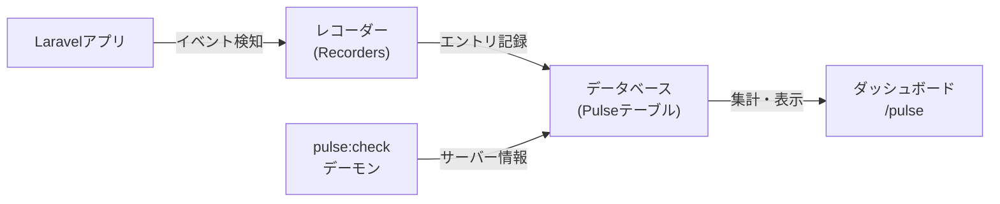

## Laravel Pulseとは

[Laravel Pulse](https://github.com/laravel/pulse) は、アプリケーションのパフォーマンスと使用状況をひと目で把握できる監視ダッシュボードです。
スロージョブや遅いエンドポイントのボトルネックを特定したり、最もアクティブなユーザーを調べたりすることができます。

### TelescopeとPulseの違い

| 特徴 | Laravel Pulse | Laravel Telescope |
| --- | --- | --- |
| 目的 | アプリ全体の傾向・集計データを監視 | 個別リクエスト・イベントの詳細なデバッグ |
| データ | 集計済みメトリクス | 個別イベントのログ |
| 向いている場面 | 本番環境のパフォーマンス監視 | 開発・ステージング環境でのデバッグ |

<Info>
  個別イベントの詳細なデバッグには [Laravel Telescope](/jp/blog/telescope-introduction) を使用してください。
</Info>

### データフロー図



---

## インストール

<Warning>
  Pulseのファーストパーティストレージ実装は、MySQL、MariaDB、またはPostgreSQLデータベースが必要です。別のデータベースエンジンを使用している場合は、Pulseデータ専用にMySQL、MariaDB、またはPostgreSQLデータベースを用意してください。
</Warning>

<Steps>
  <Step title="パッケージのインストール">
    Composerを使ってPulseをインストールします。

    ```shell
    composer require laravel/pulse
    ```
  </Step>

  <Step title="設定ファイルとマイグレーションの公開">
    `vendor:publish` Artisanコマンドでファイルを公開します。

    ```shell
    php artisan vendor:publish --provider="Laravel\Pulse\PulseServiceProvider"
    ```
  </Step>

  <Step title="マイグレーションの実行">
    Pulseのデータを保存するテーブルを作成します。

    ```shell
    php artisan migrate
    ```
  </Step>
</Steps>

マイグレーション完了後、`/pulse` ルートでダッシュボードにアクセスできます。

### 設定ファイルの公開

設定ファイルを別途公開してカスタマイズすることもできます。

```shell
php artisan vendor:publish --tag=pulse-config
```

---

## ダッシュボードのアクセス

### 認証設定

デフォルトでは `local` 環境のみダッシュボードにアクセスできます。
本番環境では `viewPulse` 認証ゲートをカスタマイズしてアクセス制御を設定してください。

```php
use App\Models\User;
use Illuminate\Support\Facades\Gate;

/**
 * Bootstrap any application services.
 */
public function boot(): void
{
    Gate::define('viewPulse', function (User $user) {
        return $user->isAdmin();
    });
}
```

`app/Providers/AppServiceProvider.php` の `boot` メソッドに上記のコードを追加します。

### ダッシュボードのカスタマイズ

ダッシュボードのビューを公開してカードやレイアウトをカスタマイズできます。

```shell
php artisan vendor:publish --tag=pulse-dashboard
```

公開後、`resources/views/vendor/pulse/dashboard.blade.php` を編集します。
ダッシュボードは [Livewire](https://livewire.laravel.com/) で動いているため、JavaScriptのビルドなしでカスタマイズできます。

```blade
{{-- 全幅表示にする --}}
<x-pulse full-width>
    ...
</x-pulse>

{{-- カラム数を変更する --}}
<x-pulse cols="16">
    ...
</x-pulse>
```

各カードは `cols` と `rows` プロパティでサイズと位置を調整できます。

```blade
<livewire:pulse.usage cols="4" rows="2" />
<livewire:pulse.slow-queries expand />
```

---

## レコーダー

レコーダーはアプリケーションのイベントをキャプチャしてPulseデータベースに記録します。
設定は `config/pulse.php` の `recorders` セクションで管理します。

### Requests / Slow Requests

`Requests` レコーダーはアプリケーションへのリクエスト情報をキャプチャします。
スロールートの閾値（デフォルト: 1000ms）、サンプリングレート、無視するパスを設定できます。

```php
Recorders\SlowRequests::class => [
    // ...
    'threshold' => [
        '#^/admin/#' => 5000,
        'default' => env('PULSE_SLOW_REQUESTS_THRESHOLD', 1000),
    ],
],
```

### Slow Jobs

`SlowJobs` レコーダーは閾値を超えた遅いジョブをキャプチャします（デフォルト: 1000ms）。
ジョブごとに異なる閾値を設定できます。

```php
Recorders\SlowJobs::class => [
    // ...
    'threshold' => [
        '#^App\\Jobs\\GenerateYearlyReports$#' => 5000,
        'default' => env('PULSE_SLOW_JOBS_THRESHOLD', 1000),
    ],
],
```

### Exceptions

`Exceptions` レコーダーはアプリケーションで発生したレポート可能な例外をキャプチャします。
例外クラスと発生場所でグループ化されます。

### Cache

`CacheInteractions` レコーダーはキャッシュのヒットとミスをキャプチャします。
類似したキーをグループ化する正規表現も設定できます。

```php
Recorders\CacheInteractions::class => [
    // ...
    'groups' => [
        '/:\d+/' => ':*',
    ],
],
```

### Queues

`Queues` レコーダーはキュー内のジョブのスループット（キュー済み、処理中、処理完了、リリース、失敗）をキャプチャします。

### Servers

`Servers` レコーダーはアプリケーションを動かすサーバーのCPU、メモリ、ストレージ使用量をキャプチャします。
このレコーダーを使うには、監視対象の各サーバーで `pulse:check` コマンドを常時起動する必要があります。

```shell
php artisan pulse:check
```

サーバー名はデフォルトでPHPの `gethostname()` の値が使われます。カスタマイズするには環境変数を設定します。

```ini
PULSE_SERVER_NAME=load-balancer
```

### Users

`UserRequests` と `UserJobs` レコーダーは、リクエストやジョブを送信したユーザー情報をキャプチャして「Application Usage」カードに表示します。

### Redis Ingest

高トラフィック環境では、エントリをRedisストリームに送信してからデータベースに取り込む方法が利用できます。

```ini
PULSE_INGEST_DRIVER=redis
```

Redisインジェストを使う場合は、`pulse:work` コマンドでストリームを監視する必要があります。

```shell
php artisan pulse:work
```

---

## サンプリング

高トラフィック環境では、全イベントをキャプチャするとデータベースに数百万行が蓄積される可能性があります。
**サンプリング**を有効にすると、一部のイベントのみ記録し、ダッシュボードで近似値として表示します。

```php
// config/pulse.php
Recorders\UserRequests::class => [
    'sample_rate' => 0.1, // 10%のリクエストのみ記録
],
```

ダッシュボードでは近似値の前に `~` が表示されます。
メトリクスのエントリ数が多いほど、精度を維持しながらサンプリングレートを下げられます。

---

## 環境変数

主要な設定は環境変数で制御できます。

| 環境変数 | 説明 | デフォルト |
| --- | --- | --- |
| `PULSE_ENABLED` | Pulseの有効/無効 | `true` |
| `PULSE_DB_CONNECTION` | Pulseが使うDBコネクション | アプリのデフォルト |
| `PULSE_INGEST_DRIVER` | インジェストドライバー (`redis` など) | `storage` |
| `PULSE_SERVER_NAME` | サーバー識別名 | `gethostname()` の値 |
| `PULSE_SLOW_REQUESTS_THRESHOLD` | スローリクエストの閾値(ms) | `1000` |
| `PULSE_SLOW_JOBS_THRESHOLD` | スロージョブの閾値(ms) | `1000` |
| `PULSE_SLOW_QUERIES_THRESHOLD` | スロークエリの閾値(ms) | `1000` |

---

## カスタムカード

独自のPulseカードを作成して、アプリケーション固有のデータを表示できます。
カードは [Livewire](https://livewire.laravel.com/) コンポーネントとして実装します。

```php
namespace App\Livewire\Pulse;

use Laravel\Pulse\Livewire\Card;
use Livewire\Attributes\Lazy;

#[Lazy]
class TopSellers extends Card
{
    public function render()
    {
        return view('livewire.pulse.top-sellers');
    }
}
```

カードのビューでは、Pulseが提供するBladeコンポーネントを使って統一感のある見た目を実現できます。

```blade
<x-pulse::card :cols="$cols" :rows="$rows" :class="$class" wire:poll.5s="">
    <x-pulse::card-header name="Top Sellers">
        <x-slot:icon>
            ...
        </x-slot:icon>
    </x-pulse::card-header>

    <x-pulse::scroll :expand="$expand">
        ...
    </x-pulse::scroll>
</x-pulse::card>
```

カスタムデータのキャプチャには `Pulse::record` メソッドを使います。

```php
use Laravel\Pulse\Facades\Pulse;

Pulse::record('user_sale', $user->id, $sale->amount)
    ->sum()
    ->count();
```

作成したコンポーネントはダッシュボードビューに組み込みます。

```blade
<x-pulse>
    ...
    <livewire:pulse.top-sellers cols="4" />
</x-pulse>
```

---

## まとめ

| やりたいこと | 方法 |
| --- | --- |
| Pulseをインストール | `composer require laravel/pulse` |
| ダッシュボードにアクセス | `/pulse` ルート |
| 本番環境でアクセス制御 | `viewPulse` ゲートを定義 |
| サーバー監視を有効化 | `php artisan pulse:check` を常時起動 |
| サンプリングを設定 | `sample_rate` オプションで比率を指定 |

## 次のステップ

<Columns cols={2}>
  <Card title="エラーハンドリング" icon="circle-x" href="/jp/error-handling">
    アプリケーションの例外処理とレポートの仕組みを学びます。
  </Card>
  <Card title="ロギング" icon="file-text" href="/jp/logging">
    Laravelのログシステムの設定と活用方法を解説します。
  </Card>
</Columns>
