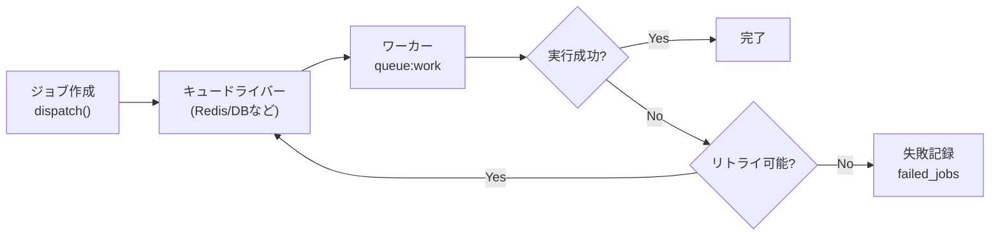

## キューとは

Webアプリケーションでは、メール送信・画像のリサイズ・外部APIへの問い合わせなど、完了まで数秒かかる処理が発生することがあります。
これをHTTPリクエストの中で同期的に行うと、ユーザーはレスポンスが返るまで待ち続けなければなりません。

Laravelのキューを使うと、こうした重い処理を**バックグラウンドで非同期に実行**できます。
リクエストはすぐにレスポンスを返し、実際の処理はワーカープロセスが別途こなしてくれます。

<Info>
  キューはデータベース・Redis・Amazon SQSなど複数のバックエンドに対応しています。
  開発環境では `sync` ドライバを使うと、キューを使わずジョブを即時実行できます。
</Info>



## キューの設定

### config/queue.php

キューの設定は `config/queue.php` に集約されています。
`QUEUE_CONNECTION` 環境変数で使用するドライバを切り替えます。

```php
// config/queue.php
'default' => env('QUEUE_CONNECTION', 'database'),
```

### .env の設定

```ini
# ドライバの選択
QUEUE_CONNECTION=database

# Redisを使う場合
# QUEUE_CONNECTION=redis
# REDIS_HOST=127.0.0.1
# REDIS_PORT=6379
```

### データベースドライバの準備

`database` ドライバを使う場合、ジョブを保存するテーブルが必要です。
Laravel 11以降の新規プロジェクトには最初からマイグレーションが含まれていますが、
含まれていない場合は次のコマンドで作成します。

```shell
php artisan make:queue-table
php artisan migrate
```

### Redisドライバの準備

`redis` ドライバを使う場合は `config/database.php` にRedis接続設定を追加し、
Composerでドライバをインストールします。

```shell
composer require predis/predis
```

## ジョブクラスの作成

### make:job コマンド

`make:job` Artisanコマンドでジョブクラスのひな型を生成します。

```shell
php artisan make:job SendWelcomeEmail
```

`app/Jobs/SendWelcomeEmail.php` が生成されます。

### ジョブクラスの構造

```php
<?php

namespace App\Jobs;

use App\Models\User;
use App\Mail\WelcomeMail;
use Illuminate\Contracts\Queue\ShouldQueue;
use Illuminate\Foundation\Queue\Queueable;
use Illuminate\Support\Facades\Mail;

class SendWelcomeEmail implements ShouldQueue
{
    use Queueable;

    /**
     * ジョブのインスタンスを作成する
     */
    public function __construct(
        public User $user,
    ) {}

    /**
     * ジョブを実行する
     */
    public function handle(): void
    {
        Mail::to($this->user->email)->send(new WelcomeMail($this->user));
    }
}
```

`ShouldQueue` インターフェースを実装することで、このジョブがキューで非同期処理されることをLaravelに伝えます。
`Queueable` トレイトがジョブのキュー操作に必要なメソッドを提供します。

<Tip>
  コンストラクタにEloquentモデルを渡すと、Laravelは自動的にIDだけをシリアライズします。
  実行時にデータベースから最新データを再取得するため、キューのペイロードが軽くなります。
</Tip>

## ジョブのディスパッチ

### dispatch()

コントローラやサービスからジョブをキューに送り出すには `dispatch()` を使います。

```php
use App\Jobs\SendWelcomeEmail;

// ルートやコントローラの中で
public function register(Request $request): RedirectResponse
{
    $user = User::create($request->validated());

    // ジョブをキューに積む
    SendWelcomeEmail::dispatch($user);

    return redirect('/dashboard');
}
```

### 遅延ディスパッチ

`delay()` メソッドでジョブの実行を指定時間後に遅らせられます。

```php
// 5分後に実行
SendWelcomeEmail::dispatch($user)->delay(now()->addMinutes(5));
```

### dispatchAfterResponse()

`dispatchAfterResponse()` を使うと、HTTPレスポンスをユーザーに返した**直後**にジョブを実行します。
`sync` ドライバでも動作するため、専用のワーカーが不要な軽量な用途に向いています。

```php
SendWelcomeEmail::dispatchAfterResponse($user);
```

### 特定のキューへのディスパッチ

```php
SendWelcomeEmail::dispatch($user)->onQueue('emails');
```

### 同期実行(テスト・開発用)

`dispatchSync()` を使うと、キューを経由せずに即時実行します。

```php
SendWelcomeEmail::dispatchSync($user);
```

## ジョブの処理

### queue:work コマンド

キューワーカーを起動してジョブを処理します。

```shell
php artisan queue:work
```

特定のドライバやキューを指定することもできます。

```shell
# Redisのemailsキューだけを処理
php artisan queue:work redis --queue=emails

# databaseドライバを使う
php artisan queue:work database
```

<Warning>
  `queue:work` は起動したまま動き続けます。コードを変更したときは `queue:restart` でワーカーを再起動してください。
  本番環境ではSupervisorなどのプロセスマネージャーで管理するのが一般的です。
</Warning>

## キューワーカーの監視オプション

よく使うオプションを組み合わせてワーカーを細かく制御できます。

```shell
php artisan queue:work --tries=3 --timeout=60 --sleep=3
```

| オプション | 説明 |
| --- | --- |
| `--tries=N` | ジョブの最大試行回数。超えると失敗ジョブとして記録される |
| `--timeout=N` | ジョブ1件の最大実行秒数。超えるとワーカーを強制終了する |
| `--sleep=N` | キューが空のときに次のポーリングまで待機する秒数(デフォルト: 3) |
| `--max-jobs=N` | N件処理したらワーカーを終了する |
| `--max-time=N` | N秒経過したらワーカーを終了する |
| `--queue=A,B` | 優先順位付きでキューを処理する(Aを優先) |

### ジョブクラスにリトライ設定を書く

コマンドラインオプションより、ジョブクラス自体に設定を書く方が管理しやすい場合があります。

```php
use Illuminate\Foundation\Queue\Queueable;
use Illuminate\Queue\Attributes\Tries;
use Illuminate\Queue\Attributes\Timeout;

#[Tries(3)]
#[Timeout(60)]
class SendWelcomeEmail implements ShouldQueue
{
    use Queueable;

    // ...
}
```

## 失敗したジョブの処理

### failed_jobs テーブルの準備

ジョブが最大試行回数を超えると、`failed_jobs` テーブルに記録されます。
テーブルがない場合は次のコマンドで作成します。

```shell
php artisan make:queue-failed-table
php artisan migrate
```

### 失敗時のクリーンアップ

ジョブに `failed()` メソッドを定義すると、失敗したときの後処理を記述できます。

```php
use Throwable;

public function failed(?Throwable $exception): void
{
    // 管理者にSlack通知を送るなど
    // Notification::route('slack', config('app.slack_webhook'))
    //     ->notify(new JobFailedNotification($this, $exception));
}
```

### 失敗したジョブの一覧確認

```shell
php artisan queue:failed
```

### 失敗したジョブのリトライ

```shell
# 特定のジョブIDを指定してリトライ
php artisan queue:retry ce7bb17c-cdd8-41f0-a8ec-7b4fef4e5ece

# すべての失敗ジョブをリトライ
php artisan queue:retry all
```

### 失敗したジョブの削除

```shell
# 特定のジョブを削除
php artisan queue:forget ce7bb17c-cdd8-41f0-a8ec-7b4fef4e5ece

# すべての失敗ジョブを削除
php artisan queue:flush
```

## よく使うキュードライバ

### database ドライバ

追加のミドルウェアなしに使い始められるシンプルなドライバです。
`jobs` テーブルにジョブを保存し、ワーカーがポーリングして処理します。

- **長所**: セットアップが簡単、既存のRDBMSをそのまま使える
- **短所**: データベースへの負荷が高いため、大量のジョブには不向き

```ini
QUEUE_CONNECTION=database
```

### redis ドライバ

本番環境で最もよく使われる高速なドライバです。
インメモリで動作するためデータベースよりもスループットが高く、大量のジョブを処理できます。

- **長所**: 高速、スケーラブル
- **短所**: Redisサーバーの用意が必要

```ini
QUEUE_CONNECTION=redis
REDIS_HOST=127.0.0.1
REDIS_PORT=6379
```

<Tip>
  Redisキューを本番運用する場合は [Laravel Horizon](https://laravel.com/docs/horizon) の導入を検討してください。
  美しいダッシュボードでジョブの状況をリアルタイムに監視できます。
</Tip>

## Supervisorによる本番運用

本番環境では、`queue:work` プロセスが何らかの理由で停止したときに自動で再起動する仕組みが必要です。
Linux環境では **Supervisor** を使うのが一般的です。

```ini
# /etc/supervisor/conf.d/laravel-worker.conf
[program:laravel-worker]
process_name=%(program_name)s_%(process_num)02d
command=php /var/www/your-app/artisan queue:work --sleep=3 --tries=3 --max-time=3600
autostart=true
autorestart=true
stopasgroup=true
killasgroup=true
user=www-data
numprocs=2
redirect_stderr=true
stdout_logfile=/var/www/your-app/storage/logs/worker.log
stopwaitsecs=3600
```

`numprocs=2` で2つのワーカープロセスを並列起動します。
設定後に Supervisor を再読み込みします。

```shell
sudo supervisorctl reread
sudo supervisorctl update
sudo supervisorctl start laravel-worker:*
```

## 実践例: メール送信をキューで処理する

<Steps>
  <Step title="ジョブクラスを作成する">
    ```shell
    php artisan make:job SendOrderConfirmation
    ```
  </Step>

  <Step title="ジョブの処理を実装する">
    ```php
    <?php

    namespace App\Jobs;

    use App\Models\Order;
    use App\Mail\OrderConfirmed;
    use Illuminate\Contracts\Queue\ShouldQueue;
    use Illuminate\Foundation\Queue\Queueable;
    use Illuminate\Queue\Attributes\Tries;
    use Illuminate\Queue\Attributes\Timeout;
    use Illuminate\Support\Facades\Mail;

    #[Tries(3)]
    #[Timeout(30)]
    class SendOrderConfirmation implements ShouldQueue
    {
        use Queueable;

        public function __construct(
            public Order $order,
        ) {}

        public function handle(): void
        {
            Mail::to($this->order->user->email)
                ->send(new OrderConfirmed($this->order));
        }
    }
    ```
  </Step>

  <Step title="コントローラからディスパッチする">
    ```php
    use App\Jobs\SendOrderConfirmation;

    public function store(Request $request): RedirectResponse
    {
        $order = Order::create($request->validated());

        SendOrderConfirmation::dispatch($order);

        return redirect()->route('orders.show', $order)
            ->with('success', '注文を受け付けました。');
    }
    ```
  </Step>

  <Step title="ワーカーを起動する">
    ```shell
    php artisan queue:work --tries=3 --timeout=30
    ```
  </Step>
</Steps>

## まとめ

<AccordionGroup>
  <Accordion title="キューを使うべきタイミング">
    - メール・SMS送信
    - 画像・動画のリサイズや変換
    - 外部APIへのリクエスト
    - レポートの生成やCSVエクスポート
    - Webhook の送信
  </Accordion>

  <Accordion title="開発時のヒント">
    `.env` で `QUEUE_CONNECTION=sync` にすると、ジョブはキューを経由せず即時実行されます。
    ワーカーを起動しなくても動作確認できるため、開発中は便利です。

    ```ini
    QUEUE_CONNECTION=sync
    ```
  </Accordion>

  <Accordion title="よく使うコマンドまとめ">
    ```shell
    # ワーカー起動
    php artisan queue:work

    # ワーカー再起動(デプロイ後)
    php artisan queue:restart

    # 失敗ジョブ一覧
    php artisan queue:failed

    # 失敗ジョブをすべてリトライ
    php artisan queue:retry all

    # 失敗ジョブをすべて削除
    php artisan queue:flush
    ```
  </Accordion>
</AccordionGroup>
