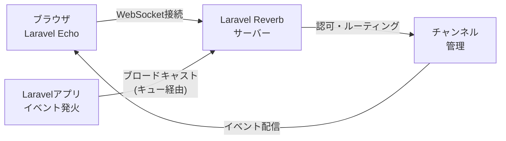
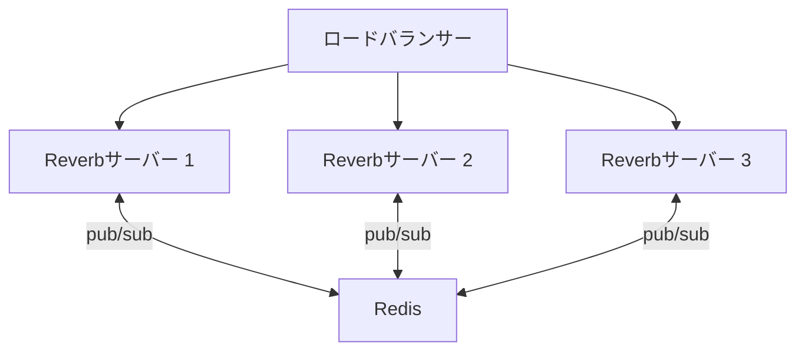

<Info>
  このページはReverb サーバー自体のセットアップと運用に焦点を当てています。
  ブロードキャストイベントの作成やLaravel Echoの使い方は[ブロードキャスト](/jp/broadcasting)を参照してください。
</Info>

## Reverbとは

[Laravel Reverb](https://github.com/laravel/reverb) は、Laravelが公式に提供するセルフホスト型WebSocketサーバーです。
外部サービスへの依存なしに、高速でスケーラブルなリアルタイム通信をLaravelアプリケーションに追加できます。

Reverbは[ブロードキャスト](/jp/broadcasting)基盤の上で動作し、サーバーサイドのイベントをWebSocket経由でブラウザへ届ける役割を担います。



## インストール

`install:broadcasting` Artisanコマンドを使うと、Reverb を含むすべての依存関係を一括でインストールできます。

```shell
php artisan install:broadcasting
```

コマンド実行時にReverbを選択するか、`--reverb` オプションを付けて実行すると自動的にReverbがセットアップされます。

```shell
php artisan install:broadcasting --reverb
```

このコマンドは以下を行います。

- Composer パッケージ (`laravel/reverb`) のインストール
- NPM パッケージ (`laravel-echo`、`pusher-js`) のインストール
- `.env` への環境変数の追加
- `config/reverb.php` の生成

手動でインストールする場合は、Composerでパッケージを追加してから `reverb:install` を実行します。

```shell
composer require laravel/reverb
php artisan reverb:install
```

## 設定

### アプリケーション認証情報

クライアントとサーバーの接続確立に使用する認証情報を環境変数で設定します。

```ini
REVERB_APP_ID=my-app-id
REVERB_APP_KEY=my-app-key
REVERB_APP_SECRET=my-app-secret
```

これらの値は `config/reverb.php` の `apps` セクションで参照されます。

### 許可するオリジン (Allowed Origins)

クライアントリクエストを許可するオリジンを `config/reverb.php` の `allowed_origins` で制限できます。

```php
'apps' => [
    [
        'app_id' => 'my-app-id',
        'allowed_origins' => ['laravel.com'],
        // ...
    ]
]
```

すべてのオリジンを許可する場合は `*` を指定します。

### 複数アプリ対応

1つのReverbサーバーで複数のアプリケーションに対応できます。
`config/reverb.php` の `apps` 配列に複数のエントリを追加します。

```php
'apps' => [
    [
        'app_id' => 'my-app-one',
        // ...
    ],
    [
        'app_id' => 'my-app-two',
        // ...
    ],
],
```

### SSL設定

本番環境では、NginxなどのWebサーバーがSSL終端を担当し、Reverbへリクエストをプロキシするのが一般的です。
ローカル開発環境でSecure WebSocket (`wss://`) を使いたい場合は、Laravel HerdやValetの証明書を活用できます。

```shell
php artisan reverb:start --host="0.0.0.0" --port=8080 --hostname="laravel.test"
```

証明書を手動で指定する場合は `config/reverb.php` の `tls` オプションを設定します。

```php
'options' => [
    'tls' => [
        'local_cert' => '/path/to/cert.pem'
    ],
],
```

## サーバーの起動

`reverb:start` Artisanコマンドでサーバーを起動します。

```shell
php artisan reverb:start
```

デフォルトでは `0.0.0.0:8080` で起動します。
`--host` / `--port` オプションでカスタムアドレスを指定できます。

```shell
php artisan reverb:start --host=127.0.0.1 --port=9000
```

環境変数でも指定できます。

```ini
REVERB_SERVER_HOST=0.0.0.0
REVERB_SERVER_PORT=8080
```

<Info>
  `REVERB_SERVER_HOST` / `REVERB_SERVER_PORT` はサーバー自体のリスンアドレスです。
  `REVERB_HOST` / `REVERB_PORT` はLaravelアプリがブロードキャストメッセージを送信する先のアドレスです。
  本番環境ではこれらが異なる場合があります。
</Info>

### デバッグモード

パフォーマンスのため、Reverbはデフォルトでデバッグ情報を出力しません。
接続やメッセージの流れを確認したい場合は `--debug` オプションを使います。

```shell
php artisan reverb:start --debug
```

### サーバーの再起動

Reverbは常駐プロセスのため、コードの変更を反映するには再起動が必要です。
`reverb:restart` コマンドは、すべての接続を graceful に終了してからサーバーを停止します。

```shell
php artisan reverb:restart
```

Supervisorなどのプロセスマネージャーを使っている場合、停止後に自動的に再起動されます。

## モニタリング

Reverbは[Laravel Pulse](https://laravel.com/docs/pulse) との連携をサポートしています。
接続数やメッセージ数をリアルタイムでダッシュボードに表示できます。

まず `config/pulse.php` にReverbのレコーダーを追加します。

```php
use Laravel\Reverb\Pulse\Recorders\ReverbConnections;
use Laravel\Reverb\Pulse\Recorders\ReverbMessages;

'recorders' => [
    ReverbConnections::class => [
        'sample_rate' => 1,
    ],

    ReverbMessages::class => [
        'sample_rate' => 1,
    ],

    // ...
],
```

次に、Pulseダッシュボードのテンプレートにカードを追加します。

```blade
<x-pulse>
    <livewire:reverb.connections cols="full" />
    <livewire:reverb.messages cols="full" />
    ...
</x-pulse>
```

接続状況を正しく記録するため、Reverbサーバーで `pulse:check` デーモンを起動してください。
水平スケーリング構成の場合、`pulse:check` は1台のサーバーでのみ実行します。

## 本番環境での運用

### ファイルオープン制限

WebSocket接続は1接続につき1ファイルディスクリプターを消費します。
OSレベルの制限を確認し、必要に応じて上限を引き上げます。

```shell
ulimit -n
```

`/etc/security/limits.conf` で上限を変更できます。

```ini
# /etc/security/limits.conf
forge        soft  nofile  10000
forge        hard  nofile  10000
```

### イベントループ (ext-uv)

ReverbはデフォルトでPHPの `stream_select` を使いますが、これは最大1,024ファイルの制限があります。
1,000以上の同時接続を扱う場合は `ext-uv` をインストールして制限を解放します。

```shell
pecl install uv
```

`ext-uv` が利用可能な場合、Reverbは自動的にそちらを使用します。

### Nginxリバースプロキシ

本番環境ではReverbを直接公開せず、NginxなどのWebサーバーでプロキシします。
以下はNginxの設定例です。

```nginx
server {
    ...

    location / {
        proxy_http_version 1.1;
        proxy_set_header Host $http_host;
        proxy_set_header Scheme $scheme;
        proxy_set_header SERVER_PORT $server_port;
        proxy_set_header REMOTE_ADDR $remote_addr;
        proxy_set_header X-Forwarded-For $proxy_add_x_forwarded_for;
        proxy_set_header Upgrade $http_upgrade;
        proxy_set_header Connection "Upgrade";

        proxy_pass http://0.0.0.0:8080;
    }

    ...
}
```

<Warning>
  ReverbはWebSocket接続を `/app` で、APIリクエストを `/apps` で受け付けます。
  Webサーバーの設定で両方のURIへのアクセスを許可してください。
</Warning>

同時接続数を増やすには、`nginx.conf` の `worker_rlimit_nofile` と `worker_connections` を調整します。

```nginx
user forge;
worker_processes auto;
pid /run/nginx.pid;
include /etc/nginx/modules-enabled/*.conf;
worker_rlimit_nofile 10000;

events {
  worker_connections 10000;
  multi_accept on;
}
```

### プロセス管理 (Supervisor)

本番環境ではSupervisorでReverbプロセスを管理します。
`supervisor.conf` の `minfds` を設定して、必要なファイルディスクリプターを確保します。

```ini
[supervisord]
...
minfds=10000
```

Supervisorの設定例：

```ini
[program:reverb]
process_name=%(program_name)s
command=php /path/to/artisan reverb:start
autostart=true
autorestart=true
user=forge
redirect_stderr=true
stdout_logfile=/path/to/reverb.log
```

### スケーリング (Redis)

単一サーバーでは処理しきれない接続数が必要な場合、Redisのpub/sub機能を使った水平スケーリングが可能です。



`.env` でスケーリングを有効化します。

```env
REVERB_SCALING_ENABLED=true
```

ReverbはアプリケーションのデフォルトRedis接続を使ってサーバー間でメッセージをやり取りします。
複数のReverbサーバーを起動し、ロードバランサーでリクエストを分散します。

<Info>
  [Laravel Cloud](https://cloud.laravel.com) では、インフラ管理なしにReverb対応アプリをデプロイできる
  フルマネージドのWebSocketインフラを提供しています。
</Info>

## イベント

Reverbは接続・メッセージのライフサイクルで以下のイベントを発行します。
[イベントリスナー](/jp/events)でこれらを受け取り、独自の処理を追加できます。

| イベント | 説明 |
|---|---|
| `ChannelCreated` | チャンネルが作成されたとき(最初の接続がサブスクライブ) |
| `ChannelRemoved` | チャンネルが削除されたとき(最後の接続がアンサブスクライブ) |
| `ConnectionPruned` | 古い接続がサーバーによって切断されたとき |
| `MessageReceived` | クライアントからメッセージを受信したとき |
| `MessageSent` | クライアントへメッセージを送信したとき |

これらのイベントはすべて `Laravel\Reverb\Events` 名前空間に属します。

## 次のステップ

<Card title="ブロードキャスト" href="/jp/broadcasting">
  ブロードキャストイベントの作成、チャンネル認可、Laravel Echoの設定方法を確認する
</Card>

<Card title="イベントとリスナー" href="/jp/events">
  Reverbが発行するイベントを受け取るためのLaravelイベントシステムを学ぶ
</Card>
