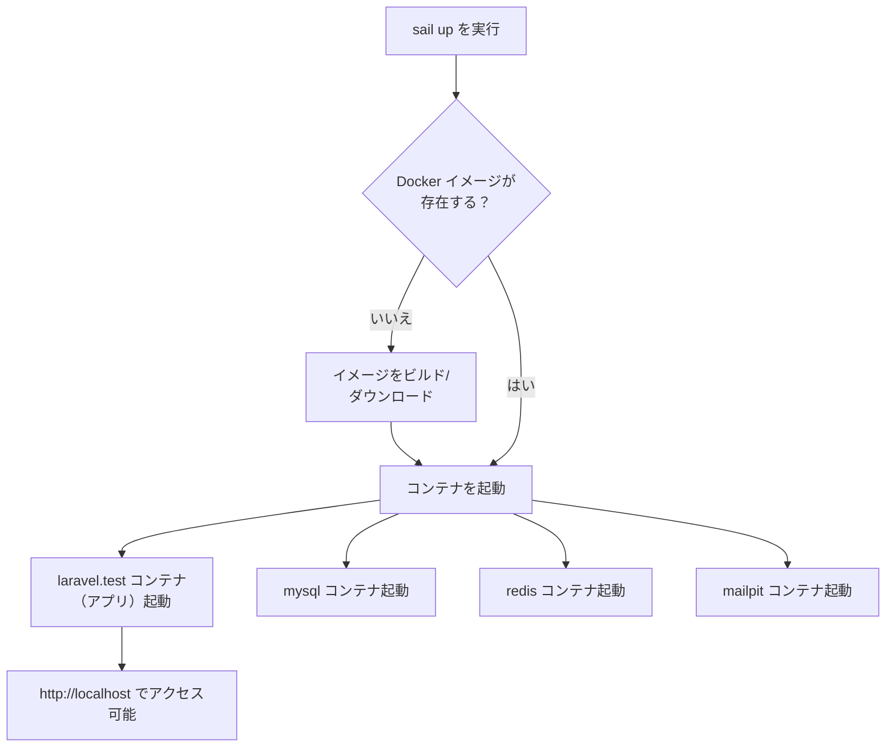

## Sail とは

[Laravel Sail](https://github.com/laravel/sail) は、Laravel のデフォルト Docker 開発環境を操作するための軽量コマンドラインインターフェースです。
PHP、MySQL、Redis を使った Laravel アプリケーションを、Docker の事前知識がなくても構築できる優れた出発点を提供します。

Sail の中心にあるのは、プロジェクトルートに置かれる `compose.yaml` ファイルと `sail` スクリプトです。
`sail` スクリプトは `compose.yaml` で定義された Docker コンテナを操作するための便利な CLI メソッドを提供します。

Laravel Sail は macOS、Linux、および Windows（[WSL2](https://docs.microsoft.com/en-us/windows/wsl/about) 経由）で動作します。

<Info>
  Sail はあくまでローカル開発専用のツールです。本番環境への利用は想定されていません。
  本番環境では適切な Docker / クラウド構成を別途用意してください。
</Info>

---

## インストール

### 既存プロジェクトへのインストール

Composer でパッケージをインストールします。

<Steps>
  <Step title="Sail パッケージを追加する">
    ```shell
    composer require laravel/sail --dev
    ```
  </Step>
  <Step title="設定ファイルを発行する">
    `sail:install` Artisan コマンドを実行します。
    このコマンドは `compose.yaml` をプロジェクトルートに発行し、`.env` に必要な環境変数を追記します。

    ```shell
    php artisan sail:install
    ```

    対話形式でサービスを選択できます。MySQL、Redis、Mailpit などを選択してください。
  </Step>
  <Step title="Sail を起動する">
    ```shell
    ./vendor/bin/sail up
    ```

    初回起動時は Docker イメージのダウンロードに時間がかかります。
    起動後は `http://localhost` でアプリケーションにアクセスできます。
  </Step>
</Steps>

<Warning>
  Docker Desktop for Linux を使用している場合は、`docker context use default` を実行して `default` コンテキストを使用してください。
  コンテナ内でファイルパーミッションエラーが発生した場合は、`SUPERVISOR_PHP_USER` 環境変数を `root` に設定してください。
</Warning>

### 追加サービスの追加

既存の Sail インストールにサービスを追加するには `sail:add` コマンドを使います。

```shell
php artisan sail:add
```

### Devcontainer の利用

[Devcontainer](https://code.visualstudio.com/docs/remote/containers) 内で開発したい場合は `--devcontainer` オプションを使います。

```shell
php artisan sail:install --devcontainer
```

---

## 設定

### シェルエイリアスの設定

デフォルトでは `./vendor/bin/sail` と毎回入力する必要があります。
シェルエイリアスを設定すると `sail` とだけ入力すれば済むようになります。

```shell
alias sail='sh $([ -f sail ] && echo sail || echo vendor/bin/sail)'
```

`~/.zshrc` または `~/.bashrc` に追記してシェルを再起動してください。

```shell
sail up
```

<Tip>
  エイリアスを設定した後は、このドキュメントのすべてのコマンド例で `./vendor/bin/sail` の代わりに `sail` と入力できます。
</Tip>

### イメージの再ビルド

パッケージを最新の状態に保ちたい場合はイメージを再ビルドします。

```shell
docker compose down -v

sail build --no-cache

sail up
```

---

## 起動と停止

`compose.yaml` に定義されたすべての Docker コンテナを起動するには `up` コマンドを使います。

```shell
# フォアグラウンドで起動
sail up

# バックグラウンドで起動
sail up -d
```

停止するには `stop` コマンドを使うか、フォアグラウンドで起動中なら `Ctrl + C` を押します。

```shell
sail stop
```

### 起動フロー



---

## コマンドの実行

Sail を使う場合、アプリケーションは Docker コンテナ内で動作します。
PHP コマンド、Artisan コマンド、Composer コマンド、Node / NPM コマンドはすべて `sail` 経由で実行します。

<Info>
  Laravel 公式ドキュメントでよく見かける `php artisan`、`composer`、`npm` コマンドは、
  Sail 環境では先頭に `sail` を付けて実行してください。
</Info>

### PHP コマンド

```shell
sail php --version

sail php script.php
```

### Composer コマンド

```shell
sail composer require laravel/sanctum
```

### Artisan コマンド

```shell
sail artisan migrate

sail artisan queue:work
```

### Node / NPM コマンド

```shell
sail node --version

sail npm run dev

# Yarn を使う場合
sail yarn
```

### コンテナ CLI (シェル)

コンテナ内で直接 Bash セッションを開くこともできます。

```shell
sail shell

# root ユーザーとして接続
sail root-shell
```

Tinker セッションを開くには次のコマンドを使います。

```shell
sail tinker
```

---

## サービス

Sail が提供するサービスの概要です。インストール時に `sail:install` で選択できます。

### MySQL

デフォルトで `compose.yaml` に含まれています。
データは Docker Volume で永続化されます。初回起動時にアプリ用と `testing` 用の 2 つのデータベースが自動作成されます。

`.env` の `DB_HOST` を `mysql` に設定するとアプリからアクセスできます。

```ini
DB_HOST=mysql
DB_PORT=3306
```

ローカルマシンから接続するには [TablePlus](https://tableplus.com) などの GUI ツールを使ってください。デフォルトポートは `3306` です。

### Redis

`.env` の `REDIS_HOST` を `redis` に設定するとアプリから Redis にアクセスできます。

```ini
REDIS_HOST=redis
REDIS_PORT=6379
```

### Valkey

Redis の代替として [Valkey](https://valkey.io/) を使う場合は `REDIS_HOST` を `valkey` に設定します。

### Mailpit

ローカル開発中のメール送信を捕捉して Web UI でプレビューできます。

```ini
MAIL_HOST=mailpit
MAIL_PORT=1025
MAIL_ENCRYPTION=null
```

Sail 起動中は `http://localhost:8025` で Mailpit の Web UI にアクセスできます。

### Meilisearch / Typesense

[Laravel Scout](/jp/scout) と統合して全文検索を試せます。

- Meilisearch: `MEILISEARCH_HOST=http://meilisearch:7700`
- Typesense: `TYPESENSE_HOST=typesense`、`TYPESENSE_PORT=8108` など

### RustFS (S3 互換ストレージ)

本番で Amazon S3 を使う予定がある場合、ローカルで S3 互換ストレージをエミュレートできます。

```ini
FILESYSTEM_DISK=s3
AWS_ACCESS_KEY_ID=sail
AWS_SECRET_ACCESS_KEY=password
AWS_DEFAULT_REGION=us-east-1
AWS_BUCKET=local
AWS_ENDPOINT=http://rustfs:9000
AWS_USE_PATH_STYLE_ENDPOINT=true
```

---

## テストの実行

```shell
sail test

sail test --group orders
```

`sail test` は内部的に `sail artisan test` と同等です。デフォルトで専用の `testing` データベースが用意されるため、開発データに影響しません。

### Laravel Dusk

Sail を使えば Selenium をローカルにインストールせずに Dusk のブラウザテストを実行できます。
`compose.yaml` の Selenium サービスのコメントを外してください。

```yaml
selenium:
    image: 'selenium/standalone-chrome'
    extra_hosts:
      - 'host.docker.internal:host-gateway'
    volumes:
        - '/dev/shm:/dev/shm'
    networks:
        - sail
```

<Tip>
  Apple Silicon (M1/M2/M3) の場合は `selenium/standalone-chromium` イメージを使ってください。
</Tip>

その後 Dusk テストを実行します。

```shell
sail dusk
```

---

## PHP / Node バージョン

### PHP バージョンの変更

`compose.yaml` の `laravel.test` コンテナの `build.context` を変更します。

```yaml
# PHP 8.5 (デフォルト)
context: ./vendor/laravel/sail/runtimes/8.5

# PHP 8.4
context: ./vendor/laravel/sail/runtimes/8.4

# PHP 8.3
context: ./vendor/laravel/sail/runtimes/8.3
```

変更後はイメージを再ビルドしてください。

```shell
sail build --no-cache
sail up
```

### Node バージョンの変更

```yaml
build:
    args:
        WWWGROUP: '${WWWGROUP}'
        NODE_VERSION: '20'
```

---

## サイトの公開共有

同僚のプレビューや Webhook テストのために、一時的にサイトを外部公開できます。

```shell
sail share
```

ランダムな `laravel-sail.site` URL が発行されます。URL 生成ヘルパーを正しく動作させるために、`bootstrap/app.php` で信頼するプロキシを設定してください。

```php
->withMiddleware(function (Middleware $middleware): void {
    $middleware->trustProxies(at: '*');
})
```

サブドメインを指定することもできます。

```shell
sail share --subdomain=my-sail-site
```

---

## Xdebug

### 有効化

まず `sail:publish` で設定ファイルを発行してから、`.env` に以下を追加します。

```ini
SAIL_XDEBUG_MODE=develop,debug,coverage
```

発行された `php.ini` ファイルに次の設定が含まれていることを確認します。

```ini
[xdebug]
xdebug.mode=${XDEBUG_MODE}
```

変更後はイメージを再ビルドします。

```shell
sail build --no-cache
```

### CLI デバッグ

```shell
# Xdebug なしで実行
sail artisan migrate

# Xdebug ありで実行
sail debug migrate
```

### ブラウザデバッグ

ブラウザからデバッグセッションを開始する手順は [Xdebug 公式ドキュメント](https://xdebug.org/docs/step_debug#web-application) を参照してください。
PhpStorm を使っている場合は [Zero-configuration debugging](https://www.jetbrains.com/help/phpstorm/zero-configuration-debugging.html) の設定が便利です。

<Warning>
  Sail は `artisan serve` を使ってアプリを提供します。
  `XDEBUG_CONFIG` と `XDEBUG_MODE` を受け付けるのは Laravel 8.53.0 以降です。
  それより古いバージョンではデバッグ接続が機能しません。
</Warning>

---

## カスタマイズ

Sail の Dockerfile や設定ファイルをカスタマイズするには `sail:publish` コマンドで発行します。

```shell
sail artisan sail:publish
```

発行後は `docker/` ディレクトリに Dockerfile が配置されます。
変更後はコンテナを再ビルドしてください。

```shell
sail build --no-cache
```

---

## 本番環境との違い

<Warning>
  Sail はローカル開発専用の環境です。本番環境での使用は想定されていません。
  本番環境への Docker デプロイには Laravel Cloud、Forge、Ploi などのサービスや、
  独自の Docker Compose / Kubernetes 構成を検討してください。
</Warning>

Sail と本番環境の主な違いを以下にまとめます。

| 項目 | Sail (ローカル) | 本番環境 |
| --- | --- | --- |
| 目的 | 開発・デバッグ | サービス提供 |
| Xdebug | 有効にできる | 無効推奨 |
| Mailpit | メールを捕捉してプレビュー | 実際のメールサーバー |
| データ永続化 | Docker Volume | マネージド DB など |
| パフォーマンス | 最適化なし | 最適化必須 |
