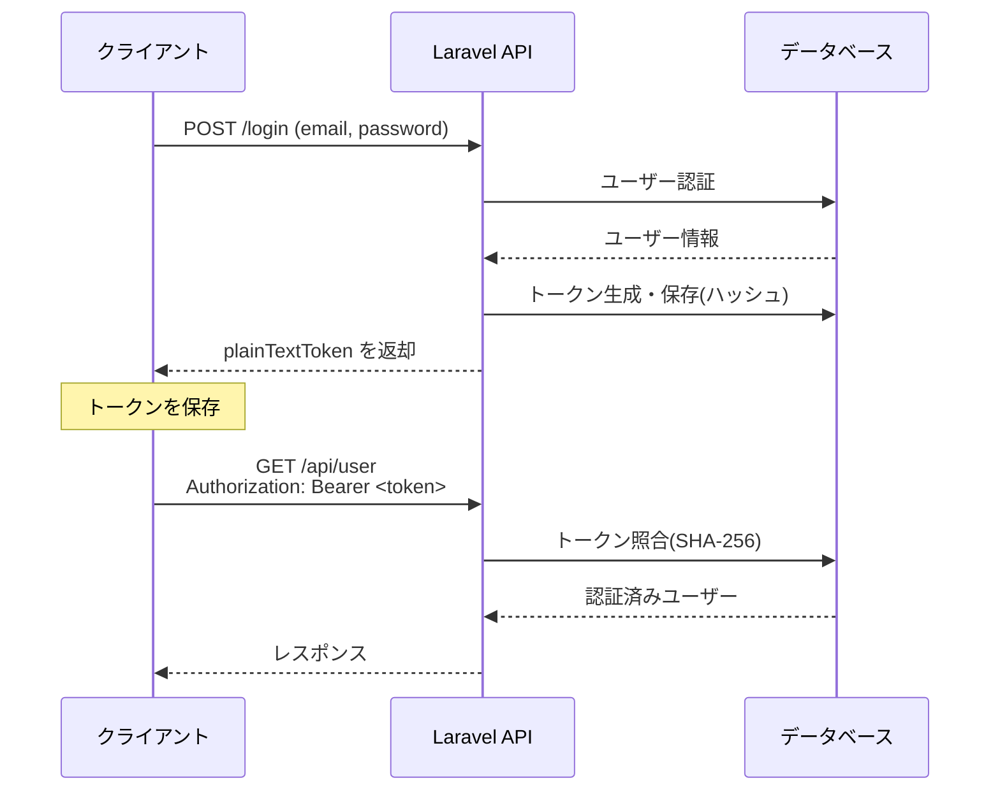
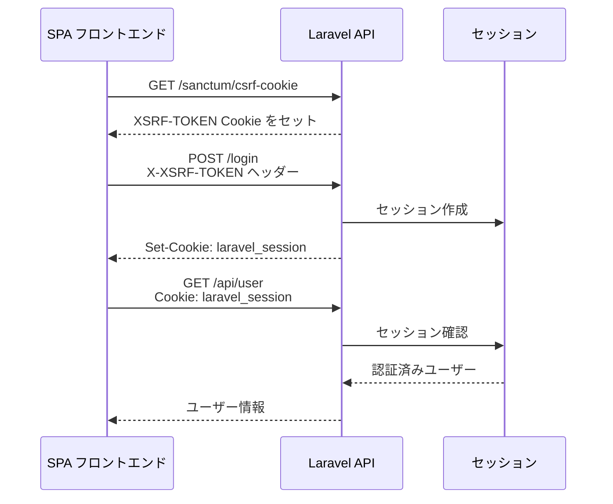

## Sanctum とは

Laravel Sanctum は、SPA(シングルページアプリケーション)・モバイルアプリ・シンプルなAPIに向けた軽量な認証パッケージです。複雑なOAuthの知識がなくても、ユーザーごとに複数のAPIトークンを発行・管理できます。

Sanctum が解決する問題は2つあります。

| 認証モード | 仕組み | 主な用途 |
| --- | --- | --- |
| **APIトークン認証** | `Authorization: Bearer <token>` ヘッダー | モバイルアプリ・サードパーティ連携 |
| **SPA認証** | セッションCookie + CSRF保護 | 自社フロントエンド(Vue/React等) |

<Info>
  自社SPAからAPIを呼び出す場合はSPA認証を使います。モバイルアプリやサードパーティがAPIを利用する場合はAPIトークン認証を使います。どちらか一方だけを使うことも構いません。
</Info>

### Passport との使い分け

| | Sanctum | Passport |
| --- | --- | --- |
| **複雑さ** | シンプル | フル機能OAuth2 |
| **向いている用途** | 自社SPA・モバイルアプリ | 外部アプリへのOAuthプロバイダー |
| **トークン種別** | パーソナルアクセストークン | OAuth2アクセストークン |

外部サービスに対してOAuth2プロバイダーになる必要がある場合は Passport を選びますが、多くのアプリケーションでは Sanctum で十分です。

---

## インストールと設定

### インストール

`install:api` Artisanコマンドを実行するだけで Sanctum がセットアップされます。

```shell
php artisan install:api
```

このコマンドは以下を自動的に行います。

- `laravel/sanctum` パッケージのインストール
- `personal_access_tokens` テーブルのマイグレーションファイルの公開
- マイグレーションの実行

### HasApiTokens トレイトを追加する

`User` モデルに `HasApiTokens` トレイトを追加します。

```php
// app/Models/User.php

use Laravel\Sanctum\HasApiTokens;

class User extends Authenticatable
{
    use HasApiTokens, HasFactory, Notifiable;
}
```

これで `$user->createToken()` や `$user->tokens` などのメソッドが使えるようになります。

---

## API トークン認証

### トークンフロー



### トークンを発行する

`createToken()` メソッドでトークンを発行します。`plainTextToken` プロパティから平文のトークン値を取得できます。**平文トークンはデータベースには保存されない**ため、発行直後にユーザーへ返す必要があります。

```php
use Illuminate\Http\Request;

Route::post('/tokens/create', function (Request $request) {
    $token = $request->user()->createToken($request->token_name);

    return ['token' => $token->plainTextToken];
})->middleware('auth');
```

データベースには SHA-256 でハッシュ化されたトークンが保存されます。

### スコープ(アビリティ)を設定する

トークンに対してアビリティ(スコープ)を付与することで、そのトークンで実行できる操作を制限できます。

```php
// スコープ付きトークンを発行
$token = $user->createToken('mobile-app', ['server:update', 'server:read']);

return $token->plainTextToken;
```

リクエスト処理時にトークンのスコープを確認します。

```php
if ($request->user()->tokenCan('server:update')) {
    // 更新操作を実行
}

if ($request->user()->tokenCant('server:update')) {
    abort(403);
}
```

#### ミドルウェアでスコープを確認する

`bootstrap/app.php` にミドルウェアエイリアスを登録します。

```php
use Laravel\Sanctum\Http\Middleware\CheckAbilities;
use Laravel\Sanctum\Http\Middleware\CheckForAnyAbility;

->withMiddleware(function (Middleware $middleware): void {
    $middleware->alias([
        'abilities' => CheckAbilities::class,  // すべてのアビリティを持つ
        'ability'   => CheckForAnyAbility::class, // いずれかのアビリティを持つ
    ]);
})
```

ルートにミドルウェアを適用します。

```php
// check-status と place-orders の両方を持つトークンのみ許可
Route::get('/orders', function () {
    // ...
})->middleware(['auth:sanctum', 'abilities:check-status,place-orders']);

// check-status または place-orders のいずれかを持つトークンを許可
Route::get('/orders', function () {
    // ...
})->middleware(['auth:sanctum', 'ability:check-status,place-orders']);
```

### トークンの有効期限

デフォルトでは Sanctum トークンに有効期限はありません。`config/sanctum.php` の `expiration` オプションで分単位の有効期限を設定できます。

```php
// config/sanctum.php
'expiration' => 525600, // 365日(分)
```

トークンごとに有効期限を指定することもできます。

```php
$token = $user->createToken(
    'token-name',
    ['*'],
    now()->addWeeks(1) // 1週間後に期限切れ
)->plainTextToken;
```

有効期限を設定している場合は、期限切れトークンを定期的に削除するスケジュールを設定します。

```php
use Illuminate\Support\Facades\Schedule;

Schedule::command('sanctum:prune-expired --hours=24')->daily();
```

### トークンを失効させる

```php
// 全トークンを削除
$user->tokens()->delete();

// 現在のリクエストで使用されているトークンを削除
$request->user()->currentAccessToken()->delete();

// 特定のトークンを削除
$user->tokens()->where('id', $tokenId)->delete();
```

---

## SPA 認証

SPA認証はセッションCookieを使うため、トークンを発行・管理する必要がありません。自社フロントエンド(Vue, React, Next.js等)からAPIを呼び出す場合に適しています。

<Warning>
  SPA認証を使うには、SPAとAPIが同じトップレベルドメインを共有している必要があります(サブドメインは異なっても構いません)。また、リクエストに `Accept: application/json` ヘッダーと `Referer` または `Origin` ヘッダーを含める必要があります。
</Warning>

### Sanctum ミドルウェアを有効にする

`bootstrap/app.php` で `statefulApi()` ミドルウェアを有効にします。

```php
->withMiddleware(function (Middleware $middleware): void {
    $middleware->statefulApi();
})
```

### ファーストパーティドメインを設定する

`config/sanctum.php` の `stateful` オプションにSPAのドメインを設定します。

```php
// config/sanctum.php
'stateful' => explode(',', env('SANCTUM_STATEFUL_DOMAINS', sprintf(
    '%s%s',
    'localhost,localhost:3000,127.0.0.1,127.0.0.1:8000,::1',
    Sanctum::currentApplicationUrlWithPort()
))),
```

### CORS の設定

別のサブドメインからAPIを呼び出す場合は、CORS設定が必要です。

```shell
php artisan config:publish cors
```

`config/cors.php` で `supports_credentials` を `true` に設定します。

```php
// config/cors.php
'supports_credentials' => true,
```

フロントエンドの axios にも設定が必要です。

```js
// resources/js/bootstrap.js
axios.defaults.withCredentials = true;
axios.defaults.withXSRFToken = true;
```

セッションCookieのドメイン設定も忘れずに行います。

```php
// config/session.php
'domain' => '.example.com', // 先頭にドットを付ける
```

### SPA からの認証フロー



<Steps>
  <Step title="CSRF クッキーを取得する">
    ログイン前に `/sanctum/csrf-cookie` エンドポイントを叩いてCSRF保護を初期化します。

    ```js
    await axios.get('/sanctum/csrf-cookie');
    ```
  </Step>

  <Step title="ログインリクエストを送信する">
    `/login` エンドポイントにPOSTリクエストを送ります。

    ```js
    await axios.post('/login', {
        email: 'user@example.com',
        password: 'password',
    });
    ```
  </Step>

  <Step title="認証済みリクエストを送る">
    ログイン後のリクエストはセッションCookieで自動的に認証されます。

    ```js
    const response = await axios.get('/api/user');
    console.log(response.data); // 認証済みユーザー情報
    ```
  </Step>
</Steps>

---

## 認証済みルートの保護

`auth:sanctum` ミドルウェアをルートに適用すると、未認証のリクエストに対して `401 Unauthorized` が返されます。APIトークン認証・SPA認証の両方をこのミドルウェア1つで処理できます。

```php
use Illuminate\Http\Request;

// 単一ルートを保護
Route::get('/user', function (Request $request) {
    return $request->user();
})->middleware('auth:sanctum');

// ルートグループを保護
Route::middleware('auth:sanctum')->group(function () {
    Route::get('/profile', [ProfileController::class, 'show']);
    Route::put('/profile', [ProfileController::class, 'update']);
    Route::get('/posts', [PostController::class, 'index']);
});
```

---

## 実用例: ログイン API とトークン返却

モバイルアプリ向けのAPIトークン認証を実装する例です。

<Steps>
  <Step title="ログインエンドポイントを作成する">
    ```php
    // routes/api.php

    use App\Models\User;
    use Illuminate\Http\Request;
    use Illuminate\Support\Facades\Hash;
    use Illuminate\Validation\ValidationException;

    Route::post('/sanctum/token', function (Request $request) {
        $request->validate([
            'email'       => ['required', 'email'],
            'password'    => ['required'],
            'device_name' => ['required', 'string'],
        ]);

        $user = User::where('email', $request->email)->first();

        if (! $user || ! Hash::check($request->password, $user->password)) {
            throw ValidationException::withMessages([
                'email' => ['提供された認証情報が正しくありません。'],
            ]);
        }

        return response()->json([
            'token' => $user->createToken($request->device_name)->plainTextToken,
        ]);
    });
    ```
  </Step>

  <Step title="認証済みルートを作成する">
    ```php
    // routes/api.php

    Route::middleware('auth:sanctum')->group(function () {
        // 現在のユーザー情報を返す
        Route::get('/user', function (Request $request) {
            return $request->user();
        });

        // 現在のトークンを失効させてログアウト
        Route::post('/logout', function (Request $request) {
            $request->user()->currentAccessToken()->delete();

            return response()->json(['message' => 'ログアウトしました。']);
        });

        // 全デバイスからログアウト
        Route::post('/logout/all', function (Request $request) {
            $request->user()->tokens()->delete();

            return response()->json(['message' => '全デバイスからログアウトしました。']);
        });
    });
    ```
  </Step>

  <Step title="クライアントからリクエストを送る">
    ```js
    // ログイン
    const { data } = await axios.post('/api/sanctum/token', {
        email: 'user@example.com',
        password: 'password',
        device_name: 'My iPhone',
    });

    const token = data.token;

    // 認証済みリクエスト
    const response = await axios.get('/api/user', {
        headers: {
            Authorization: `Bearer ${token}`,
        },
    });
    ```
  </Step>
</Steps>

---

## テスト

Sanctum のテストでは `Sanctum::actingAs()` を使ってユーザーを認証し、付与するアビリティを指定します。

<Tabs>
  <Tab title="Pest">
    ```php
    use App\Models\User;
    use Laravel\Sanctum\Sanctum;

    test('タスク一覧を取得できる', function () {
        Sanctum::actingAs(
            User::factory()->create(),
            ['view-tasks']
        );

        $response = $this->get('/api/tasks');

        $response->assertOk();
    });

    test('全アビリティを持つトークンでアクセスできる', function () {
        Sanctum::actingAs(
            User::factory()->create(),
            ['*']
        );

        $response = $this->get('/api/tasks');

        $response->assertOk();
    });
    ```
  </Tab>
  <Tab title="PHPUnit">
    ```php
    use App\Models\User;
    use Laravel\Sanctum\Sanctum;

    public function test_task_list_can_be_retrieved(): void
    {
        Sanctum::actingAs(
            User::factory()->create(),
            ['view-tasks']
        );

        $response = $this->get('/api/tasks');

        $response->assertOk();
    }
    ```
  </Tab>
</Tabs>

---

## まとめ

<AccordionGroup>
  <Accordion title="インストール手順の確認">
    ```shell
    # Sanctum をインストールしてマイグレーションを実行
    php artisan install:api
    ```

    User モデルに `HasApiTokens` トレイトを追加:

    ```php
    use Laravel\Sanctum\HasApiTokens;

    class User extends Authenticatable
    {
        use HasApiTokens, HasFactory, Notifiable;
    }
    ```
  </Accordion>

  <Accordion title="よく使う API まとめ">
    ```php
    // トークン発行
    $token = $user->createToken('token-name')->plainTextToken;

    // スコープ付きトークン発行
    $token = $user->createToken('token-name', ['read', 'write'])->plainTextToken;

    // スコープ確認
    $user->tokenCan('read');   // true/false
    $user->tokenCant('write'); // true/false

    // トークン失効
    $user->tokens()->delete();                        // 全トークン
    $request->user()->currentAccessToken()->delete(); // 現在のトークン
    $user->tokens()->where('id', $id)->delete();      // 特定のトークン
    ```
  </Accordion>

  <Accordion title="APIトークン認証 vs SPA認証の選択">
    - **APIトークン認証**: モバイルアプリ、サードパーティ、CLIツールなど、セッションを持たないクライアントから利用する場合。
    - **SPA認証**: 自社のVue/React/Next.jsフロントエンドなど、同じドメイン(またはサブドメイン)上のSPAから利用する場合。よりセキュアでトークン管理が不要。
  </Accordion>
</AccordionGroup>
