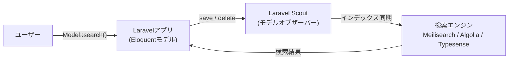

## はじめに

**Laravel Scout** は、[Eloquentモデル](/jp/eloquent)に全文検索機能を追加するための、シンプルなドライバーベースのソリューションです。モデルオブザーバーを使用して、Eloquentレコードと検索インデックスを自動的に同期します。

Scout には、MySQL / PostgreSQL の全文インデックスと `LIKE` 句を使ってデータベースを直接検索する組み込みの `database` エンジンが含まれており、外部サービスは不要です。大規模なプロダクション環境で、タイポ許容・ファセット検索・ジオサーチが必要な場合は、外部エンジンが役立ちます。

### 対応エンジン一覧

| エンジン | 特徴 | 用途 |
|---|---|---|
| `database` | MySQL / PostgreSQL の全文インデックス | ほとんどのアプリ |
| `collection` | PHPでフィルタリング（SQLiteも可） | ローカル開発・テスト |
| Meilisearch | オープンソース、タイポ許容、高速 | 本番環境 |
| Algolia | クラウドSaaS、高度な機能 | 本番環境 |
| Typesense | オープンソース、ベクトル検索対応 | 本番環境 |



## インストール

Composerでパッケージをインストールします。

```shell
composer require laravel/scout
```

インストール後、`vendor:publish` コマンドで設定ファイルを公開します。`config/scout.php` が生成されます。

```shell
php artisan vendor:publish --provider="Laravel\Scout\ScoutServiceProvider"
```

最後に、検索可能にしたいモデルに `Laravel\Scout\Searchable` トレイトを追加します。このトレイトがモデルオブザーバーを登録し、検索ドライバーとの自動同期を有効にします。

```php
<?php

namespace App\Models;

use Illuminate\Database\Eloquent\Model;
use Laravel\Scout\Searchable;

class Post extends Model
{
    use Searchable;
}
```

### キューの設定

`database` または `collection` エンジン以外を使用する場合、Scoutを使用する前に[キュードライバー](/jp/queues)の設定を強く推奨します。キューワーカーを動かすことで、インデックス同期操作がバックグラウンドで実行され、Webインターフェースの応答速度が大幅に向上します。

`config/scout.php` の `queue` オプションを `true` に設定します。

```php
'queue' => true,
```

接続名とキュー名を指定することもできます。

```php
'queue' => [
    'connection' => 'redis',
    'queue' => 'scout'
],
```

設定後、専用のキューワーカーを起動します。

```shell
php artisan queue:work redis --queue=scout
```

## ドライバーの前提条件

### Algolia

Algoliaドライバーを使用する場合は、`config/scout.php` に `id` と `secret` の認証情報を設定し、Algolia PHP SDKをインストールします。

```shell
composer require algolia/algoliasearch-client-php
```

`.env` ファイルに認証情報を追加します。

```ini
ALGOLIA_APP_ID=your-app-id
ALGOLIA_SECRET=your-secret-key
```

#### インデックス設定

Algoliaでは `config/scout.php` でインデックス設定を管理できます。

```php
use App\Models\User;

'algolia' => [
    'id' => env('ALGOLIA_APP_ID', ''),
    'secret' => env('ALGOLIA_SECRET', ''),
    'index-settings' => [
        User::class => [
            'searchableAttributes' => ['id', 'name', 'email'],
            'attributesForFaceting' => ['filterOnly(email)'],
        ],
    ],
],
```

設定後、`scout:sync-index-settings` コマンドを実行してAlgoliaに設定を反映させます。

```shell
php artisan scout:sync-index-settings
```

### Meilisearch

[Meilisearch](https://www.meilisearch.com) は高速なオープンソース検索エンジンです。ローカル開発では [Laravel Sail](https://laravel.com/docs/sail#meilisearch) のDockerを使うのが最も簡単です。

```shell
# Laravel Sailを使う場合
./vendor/bin/sail up -d meilisearch
```

Sailを使わない場合は、Dockerで直接起動できます。

```shell
docker run -it --rm \
    -p 7700:7700 \
    getmeili/meilisearch:latest \
    meilisearch --master-key="masterKey"
```

Meilisearch PHP SDKをインストールします。

```shell
composer require meilisearch/meilisearch-php http-interop/http-factory-guzzle
```

`.env` ファイルにドライバーとホストを設定します。

```ini
SCOUT_DRIVER=meilisearch
MEILISEARCH_HOST=http://127.0.0.1:7700
MEILISEARCH_KEY=masterKey
```

<Warning>
  Scoutをアップグレードする際は、Meilisearchサービス自体の[破壊的変更](https://github.com/meilisearch/Meilisearch/releases)も必ず確認してください。
</Warning>

#### インデックス設定（Meilisearch）

Meilisearchでは `where()` でフィルタリングするカラムを `filterableAttributes` に、`orderBy()` でソートするカラムを `sortableAttributes` に事前登録する必要があります。

```php
use App\Models\User;

'meilisearch' => [
    'host' => env('MEILISEARCH_HOST', 'http://localhost:7700'),
    'key' => env('MEILISEARCH_KEY', null),
    'index-settings' => [
        User::class => [
            'filterableAttributes' => ['id', 'name', 'email'],
            'sortableAttributes' => ['created_at'],
        ],
    ],
],
```

数値カラムのデータ型に注意が必要です。Meilisearchは正しい型のデータにのみフィルター操作（`>`、`<` など）を実行できます。

```php
public function toSearchableArray(): array
{
    return [
        'id' => (int) $this->id,
        'name' => $this->name,
        'price' => (float) $this->price,
    ];
}
```

設定後、`scout:sync-index-settings` コマンドを実行します。

```shell
php artisan scout:sync-index-settings
```

### Typesense

[Typesense](https://typesense.org) は高速なオープンソース検索エンジンで、キーワード検索・セマンティック検索・ジオ検索・ベクトル検索に対応しています。

```shell
composer require typesense/typesense-php
```

`.env` ファイルに接続情報を設定します。

```ini
SCOUT_DRIVER=typesense
TYPESENSE_API_KEY=masterKey
TYPESENSE_HOST=localhost
TYPESENSE_PORT=8108
TYPESENSE_PATH=
TYPESENSE_PROTOCOL=http
```

Typesenseを使用する場合、`toSearchableArray` メソッドでモデルの主キーを文字列に、作成日時をUNIXタイムスタンプにキャストする必要があります。

```php
public function toSearchableArray(): array
{
    return array_merge($this->toArray(), [
        'id' => (string) $this->id,
        'created_at' => $this->created_at->timestamp,
    ]);
}
```

### データベース / コレクションエンジン

外部サービスなしで検索を追加したい場合に最適なオプションです。

**データベースエンジン**はMySQL / PostgreSQLの全文インデックスと `LIKE` 句を使用します。ほとんどのアプリケーションでこれで十分です。

```ini
SCOUT_DRIVER=database
```

**コレクションエンジン**はPHPでフィルタリングするため、SQLiteを含むLaravelがサポートするすべてのデータベースで動作します。ローカル開発・テスト・小規模データセット向けです。

```ini
SCOUT_DRIVER=collection
```

<Info>
  データベースエンジンでは、外部エンジンとは異なりインデックスの手動管理は不要です。データベーステーブルを直接検索します。
</Info>

## Searchable トレイト

### toSearchableArray() のカスタマイズ

デフォルトでは、モデルの `toArray()` の全データが検索インデックスに保存されます。インデックスに同期するデータをカスタマイズするには、`toSearchableArray` メソッドをオーバーライドします。

```php
<?php

namespace App\Models;

use Illuminate\Database\Eloquent\Model;
use Laravel\Scout\Searchable;

class Post extends Model
{
    use Searchable;

    /**
     * モデルのインデックス可能なデータ配列を取得します。
     *
     * @return array<string, mixed>
     */
    public function toSearchableArray(): array
    {
        $array = $this->toArray();

        // データをカスタマイズ...

        return $array;
    }
}
```

### インデックス名のカスタマイズ

デフォルトでは、モデルのテーブル名（複数形）がインデックス名として使用されます。`searchableAs` メソッドをオーバーライドしてカスタマイズできます。

```php
public function searchableAs(): string
{
    return 'posts_index';
}
```

### データベースエンジン用の検索戦略

データベースエンジンでは、カラムごとに効率的な検索戦略をPHP属性で指定できます。

```php
use Laravel\Scout\Attributes\SearchUsingFullText;
use Laravel\Scout\Attributes\SearchUsingPrefix;

#[SearchUsingPrefix(['id', 'email'])]
#[SearchUsingFullText(['bio'])]
public function toSearchableArray(): array
{
    return [
        'id' => $this->id,
        'name' => $this->name,
        'email' => $this->email,
        'bio' => $this->bio,
    ];
}
```

<Warning>
  `SearchUsingFullText` を使用する前に、対象カラムに[全文インデックス](/jp/migrations)が付与されていることを確認してください。
</Warning>

### 条件付きで検索可能にする

特定の条件下でのみモデルを検索可能にしたい場合は、`shouldBeSearchable` メソッドを定義します。

```php
/**
 * このモデルを検索可能にすべきか判断します。
 */
public function shouldBeSearchable(): bool
{
    return $this->isPublished();
}
```

<Warning>
  `shouldBeSearchable` はデータベースエンジンでは機能しません。データベースエンジンで同様の動作を実現するには、[where句](#フィルタリングとソート)を使用してください。
</Warning>

## インデックスの管理

<Info>
  このセクションのコマンドは、主にAlgolia・Meilisearch・Typesenseなどのサードパーティエンジンを使用する場合に関係します。データベースエンジンではインデックス管理は不要です。
</Info>

### 既存レコードのインポート

既存プロジェクトにScoutを導入する場合、`scout:import` コマンドで既存レコードをインデックスにインポートします。

```shell
php artisan scout:import "App\Models\Post"
```

キューを使ってバックグラウンドでインポートすることもできます。

```shell
php artisan scout:queue-import "App\Models\Post" --chunk=500
```

### インデックスのクリア

モデルのすべてのレコードを検索インデックスから削除するには `scout:flush` を使います。

```shell
php artisan scout:flush "App\Models\Post"
```

### インデックスの一時停止

Eloquent操作中に検索インデックスとの同期を一時的に止めたい場合は `withoutSyncingToSearch` を使います。

```php
use App\Models\Order;

Order::withoutSyncingToSearch(function () {
    // この中のモデル操作は検索インデックスに同期されない
});
```

### レコードの手動追加・削除

クエリを使ってモデルのコレクションをインデックスに追加できます。

```php
// クエリ結果を追加
Order::where('price', '>', 100)->searchable();

// リレーション経由で追加
$user->orders()->searchable();
```

インデックスからレコードを削除するには `unsearchable` を使います。

```php
Order::where('price', '>', 100)->unsearchable();
```

モデルを `delete` すると、インデックスからも自動的に削除されます。

## 検索

`search` メソッドでモデルを検索します。`get` を連結してEloquentモデルのコレクションを取得します。

```php
use App\Models\Order;

$orders = Order::search('Star Trek')->get();
```

コントローラーやルートから直接返すとJSONに自動変換されます。

```php
use Illuminate\Http\Request;

Route::get('/search', function (Request $request) {
    return Order::search($request->search)->get();
});
```

生の検索結果が必要な場合は `raw` メソッドを使います。

```php
$orders = Order::search('Star Trek')->raw();
```

### ページネーション

`paginate` メソッドで検索結果をページネーションできます。通常のEloquentクエリのページネーションと同様に機能します。

```php
$orders = Order::search('Star Trek')->paginate();

// 1ページあたりの件数を指定
$orders = Order::search('Star Trek')->paginate(15);
```

データベースエンジンでは `simplePaginate` も使用できます。総件数を取得しないため大規模データセットで効率的です。

```php
$orders = Order::search('Star Trek')->simplePaginate(15);
```

Bladeテンプレートでの表示例：

```html
<div class="container">
    @foreach ($orders as $order)
        {{ $order->price }}
    @endforeach
</div>

{{ $orders->links() }}
```

## フィルタリングとソート

`where` メソッドで検索クエリにフィルター条件を追加できます。

```php
use App\Models\Order;

// 等値フィルター
$orders = Order::search('Star Trek')->where('user_id', 1)->get();

// 配列内のいずれかに一致
$orders = Order::search('Star Trek')->whereIn('status', ['open', 'paid'])->get();

// 配列内のいずれにも一致しない
$orders = Order::search('Star Trek')->whereNotIn('status', ['closed'])->get();
```

<Warning>
  Meilisearchを使用する場合、`where` を使う前に[フィルタリング可能な属性](#インデックス設定meilisearch)を設定する必要があります。
</Warning>

`query` メソッドでEloquentクエリをカスタマイズすることもできます。

```php
use Illuminate\Database\Eloquent\Builder;

$orders = Order::search('Star Trek')
    ->query(fn (Builder $query) => $query->with('invoices'))
    ->get();
```

## Eager Loading

Scout を使用すると、検索エンジンからIDの一覧を取得した後、Eloquentでモデルを取得します。N+1問題を避けるには、`query` メソッドで `with()` を使ったEager Loadingを指定します。

```php
use App\Models\Order;
use Illuminate\Database\Eloquent\Builder;

$orders = Order::search('Star Trek')
    ->query(fn (Builder $query) => $query->with(['invoices', 'user']))
    ->get();
```

バッチインポート時にリレーションをEager Loadするには、`makeAllSearchableUsing` メソッドを定義します。

```php
use Illuminate\Database\Eloquent\Builder;

protected function makeAllSearchableUsing(Builder $query): Builder
{
    return $query->with('author');
}
```

<Warning>
  `makeAllSearchableUsing` はキューを使ったバッチインポートでは使用できない場合があります。キュージョブでモデルコレクションが処理されるときにリレーションは復元されません。
</Warning>

## ソフトデリート

インデックスされたモデルが[ソフトデリート](/jp/eloquent)を使用していて、削除済みモデルも検索したい場合は、`config/scout.php` の `soft_delete` オプションを `true` に設定します。

```php
'soft_delete' => true,
```

有効にすると、`withTrashed` や `onlyTrashed` で削除済みレコードを検索できます。

```php
// 削除済みを含めて検索
$orders = Order::search('Star Trek')->withTrashed()->get();

// 削除済みのみ検索
$orders = Order::search('Star Trek')->onlyTrashed()->get();
```

## カスタムエンジン

組み込みの検索エンジンがニーズに合わない場合は、独自のカスタムエンジンを実装できます。カスタムエンジンは `Laravel\Scout\Engines\Engine` 抽象クラスを継承し、以下の8つのメソッドを実装する必要があります。

```php
use Laravel\Scout\Builder;

abstract public function update($models);
abstract public function delete($models);
abstract public function search(Builder $builder);
abstract public function paginate(Builder $builder, $perPage, $page);
abstract public function mapIds($results);
abstract public function map(Builder $builder, $results, $model);
abstract public function getTotalCount($results);
abstract public function flush($model);
```

実装の参考として、`Laravel\Scout\Engines\AlgoliaEngine` クラスを確認してください。

作成したカスタムエンジンは、`App\Providers\AppServiceProvider` の `boot` メソッドでScoutに登録します。

```php
use App\ScoutExtensions\MySqlSearchEngine;
use Laravel\Scout\EngineManager;

public function boot(): void
{
    resolve(EngineManager::class)->extend('mysql', function () {
        return new MySqlSearchEngine;
    });
}
```

登録後、`config/scout.php` でドライバーとして指定します。

```php
'driver' => 'mysql',
```

## 関連ページ

<Card title="Eloquent ORM" icon="database" href="/jp/eloquent">
  Eloquentモデルの基本的な使い方を確認します。
</Card>

<Card title="Eloquentリレーション" icon="link" href="/jp/eloquent-relationships">
  リレーションの定義とEager Loadingを確認します。
</Card>

<Card title="キュー" icon="clock" href="/jp/queues">
  Scoutはキューとあわせてインデックスをバックグラウンドで更新できます。
</Card>
