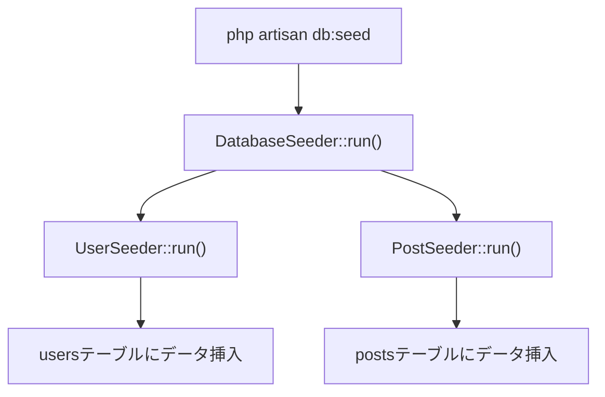

## シーディングとは

シーディング（Seeding）はデータベースにサンプルデータや初期データを投入する仕組みです。

開発環境のセットアップや自動テストでは、あらかじめデータが入っている状態が必要になります。毎回手動でデータを入力するのは手間がかかるため、シーダーを使って繰り返し実行できる形にまとめます。

シーダークラスは `database/seeders` ディレクトリに格納されます。デフォルトで `DatabaseSeeder` クラスが用意されています。



## シーダーの作成

`make:seeder` Artisanコマンドで新しいシーダークラスを生成します。

```shell
php artisan make:seeder UserSeeder
```

生成されたファイルは `database/seeders/UserSeeder.php` に配置されます。

```php
<?php

namespace Database\Seeders;

use Illuminate\Database\Seeder;

class UserSeeder extends Seeder
{
    /**
     * シーダーを実行する
     */
    public function run(): void
    {
        // ここにデータ投入の処理を書く
    }
}
```

## シーダーの実装

`run()` メソッド内にデータ投入の処理を書きます。DBファサードやEloquentモデルを使って挿入できます。

### DBファサードを使う

```php
<?php

namespace Database\Seeders;

use Illuminate\Database\Seeder;
use Illuminate\Support\Facades\DB;
use Illuminate\Support\Facades\Hash;

class UserSeeder extends Seeder
{
    public function run(): void
    {
        DB::table('users')->insert([
            [
                'name' => '山田太郎',
                'email' => 'taro@example.com',
                'password' => Hash::make('password'),
                'created_at' => now(),
                'updated_at' => now(),
            ],
            [
                'name' => '鈴木花子',
                'email' => 'hanako@example.com',
                'password' => Hash::make('password'),
                'created_at' => now(),
                'updated_at' => now(),
            ],
        ]);
    }
}
```

### Eloquentモデルを使う

```php
use App\Models\User;
use Illuminate\Support\Facades\Hash;

public function run(): void
{
    User::create([
        'name' => '管理者',
        'email' => 'admin@example.com',
        'password' => Hash::make('password'),
    ]);
}
```

<Info>
  シーディング実行中はマスアサインメント保護が自動的に無効になります。`$fillable` や `$guarded` の設定を気にせずデータを挿入できます。
</Info>

## モデルファクトリーとの組み合わせ

大量のテストデータが必要な場合は[モデルファクトリー](/jp/eloquent)との組み合わせが便利です。ファクトリーを使うとランダムなダミーデータを一括生成できます。

```php
use App\Models\User;
use App\Models\Post;

public function run(): void
{
    // 10人のユーザーを作成
    User::factory(10)->create();

    // 各ユーザーに3件の投稿を作成
    User::factory(5)
        ->hasPosts(3)
        ->create();
}
```

<Tip>
  ファクトリーの詳細な使い方はEloquentファクトリーのドキュメントを参照してください。
</Tip>

## DatabaseSeeder の使い方

`DatabaseSeeder` は複数のシーダーをまとめて管理するエントリーポイントです。`call()` メソッドで実行するシーダーを指定します。

```php
<?php

namespace Database\Seeders;

use Illuminate\Database\Seeder;

class DatabaseSeeder extends Seeder
{
    public function run(): void
    {
        $this->call([
            UserSeeder::class,
            PostSeeder::class,
            CommentSeeder::class,
        ]);
    }
}
```

`call()` に渡した順序でシーダーが実行されます。外部キー制約がある場合は、参照先のテーブルを先にシードする順序にしてください（例：`users` → `posts`）。

## シーダーの実行

### 全シーダーを実行する

```shell
php artisan db:seed
```

`DatabaseSeeder` が呼び出され、そこから `call()` で指定したシーダーが順番に実行されます。

### 特定のシーダーだけ実行する

`--class` オプションで実行するシーダークラスを指定できます。

```shell
php artisan db:seed --class=UserSeeder
```

## マイグレーションと同時に実行する

`migrate:fresh` コマンドに `--seed` オプションを付けると、全テーブルを再作成してからシーディングを一括実行できます。

```shell
php artisan migrate:fresh --seed
```

特定のシーダーだけ実行したい場合は `--seeder` オプションを使います。

```shell
php artisan migrate:fresh --seed --seeder=UserSeeder
```

<Warning>
  `migrate:fresh` はすべてのテーブルを削除して作り直します。既存のデータはすべて失われるため、本番環境では使用しないでください。
</Warning>

## 本番環境での実行

本番環境でシーディングを実行しようとすると確認プロンプトが表示されます。確認なしで実行するには `--force` フラグを使います。

```shell
php artisan db:seed --force
```

<Warning>
  本番環境でのシーディングはデータの上書きや損失につながる可能性があります。実行前に必ずバックアップを取ってください。
</Warning>

## モデルイベントの抑制

シーディング中にモデルのイベント（`creating`、`created` など）が発火するのを防ぎたい場合は、`WithoutModelEvents` トレイトを使います。

```php
<?php

namespace Database\Seeders;

use Illuminate\Database\Seeder;
use Illuminate\Database\Console\Seeds\WithoutModelEvents;

class DatabaseSeeder extends Seeder
{
    use WithoutModelEvents;

    public function run(): void
    {
        $this->call([
            UserSeeder::class,
        ]);
    }
}
```

`call()` 経由で実行される子シーダーにも適用されます。

## 実践例：ブログアプリのシーダー

ユーザーと投稿を持つブログアプリの初期データをセットアップする例です。

```php
// database/seeders/UserSeeder.php
class UserSeeder extends Seeder
{
    public function run(): void
    {
        User::factory(10)->create();
    }
}

// database/seeders/PostSeeder.php
class PostSeeder extends Seeder
{
    public function run(): void
    {
        // 各ユーザーに2〜5件の投稿を作成
        User::all()->each(function ($user) {
            Post::factory(rand(2, 5))->create([
                'user_id' => $user->id,
            ]);
        });
    }
}

// database/seeders/DatabaseSeeder.php
class DatabaseSeeder extends Seeder
{
    public function run(): void
    {
        $this->call([
            UserSeeder::class,
            PostSeeder::class, // usersの後に実行
        ]);
    }
}
```

実行手順：

```shell
php artisan migrate:fresh --seed
```

## 次のステップ

<Card title="Eloquent入門" icon="database" href="/jp/eloquent">
  シーダーで投入したデータをEloquent ORMで取得・操作する方法を学びます。
</Card>
