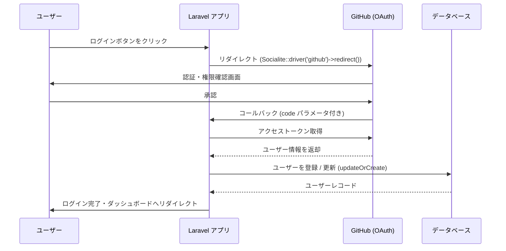

## Laravel Socialite とは

Laravel Socialite は、OAuth 2.0 を使ったソーシャルログインをシンプルに実装できる公式パッケージです。GitHub、Google、Facebook、X(Twitter)、LinkedIn など主要なプロバイダーに対応しており、複雑な OAuth の実装を数行のコードで済ませることができます。

組み込みでサポートされているプロバイダーは以下のとおりです。

| プロバイダー | キー名 |
| --- | --- |
| Bitbucket | `bitbucket` |
| Facebook | `facebook` |
| GitHub | `github` |
| GitLab | `gitlab` |
| Google | `google` |
| LinkedIn (OpenID) | `linkedin-openid` |
| Slack | `slack` / `slack-openid` |
| Spotify | `spotify` |
| Twitch | `twitch` |
| X (Twitter) | `x` |

<Info>
  上記以外のプロバイダーは、コミュニティが提供する [Socialite Providers](https://socialiteproviders.com/) で追加できます。
</Info>

### ソーシャルログインのフロー



---

## インストール

Composer でパッケージを追加します。

```shell
composer require laravel/socialite
```

<Info>
  Socialite をメジャーバージョンアップする際は、必ず [アップグレードガイド](https://github.com/laravel/socialite/blob/master/UPGRADE.md) を確認してください。
</Info>

---

## 設定

### config/services.php

各プロバイダーのクライアント ID・シークレット・コールバック URL を `config/services.php` に追加します。

```php
// config/services.php

'github' => [
    'client_id' => env('GITHUB_CLIENT_ID'),
    'client_secret' => env('GITHUB_CLIENT_SECRET'),
    'redirect' => env('GITHUB_REDIRECT_URI'),
],

'google' => [
    'client_id' => env('GOOGLE_CLIENT_ID'),
    'client_secret' => env('GOOGLE_CLIENT_SECRET'),
    'redirect' => env('GOOGLE_REDIRECT_URI'),
],

'facebook' => [
    'client_id' => env('FACEBOOK_CLIENT_ID'),
    'client_secret' => env('FACEBOOK_CLIENT_SECRET'),
    'redirect' => env('FACEBOOK_REDIRECT_URI'),
],
```

<Info>
  `redirect` オプションに相対パスを指定すると、自動的に完全な URL に解決されます。
</Info>

### .env

環境変数でクレデンシャルを管理します。GitHub を例に示します。

```ini
GITHUB_CLIENT_ID=your-client-id
GITHUB_CLIENT_SECRET=your-client-secret
GITHUB_REDIRECT_URI=https://example.com/auth/github/callback
```

GitHub の場合、[GitHub Developer Settings](https://github.com/settings/developers) で OAuth App を作成するとクライアント ID とシークレットを取得できます。

---

## 認証フロー

### ルーティング

OAuth 認証には2つのルートが必要です。リダイレクト用とコールバック用です。

```php
use Laravel\Socialite\Facades\Socialite;

// ユーザーを GitHub にリダイレクト
Route::get('/auth/github', function () {
    return Socialite::driver('github')->redirect();
});

// GitHub からのコールバックを処理
Route::get('/auth/github/callback', function () {
    $user = Socialite::driver('github')->user();

    // $user->token でアクセストークンを取得
});
```

### ユーザーの保存とログイン

コールバックルートでユーザー情報を取得し、データベースに保存してからログインします。

```php
use App\Models\User;
use Illuminate\Support\Facades\Auth;
use Laravel\Socialite\Facades\Socialite;

Route::get('/auth/github/callback', function () {
    $githubUser = Socialite::driver('github')->user();

    $user = User::updateOrCreate(
        ['github_id' => $githubUser->id],
        [
            'name' => $githubUser->name,
            'email' => $githubUser->email,
            'github_token' => $githubUser->token,
            'github_refresh_token' => $githubUser->refreshToken,
        ]
    );

    Auth::login($user);

    return redirect('/dashboard');
});
```

<Warning>
  `updateOrCreate` を使う場合、`github_id` カラムが `users` テーブルに存在している必要があります。後述のマイグレーション例を参考にしてください。
</Warning>

---

## ユーザー情報の取得

`user()` メソッドが返すオブジェクトから、以下のプロパティ・メソッドでユーザー情報を取得できます。

```php
Route::get('/auth/github/callback', function () {
    $user = Socialite::driver('github')->user();

    // OAuth 2.0 プロバイダー
    $token = $user->token;
    $refreshToken = $user->refreshToken;
    $expiresIn = $user->expiresIn;

    // OAuth 1.0 プロバイダー (X など)
    $token = $user->token;
    $tokenSecret = $user->tokenSecret;

    // 全プロバイダー共通
    $user->getId();
    $user->getNickname();
    $user->getName();
    $user->getEmail();
    $user->getAvatar();
});
```

### アクセストークンからユーザーを取得

既存のアクセストークンからユーザー情報を取得する場合は `userFromToken()` を使います。

```php
$user = Socialite::driver('github')->userFromToken($token);
```

### ステートレスモード

Cookie セッションを使わない API では `stateless()` メソッドでセッション状態の検証を無効化できます。

```php
return Socialite::driver('google')->stateless()->user();
```

---

## データベース連携

### マイグレーション

`users` テーブルにソーシャルログイン用のカラムを追加します。

```php
// database/migrations/xxxx_xx_xx_add_github_columns_to_users_table.php

return new class extends Migration
{
    public function up(): void
    {
        Schema::table('users', function (Blueprint $table) {
            $table->string('github_id')->nullable()->unique()->after('id');
            $table->string('github_token')->nullable()->after('github_id');
            $table->string('github_refresh_token')->nullable()->after('github_token');
        });
    }

    public function down(): void
    {
        Schema::table('users', function (Blueprint $table) {
            $table->dropColumn(['github_id', 'github_token', 'github_refresh_token']);
        });
    }
};
```

### provider カラムで複数プロバイダーに対応

複数のプロバイダーをまとめて管理する場合は `provider` / `provider_id` の2カラム構成が一般的です。

```php
Schema::table('users', function (Blueprint $table) {
    $table->string('provider')->nullable()->after('id');
    $table->string('provider_id')->nullable()->after('provider');
    $table->string('provider_token')->nullable()->after('provider_id');

    $table->unique(['provider', 'provider_id']);
});
```

コールバック処理はプロバイダー名を動的に渡すようにします。

```php
Route::get('/auth/{provider}/callback', function (string $provider) {
    $socialUser = Socialite::driver($provider)->user();

    $user = User::updateOrCreate(
        [
            'provider' => $provider,
            'provider_id' => $socialUser->getId(),
        ],
        [
            'name' => $socialUser->getName(),
            'email' => $socialUser->getEmail(),
            'provider_token' => $socialUser->token,
        ]
    );

    Auth::login($user);

    return redirect('/dashboard');
});
```

### 既存ユーザーとの紐付け

同じメールアドレスを持つ既存ユーザーとアカウントを紐付ける場合は、メールアドレスで検索してからカラムを更新します。

```php
$socialUser = Socialite::driver('github')->user();

$user = User::where('email', $socialUser->getEmail())->first();

if ($user) {
    // 既存ユーザーに GitHub 情報を紐付け
    $user->update([
        'github_id' => $socialUser->getId(),
        'github_token' => $socialUser->token,
    ]);
} else {
    // 新規ユーザーとして作成
    $user = User::create([
        'name' => $socialUser->getName(),
        'email' => $socialUser->getEmail(),
        'github_id' => $socialUser->getId(),
        'github_token' => $socialUser->token,
    ]);
}

Auth::login($user);
```

---

## スコープとオプション

### スコープの追加

`scopes()` メソッドで追加のスコープを指定できます。

```php
return Socialite::driver('github')
    ->scopes(['read:user', 'public_repo'])
    ->redirect();
```

`setScopes()` メソッドを使うと、既存のスコープをすべて上書きします。

```php
return Socialite::driver('github')
    ->setScopes(['read:user', 'public_repo'])
    ->redirect();
```

### オプションパラメータ

`with()` メソッドで追加パラメータをリダイレクトリクエストに含めます。

```php
// Google でホスト制限を指定
return Socialite::driver('google')
    ->with(['hd' => 'example.com'])
    ->redirect();

// Google で毎回同意画面を表示
return Socialite::driver('google')
    ->with(['prompt' => 'consent'])
    ->redirect();
```

<Warning>
  `with()` メソッドで `state` や `response_type` などの予約済みキーワードを渡さないように注意してください。
</Warning>

### Slack Bot トークン

Slack Bot トークンを生成する場合は `asBotUser()` を使います。

```php
// リダイレクト時
return Socialite::driver('slack')
    ->asBotUser()
    ->setScopes(['chat:write', 'chat:write.public', 'chat:write.customize'])
    ->redirect();

// コールバック時
$user = Socialite::driver('slack')->asBotUser()->user();
```

---

## テスト

Socialite はテスト用のモック機能を提供しています。実際のプロバイダーへのリクエストなしに OAuth フローをテストできます。

### リダイレクトのテスト

```php
use Laravel\Socialite\Facades\Socialite;

test('ユーザーがGitHubにリダイレクトされる', function () {
    Socialite::fake('github');

    $response = $this->get('/auth/github');

    $response->assertRedirect();
});
```

### コールバックのテスト

`fake()` メソッドにユーザーインスタンスを渡して、プロバイダーから返ってくるユーザー情報をモックします。

```php
use Laravel\Socialite\Facades\Socialite;
use Laravel\Socialite\Two\User;

test('GitHubでログインできる', function () {
    Socialite::fake('github', (new User)->map([
        'id' => 'github-123',
        'name' => 'Jane Doe',
        'email' => 'jane@example.com',
    ]));

    $response = $this->get('/auth/github/callback');

    $response->assertRedirect('/dashboard');

    $this->assertDatabaseHas('users', [
        'name' => 'Jane Doe',
        'email' => 'jane@example.com',
        'github_id' => 'github-123',
    ]);
});
```

トークンなど追加のプロパティを設定することもできます。

```php
$fakeUser = (new User)->map([
    'id' => 'github-123',
    'name' => 'Jane Doe',
    'email' => 'jane@example.com',
])->setToken('fake-token')
  ->setRefreshToken('fake-refresh-token')
  ->setExpiresIn(3600)
  ->setApprovedScopes(['read:user', 'public_repo']);
```

---

## コミュニティプロバイダー

組み込みプロバイダー以外(LINE、Discord、Apple など)を使う場合は [Socialite Providers](https://socialiteproviders.com/) を利用します。

```shell
composer require socialiteproviders/line
```

`config/app.php` の `providers` にサービスプロバイダーを追加し、`config/services.php` にクレデンシャルを設定するだけで、Socialite と同じ API で使えるようになります。

```php
// EventServiceProvider クラスの $listen 配列に追加
\SocialiteProviders\Manager\SocialiteWasCalled::class => [
    \SocialiteProviders\Line\LineExtendSocialite::class . '@handle',
],
```

```php
// config/services.php
'line' => [
    'client_id' => env('LINE_CLIENT_ID'),
    'client_secret' => env('LINE_CLIENT_SECRET'),
    'redirect' => env('LINE_REDIRECT_URI'),
],
```
