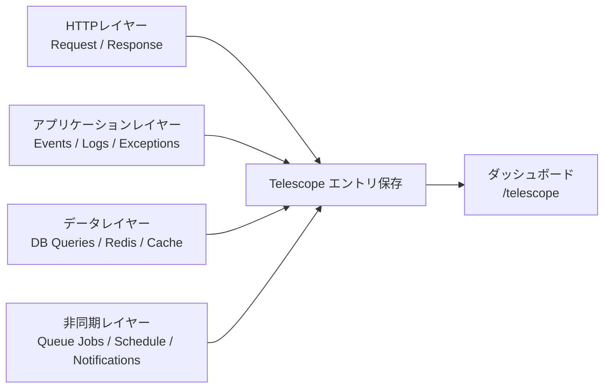

## Laravel Telescopeとは

[Laravel Telescope](https://github.com/laravel/telescope) は、Laravelアプリケーションの内部状態を可視化する公式デバッグツールです。
リクエスト、例外、クエリ、ジョブ、ログ、メール、通知、キャッシュ操作、スケジュール実行などを詳細に記録できます。

個々のリクエストを深く追跡する用途に強く、特にローカル・ステージング環境で有効です。

### モニタリング対象レイヤー



---

## インストール

<Steps>
  <Step title="Telescopeをインストールする">
    ```shell
    composer require laravel/telescope
    ```
  </Step>

  <Step title="アセットとマイグレーションを公開する">
    ```shell
    php artisan telescope:install
    ```
  </Step>

  <Step title="マイグレーションを実行する">
    ```shell
    php artisan migrate
    ```
  </Step>
</Steps>

インストール後、`/telescope` でダッシュボードにアクセスできます。

## ローカル専用インストール（推奨）

<Info>
  ローカル開発でのデバッグが主目的なら、`--dev` でインストールし、サービスプロバイダーを `local` 環境だけで手動登録する構成を推奨します。  
  本番環境でデバッグツールを誤って公開するリスクを下げられます。
</Info>

```shell
composer require laravel/telescope --dev

php artisan telescope:install
php artisan migrate
```

`telescope:install` 実行後、`bootstrap/providers.php` から `TelescopeServiceProvider` の登録を削除してください。
そのうえで、`App\Providers\AppServiceProvider` の `register` メソッドで手動登録します。

```php
public function register(): void
{
    if ($this->app->environment('local') && class_exists(\Laravel\Telescope\TelescopeServiceProvider::class)) {
        $this->app->register(\Laravel\Telescope\TelescopeServiceProvider::class);
        $this->app->register(TelescopeServiceProvider::class);
    }
}
```

さらに `composer.json` で auto-discovery を無効化してください。

```json
{
  "extra": {
    "laravel": {
      "dont-discover": [
        "laravel/telescope"
      ]
    }
  }
}
```

---

## ダッシュボード認証

Telescopeダッシュボードは `/telescope` で公開されます。
デフォルトでは `local` 環境のみアクセス可能です。非ローカル環境では `app/Providers/TelescopeServiceProvider.php` の `viewTelescope` ゲートでアクセスを制御してください。

```php
use App\Models\User;
use Illuminate\Support\Facades\Gate;

protected function gate(): void
{
    Gate::define('viewTelescope', function (User $user) {
        return in_array($user->email, [
            'admin@example.com',
        ]);
    });
}
```

<Warning>
  本番環境では必ず `APP_ENV=production` を設定してください。  
  `APP_ENV=local` のままだと、Telescopeダッシュボードが公開状態になる可能性があります。
</Warning>

---

## データプルーニング

Telescopeのデータは短期間で急増します。
`telescope:prune` を毎日実行するようにスケジュールしてください。

```php
use Illuminate\Support\Facades\Schedule;

Schedule::command('telescope:prune')->daily();
```

デフォルトでは24時間より古いエントリが削除されます。
保存期間を変更したい場合は `--hours` を使います。

```php
Schedule::command('telescope:prune --hours=48')->daily();
```

---

## 本番向けフィルタリング

ローカル環境では広く記録し、本番環境では重要エントリに絞る運用が一般的です。
`App\Providers\TelescopeServiceProvider` で設定します。

### エントリ単位のフィルタ

```php
use Laravel\Telescope\IncomingEntry;
use Laravel\Telescope\Telescope;

Telescope::filter(function (IncomingEntry $entry) {
    if ($this->app->environment('local')) {
        return true;
    }

    return $entry->isReportableException() ||
        $entry->isFailedJob() ||
        $entry->isScheduledTask() ||
        $entry->isSlowQuery() ||
        $entry->hasMonitoredTag();
});
```

### バッチ単位のフィルタ

```php
use Illuminate\Support\Collection;
use Laravel\Telescope\IncomingEntry;
use Laravel\Telescope\Telescope;

Telescope::filterBatch(function (Collection $entries) {
    if ($this->app->environment('local')) {
        return true;
    }

    return $entries->contains(function (IncomingEntry $entry) {
        return $entry->isReportableException() ||
            $entry->isFailedJob() ||
            $entry->isScheduledTask() ||
            $entry->isSlowQuery() ||
            $entry->hasMonitoredTag();
    });
});
```

---

## 利用可能なウォッチャー

ウォッチャーはリクエストやコマンド実行時のテレメトリを収集します。
`config/telescope.php` で有効化・設定を管理します。

<AccordionGroup>
  <Accordion title="Request Watcher">
    リクエスト、ヘッダー、セッション、レスポンスを記録します。  
    `size_limit` でレスポンス記録サイズを制限できます。
  </Accordion>

  <Accordion title="Query Watcher（特に重要）">
    SQL、バインディング、実行時間を記録します。  
    デフォルトでは **100ms** 超のクエリが `slow` タグで記録されるため、性能ボトルネック検知に非常に有効です。

    ```php
    Watchers\QueryWatcher::class => [
        'enabled' => env('TELESCOPE_QUERY_WATCHER', true),
        'slow' => 100,
    ],
    ```
  </Accordion>

  <Accordion title="Job Watcher">
    キュージョブの投入と実行結果を記録します。
  </Accordion>

  <Accordion title="Exception Watcher">
    report対象の例外とスタックトレースを記録します。
  </Accordion>

  <Accordion title="Log Watcher">
    アプリケーションログを記録します。  
    デフォルトは `error` 以上で、設定で `debug` まで下げられます。
  </Accordion>

  <Accordion title="Command Watcher">
    Artisanコマンドの引数、オプション、出力、終了コードを記録します。
  </Accordion>

  <Accordion title="Event Watcher">
    dispatchされたイベントのペイロードとリスナー情報を記録します（Laravel内部イベントは除外）。
  </Accordion>

  <Accordion title="Cache Watcher">
    キャッシュのヒット、ミス、更新、削除を記録します。
  </Accordion>

  <Accordion title="Redis Watcher">
    アプリケーションから実行されたRedisコマンドを記録します。
  </Accordion>

  <Accordion title="Model Watcher">
    Eloquentモデルイベントを記録し、必要に応じてhydration件数も収集できます。
  </Accordion>

  <Accordion title="Notification Watcher">
    送信された通知を記録します。
  </Accordion>

  <Accordion title="Mail Watcher">
    送信メールをブラウザでプレビューし、`.eml` としてダウンロードできます。
  </Accordion>

  <Accordion title="HTTP Client Watcher">
    外向きHTTPクライアントリクエストを記録します。
  </Accordion>

  <Accordion title="Gate Watcher">
    Gate / Policy の認可チェック結果を記録します。
  </Accordion>

  <Accordion title="Schedule Watcher">
    スケジュール実行されたコマンドと出力を記録します。
  </Accordion>

  <Accordion title="View Watcher">
    レンダリングされたビュー名、パス、データ、composerを記録します。
  </Accordion>

  <Accordion title="Batch Watcher">
    キューバッチ情報（ジョブやコネクション情報）を記録します。
  </Accordion>

  <Accordion title="Dump Watcher">
    TelescopeのDumpタブが開いている間の `dump` 出力を記録します。
  </Accordion>
</AccordionGroup>

---

## まとめ

| タスク | 推奨設定 |
| --- | --- |
| 通常の導入 | `composer require laravel/telescope --dev` |
| 本番公開リスクの低減 | ローカル限定の手動プロバイダー登録 + `dont-discover` |
| ダッシュボード保護 | `viewTelescope` ゲート設定 + `APP_ENV=production` 確認 |
| データ肥大化対策 | `telescope:prune` を日次実行 |
| 本番ノイズ削減 | `Telescope::filter` / `filterBatch` で重要項目のみ記録 |
| DB性能調査 | Query Watcher の slowクエリタグ（デフォルト100ms）を活用 |
