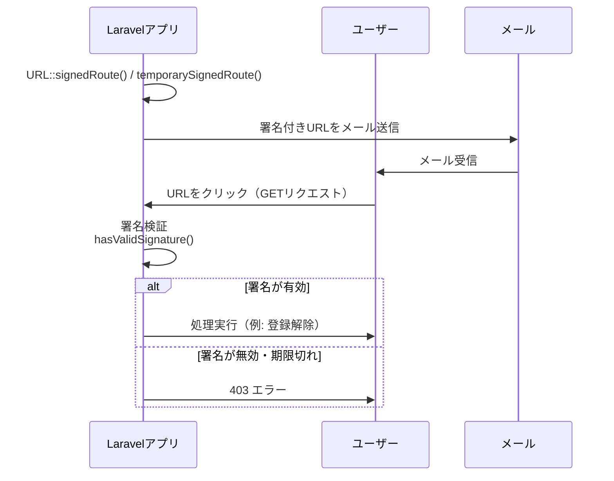

## はじめに

LaravelはアプリケーションのURLを生成するためのヘルパーをいくつか提供しています。
これらはテンプレートやAPIレスポンスでリンクを構築する際、またはアプリケーションの別の場所へリダイレクトレスポンスを生成する際に特に便利です。

## 基本的な使い方

### URLの生成

`url` ヘルパーを使って任意のURLを生成できます。
生成されたURLは、アプリケーションが処理している現在のリクエストのスキーム（HTTPまたはHTTPS）とホストを自動的に使用します。

```php
$post = App\Models\Post::find(1);

echo url("/posts/{$post->id}");

// http://example.com/posts/1
```

クエリ文字列パラメータを含むURLを生成するには `query` メソッドを使います。

```php
echo url()->query('/posts', ['search' => 'Laravel']);

// https://example.com/posts?search=Laravel

echo url()->query('/posts?sort=latest', ['search' => 'Laravel']);

// http://example.com/posts?sort=latest&search=Laravel
```

パスにすでに存在するクエリ文字列パラメータを指定すると、既存の値が上書きされます。

```php
echo url()->query('/posts?sort=latest', ['sort' => 'oldest']);

// http://example.com/posts?sort=oldest
```

配列の値もクエリパラメータとして渡せます。これらの値は適切にキー付けされ、生成されたURLにエンコードされます。

```php
echo $url = url()->query('/posts', ['columns' => ['title', 'body']]);

// http://example.com/posts?columns%5B0%5D=title&columns%5B1%5D=body

echo urldecode($url);

// http://example.com/posts?columns[0]=title&columns[1]=body
```

### 現在のURLの取得

`url` ヘルパーにパスを指定しない場合、`Illuminate\Routing\UrlGenerator` インスタンスが返され、現在のURLに関する情報にアクセスできます。

```php
// クエリ文字列なしの現在のURL
echo url()->current();

// クエリ文字列を含む現在のURL
echo url()->full();
```

これらのメソッドは `URL` [ファサード](./facades)からもアクセスできます。

```php
use Illuminate\Support\Facades\URL;

echo URL::current();
```

### 直前のURLの取得

ユーザーが訪問していた直前のURLを知りたい場合があります。`url` ヘルパーの `previous` メソッドや `previousPath` メソッドで取得できます。

```php
// 直前のリクエストの完全なURL
echo url()->previous();

// 直前のリクエストのパス
echo url()->previousPath();
```

セッション経由で直前のURLを取得することもできます。

```php
use Illuminate\Http\Request;

Route::post('/users', function (Request $request) {
    $previousUri = $request->session()->previousUri();

    // ...
});
```

直前に訪問したURLのルート名をセッション経由で取得することも可能です。

```php
$previousRoute = $request->session()->previousRoute();
```

## 名前付きルートのURL

`route` ヘルパーは[名前付きルート](./routing#named-routes)へのURLを生成するために使えます。
名前付きルートを使うと、ルートに定義された実際のURLに依存せずにURLを生成できます。
そのため、ルートのURLが変更されても、`route` 関数の呼び出しを変更する必要がありません。

```php
Route::get('/post/{post}', function (Post $post) {
    // ...
})->name('post.show');
```

このルートへのURLを生成するには次のようにします。

```php
echo route('post.show', ['post' => 1]);

// http://example.com/post/1
```

複数のパラメータを持つルートにも対応しています。

```php
Route::get('/post/{post}/comment/{comment}', function (Post $post, Comment $comment) {
    // ...
})->name('comment.show');

echo route('comment.show', ['post' => 1, 'comment' => 3]);

// http://example.com/post/1/comment/3
```

ルートの定義パラメータに対応しない追加の配列要素はURLのクエリ文字列に追加されます。

```php
echo route('post.show', ['post' => 1, 'search' => 'rocket']);

// http://example.com/post/1?search=rocket
```

### Eloquentモデル

Eloquentモデルのルートキー（通常は主キー）を使ってURLを生成することが多いでしょう。
そのためにEloquentモデルをパラメータ値として渡せます。`route` ヘルパーはモデルのルートキーを自動的に取り出します。

```php
echo route('post.show', ['post' => $post]);
```

### 署名付きURL

Laravelでは名前付きルートへの「署名付き」URLを簡単に作成できます。
これらのURLにはクエリ文字列に「署名」ハッシュが付加され、URLが作成後に改ざんされていないことをLaravelが検証できます。
署名付きURLは、公開アクセス可能だがURL操作に対する保護が必要なルートに特に便利です。

たとえば、顧客にメールで送信する公開「登録解除」リンクを実装するために署名付きURLを使えます。
`URL` ファサードの `signedRoute` メソッドを使って署名付きURLを作成します。

```php
use Illuminate\Support\Facades\URL;

return URL::signedRoute('unsubscribe', ['user' => 1]);
```

`signedRoute` メソッドに `absolute` 引数を指定することで、署名URLハッシュからドメインを除外できます。

```php
return URL::signedRoute('unsubscribe', ['user' => 1], absolute: false);
```

指定した時間後に有効期限が切れる一時的な署名付きURLを生成するには `temporarySignedRoute` メソッドを使います。
Laravelは一時的な署名付きURLを検証する際、署名付きURLにエンコードされた有効期限タイムスタンプが経過していないことを確認します。

```php
use Illuminate\Support\Facades\URL;

return URL::temporarySignedRoute(
    'unsubscribe', now()->plus(minutes: 30), ['user' => 1]
);
```

#### 署名付きURLの検証フロー



#### 署名付きルートリクエストの検証

受信リクエストに有効な署名があることを確認するには、`Illuminate\Http\Request` インスタンスの `hasValidSignature` メソッドを呼び出します。

```php
use Illuminate\Http\Request;

Route::get('/unsubscribe/{user}', function (Request $request) {
    if (! $request->hasValidSignature()) {
        abort(401);
    }

    // ...
})->name('unsubscribe');
```

特定のクエリパラメータを検証時に無視したい場合は `hasValidSignatureWhileIgnoring` メソッドを使います。

```php
if (! $request->hasValidSignatureWhileIgnoring(['page', 'order'])) {
    abort(401);
}
```

受信リクエストインスタンスを使う代わりに、`signed`（`Illuminate\Routing\Middleware\ValidateSignature`）[ミドルウェア](./middleware)をルートに割り当てることもできます。
受信リクエストに有効な署名がない場合、ミドルウェアは自動的に `403` HTTPレスポンスを返します。

```php
Route::post('/unsubscribe/{user}', function (Request $request) {
    // ...
})->name('unsubscribe')->middleware('signed');
```

署名付きURLにドメインが含まれない場合は `relative` 引数をミドルウェアに指定します。

```php
Route::post('/unsubscribe/{user}', function (Request $request) {
    // ...
})->name('unsubscribe')->middleware('signed:relative');
```

#### 無効な署名付きルートへの応答

有効期限切れの署名付きURLにアクセスすると、`403` HTTPステータスコードの汎用エラーページが表示されます。
アプリケーションの `bootstrap/app.php` ファイルで `InvalidSignatureException` 例外のカスタム「render」クロージャを定義することで、この動作をカスタマイズできます。

```php
use Illuminate\Routing\Exceptions\InvalidSignatureException;

->withExceptions(function (Exceptions $exceptions): void {
    $exceptions->render(function (InvalidSignatureException $e) {
        return response()->view('errors.link-expired', status: 403);
    });
})
```

## コントローラーアクションのURL

`action` 関数は指定されたコントローラーアクションのURLを生成します。

```php
use App\Http\Controllers\HomeController;

$url = action([HomeController::class, 'index']);
```

コントローラーメソッドがルートパラメータを受け取る場合は、関数の第2引数にルートパラメータの連想配列を渡します。

```php
$url = action([UserController::class, 'profile'], ['id' => 1]);
```

## フルエントURIオブジェクト

LaravelのURIクラスは、オブジェクトを通じてURIを作成・操作するための便利なフルエントインターフェースを提供します。

```php
use App\Http\Controllers\UserController;
use Illuminate\Support\Uri;

// 文字列からURIインスタンスを生成
$uri = Uri::of('https://example.com/path');

// パス、名前付きルート、コントローラーアクションへのURIを生成
$uri = Uri::to('/dashboard');
$uri = Uri::route('users.show', ['user' => 1]);
$uri = Uri::signedRoute('users.show', ['user' => 1]);
$uri = Uri::temporarySignedRoute('user.index', now()->plus(minutes: 5));
$uri = Uri::action([UserController::class, 'index']);

// 現在のリクエストURLからURIインスタンスを生成
$uri = $request->uri();
```

URIインスタンスを取得したら、フルエントに変更できます。

```php
$uri = Uri::of('https://example.com')
    ->withScheme('http')
    ->withHost('test.com')
    ->withPort(8000)
    ->withPath('/users')
    ->withQuery(['page' => 2])
    ->withFragment('section-1');
```

## デフォルトのURLパラメータ

特定のURLパラメータにリクエスト全体のデフォルト値を指定したい場合があります。
たとえば、多くのルートに `{locale}` パラメータが定義されているとします。

```php
Route::get('/{locale}/posts', function () {
    // ...
})->name('post.index');
```

`route` ヘルパーを呼び出すたびに `locale` を渡すのは面倒です。
そこで `URL::defaults` メソッドを使って、現在のリクエスト中に常に適用されるこのパラメータのデフォルト値を定義できます。
このメソッドは[ルートミドルウェア](./middleware#assigning-middleware-to-routes)から呼び出すと、現在のリクエストにアクセスできます。

```php
<?php

namespace App\Http\Middleware;

use Closure;
use Illuminate\Http\Request;
use Illuminate\Support\Facades\URL;
use Symfony\Component\HttpFoundation\Response;

class SetDefaultLocaleForUrls
{
    /**
     * 受信リクエストを処理する。
     *
     * @param  \Closure(\Illuminate\Http\Request): (\Symfony\Component\HttpFoundation\Response)  $next
     */
    public function handle(Request $request, Closure $next): Response
    {
        URL::defaults(['locale' => $request->user()->locale]);

        return $next($request);
    }
}
```

`locale` パラメータのデフォルト値が設定されると、`route` ヘルパーでURLを生成する際にその値を渡す必要がなくなります。

<Info>
URLデフォルト値の設定はLaravelの暗黙的なモデルバインディングの処理を妨げる場合があります。
URLデフォルト値を設定するミドルウェアをLaravel自身の `SubstituteBindings` ミドルウェアより前に実行されるよう[ミドルウェアの優先度設定](./middleware#sorting-middleware)を行ってください。
アプリケーションの `bootstrap/app.php` ファイルで `priority` ミドルウェアメソッドを使って設定できます。

```php
->withMiddleware(function (Middleware $middleware): void {
    $middleware->prependToPriorityList(
        before: \Illuminate\Routing\Middleware\SubstituteBindings::class,
        prepend: \App\Http\Middleware\SetDefaultLocaleForUrls::class,
    );
})
```
</Info>
